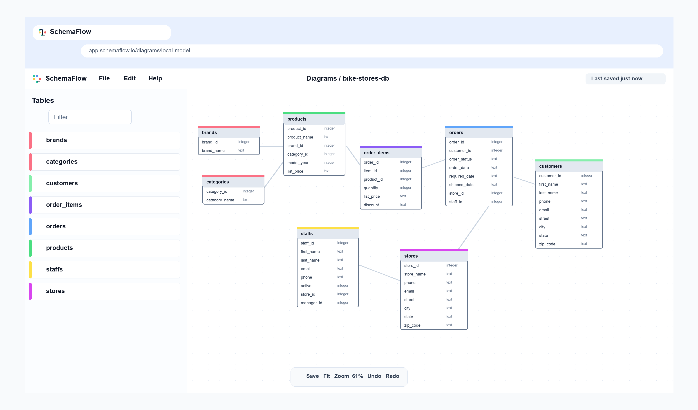

<div align="center">
  
  <h1>SchemaFlow</h1>
</div>

<h3 align="center">本地优先、无需账号、无需数据库密码的数据库结构可视化与 SQL 导出工具。</h3>

<p align="center">
  
</p>

SchemaFlow 是一个运行在浏览器中的数据库 schema 可视化编辑器。你可以通过 Smart Query、SQL、DBML、JSON 或内置模板快速生成可编辑的数据库关系图，也可以在画布中继续调整表、字段、索引、关系、区域和备注，并导出 SQL、DBML、JSON、图片或本地备份文件。核心建模、保存、导入和导出能力默认在本地完成，不需要注册账号，也不要求填写数据库密码。

## 项目来源与致谢

SchemaFlow 是基于 [ChartDB](https://github.com/chartdb/chartdb) 开源项目优化重构后的项目。我们在 ChartDB 原项目优秀的浏览器端数据库结构可视化、Smart Query 导入、多数据库支持和 SQL / DBML 导入导出能力基础上，围绕 SchemaFlow 品牌化、默认中文体验、本地优先数据边界、浏览器端密钥安全、AI 辅助导出默认关闭、旧 ChartDB 本地数据兼容迁移、Schema Core 与 Command 架构、Dexie / IndexedDB 存储抽象、备份恢复格式、导入导出能力矩阵、可访问性、测试门禁、Docker / Nginx 自托管安全配置和发布治理做了系统整理与增强。

感谢 ChartDB 原项目作者与贡献者提供的开源基础。SchemaFlow 的持续演进建立在这份开放工作的价值之上，并继续遵守原项目采用的 AGPL-3.0 开源许可证。

## 核心功能

- **Smart Query 导入**：根据所选数据库生成只读查询，用户在自己的数据库环境执行后，将结果粘贴到 SchemaFlow 中生成图表。
- **SQL / DBML 导入**：支持从 SQL DDL 或 DBML 文本导入数据库结构，并在导入前预览表、关系、索引、自定义类型和 warning。
- **可视化建模**：在画布中查看和编辑表、字段、关系、索引、check constraint、区域和备注。
- **多数据库支持**：覆盖 PostgreSQL、MySQL、SQL Server、MariaDB、SQLite、CockroachDB、ClickHouse 和 DBML 等场景。
- **SQL / DBML 导出**：可将当前 diagram 导出为目标数据库方言 SQL 或 DBML。
- **跨方言辅助导出**：在可支持路径上提供跨数据库 SQL 导出；风险较高或暂不支持的语法会通过 warning 标记。
- **本地保存与恢复**：diagram 默认保存到浏览器 IndexedDB，支持打开本地图表、导出备份和从备份恢复。
- **旧数据兼容**：保留旧 ChartDB IndexedDB、localStorage key、backup envelope 和环境变量的兼容读取路径，避免老用户数据丢失。
- **模板浏览**：内置真实项目 schema 示例，方便快速查看常见数据库结构。
- **默认中文界面**：首次访问默认使用简体中文，用户仍可主动切换其他语言。
- **可选 AI 辅助导出**：浏览器构建默认关闭 AI 能力；需要时可通过 session-only BYOK 或自托管 Gateway 明确启用。

## 隐私与数据边界

SchemaFlow 的默认模式是本地优先：

- 不登录也可以创建、导入、编辑、保存和导出 diagram。
- diagram 数据默认保存在当前浏览器的 IndexedDB。
- Smart Query 由用户在自己的数据库环境中执行，SchemaFlow 不需要数据库连接串或数据库密码。
- SQL、DBML、JSON 和 backup 文件默认在浏览器内解析、校验和导出。
- 浏览器构建不得持久化长期模型供应商 API key。
- AI 辅助导出默认关闭，用户明确启用前不会发送 schema 内容。
- Docker / Nginx 运行时配置只允许注入非敏感 endpoint、model name、feature flag 等信息。

## 支持格式

| 类型 | 支持内容 |
| --- | --- |
| 导入 | Smart Query JSON、SQL DDL、DBML、SchemaFlow backup、旧 ChartDB backup |
| SQL 导出 | PostgreSQL、MySQL、SQL Server、MariaDB、SQLite、CockroachDB、ClickHouse 等已支持方言 |
| 结构导出 | DBML、JSON、本地 backup |
| 图像导出 | PNG、SVG 等浏览器端导出格式 |
| 兼容数据 | 旧 ChartDB IndexedDB、旧 `chartdb.backup`、旧 `chartdb.ai.*` 本地配置 |

## 技术栈

- React 18
- Vite
- TypeScript
- Radix UI
- Tailwind CSS
- XYFlow
- Dexie / IndexedDB
- i18next
- Monaco Editor
- DBML parser
- Vitest
- Docker / Nginx

## 本地开发

环境要求：

- Node.js 24 或兼容版本
- npm

安装依赖并启动开发服务：

```bash
npm install
npm run dev
```

默认开发地址由 Vite 输出，通常是：

```text
http://localhost:5173
```

## 常用命令

```bash
# 启动开发服务
npm run dev

# ESLint 检查
npm run lint

# 运行测试
npm run test

# CI 测试模式
npm run test:ci

# 生产构建
npm run build

# 本地预览构建产物
npm run preview
```

## Docker 运行

使用已发布镜像：

```bash
docker run -p 8080:80 ghcr.io/lynn-lee/schemaflow:<version>
```

本地构建并运行：

```bash
docker build -t schemaflow .
docker run -p 8080:80 schemaflow
```

访问：

```text
http://localhost:8080
```

## 可选 AI Gateway 配置

SchemaFlow 不依赖 AI 即可使用 deterministic SQL / DBML 导入导出。若需要接入自托管推理服务，可以使用非敏感运行时配置：

```bash
docker build \
  --build-arg VITE_OPENAI_API_ENDPOINT=<YOUR_ENDPOINT> \
  --build-arg VITE_LLM_MODEL_NAME=<YOUR_MODEL_NAME> \
  -t schemaflow .

docker run \
  -e OPENAI_API_ENDPOINT=<YOUR_ENDPOINT> \
  -e LLM_MODEL_NAME=<YOUR_MODEL_NAME> \
  -p 8080:80 schemaflow
```

`OPENAI_API_ENDPOINT` 和 `LLM_MODEL_NAME` 只是非敏感提示信息，不应把长期 API key、生产数据库凭据或私有 schema 内容写入构建产物、镜像或仓库。

## 项目结构

```text
src/
  components/        通用 UI 组件
  context/           编辑器、配置、历史、导入导出等状态上下文
  dialogs/           导入、导出、打开图表和建模弹窗
  dialects/          方言能力、导入器和导出器边界
  features/          设置、导入预览、onboarding 等功能模块
  hooks/             编辑器和应用级 React hooks
  i18n/              多语言资源
  lib/               数据模型、SQL/DBML 导入导出、安全与工具函数
  pages/             编辑器、模板和示例页面
  schema-core/       Schema model 与 command 架构
  storage/           Dexie 数据库、repository、backup 和 transaction 服务
  templates-data/    内置示例 schema
  workers/           导入预览等耗时任务 worker
```

## 贡献

贡献前请阅读 [CONTRIBUTING.md](CONTRIBUTING.md)。安全相关问题请参考 [SECURITY.md](SECURITY.md)，不要在公开 issue 中披露可利用细节。

## 许可证

本项目使用 [GNU Affero General Public License v3.0](LICENSE)。
