# ChartDB 全方位评估与后续优化手册

> 版本：v1.4（2026-07-04 四次修订：新增独立三路复核发现 13 项，覆盖架构可靠性、产品/无障碍、安全预防三个维度；已对 v1.3 全部具体断言逐条核对代码现状，结论：v1.3 记录准确，无需撤回）
> 日期：2026-07-04
> 本地路径：`/Users/lynn/SynologyDrive/SynologyDrive/Code/ChartDB`
> 重构仓库：`https://github.com/Lynn-Lee/ChartDB`
> 依据文档：`docs/ChartDB自动开发任务计划.md`、`docs/ChartDB重构优化产品设计与研发计划.md`、`docs/ChartDB重构优化工程实施计划.md`
> 文档定位：Phase 0-8 重构完成后的全方位深度评估结果与后续优化任务编排手册。给后续自动开发 agent、dispatcher、reviewer 使用。

## 1. 文档背景

ChartDB 已完成 Phase 0 到 Phase 8 的首轮重构，共 42 个任务全部 `done`。本轮评估从**架构设计、安全漏洞、产品设计、技术栈与代码质量**四个维度对重构后的代码库进行了深度审查。

评估结论：重构方向正确，安全基线扎实（无 Critical/High 安全漏洞），分层意图清晰。但处于**重构进行中**的状态——架构边界有虚假层、Provider 未拆分、依赖冗余严重、部分功能为空壳。本手册把发现的问题转换为可自动派发、可验证、可回滚的任务队列。

> **2026-07-04 复核说明**：本次复核对 v1.3 的全部 Critical/High/Medium 关键断言（C1-C5、H1-H8、M2-M12 中可静态验证的项、任务卡中引用的行号）逐条用 `rg`/`wc`/文件读取重新核实，结论：**v1.3 记录与当前代码状态一致，无失真项**，可直接沿用。在此基础上，另发起三路独立复核（安全纵深 / 产品与可访问性 / 架构与技术栈可靠性），要求复核者不得重复已记录问题、只报告新发现，最终合并得到 13 项新增问题（1 Critical、5 High、6 Medium、1 Low），已并入下表和任务卡（新增 ID 前缀沿用批次字母，编号从各批次现有最大编号之后继续）。

## 2. 评估总览

### 2.1 健康方面（无需修复）

| 维度 | 评估 |
|------|------|
| 安全基线 | ✅ 无 Critical/High 安全漏洞；API key 不暴露；Markdown 无 XSS；CSP/安全头已配置 |
| OSS Core 边界 | ✅ 无登录/注册代码；无云端上传；AI 默认禁用；Phase 8 预研保持隔离 |
| TypeScript 严格性 | ✅ strict + noUnusedLocals + noUnusedParameters + noFallthroughCasesInSwitch |
| @ts-ignore 使用 | ✅ 仅 8 处，全部有文档注释 |
| any 类型 | ✅ 仅 6 处，都在 AST 解析和工具函数中 |
| ESLint 配置 | ✅ 全面（typescript-eslint + react-hooks + jsx-a11y + tailwindcss） |
| Storage 三层架构 | ✅ db → repositories → transactions 依赖方向干净 |
| Backup 格式 | ✅ 版本化 + Zod 校验 + diagramCount 防篡改 |
| Worker 通信协议 | ✅ 统一 envelope/response，fallback 可靠 |
| Command 纯函数设计 | ✅ apply* 函数无副作用 |
| 路由级代码分割 | ✅ React.lazy() 已用于路由和 Monaco 编辑器组件 |

### 2.2 问题统计

> 2026-07-04 复核后合计 48 项（原 35 项 + 新增 13 项）。新增项见 3.5 节，任务卡见 4.x「批次追加」。

| 严重程度 | 数量（原 → 现） | 分布 |
|----------|------|------|
| Critical | 5 → 6 | 架构 3 + 技术栈 2 + 产品 1 |
| High | 8 → 13 | 架构 7 + 产品 7 + 技术栈 3（有交叉） |
| Medium | 12 → 18 | 安全 5 + 架构 5 + 产品 8（有交叉） |
| Low | 10 → 11 | 架构 4 + 安全 4 + 产品 6（有交叉） |

## 3. 问题清单（按严重程度排序）

### 3.1 Critical 问题

| ID | 问题 | 维度 | 文件位置 |
|----|------|------|----------|
| C1 | `schema-core/model/` 是空壳重导出，真实模型在 `lib/domain/` | 架构 | `src/schema-core/model/*.ts` |
| C2 | `commandHistory` 数据从未被 undo/redo 使用，是死代码 | 架构 | `chartdb-provider.tsx` → `history-provider.tsx` |
| C3 | 依赖声明与 AI SDK 残留治理（`@uidotdev/usehooks` 零引用；`motion` 实为 `framer-motion` 传递依赖需显式化；`@ai-sdk/openai`/`ai` 无静态 import） | 技术栈 | `package.json` — `@ai-sdk/openai`、`ai`、`motion`、`@uidotdev/usehooks` |
| C4 | 构建产物 83 MB，无 manualChunks 优化 | 技术栈 | `vite.config.ts` |
| C5 | 已修复：ClickHouse 不再作为 onboarding DDL 导入数据库选项，避免引导用户进入不支持路径 | 产品 | `onboarding-dialog.tsx` → `sql-import/index.ts` |
| C6 | 已修复：应用根级新增 React ErrorBoundary，渲染期未捕获异常会展示恢复页而非整页白屏 | 架构 | `src/App.tsx`、`src/components/error-boundary/error-boundary.tsx` |

### 3.2 High 问题

| ID | 问题 | 维度 | 文件位置 |
|----|------|------|----------|
| H1 | ChartDBProvider 是 2863 行 God Object | 架构 | `src/context/chartdb-context/chartdb-provider.tsx` |
| H2 | Diff 合并和 loadDiagram 绕过 Command 系统直接写 State | 架构 | `chartdb-provider.tsx:122-140`、`:2444-2484` |
| H3 | `dialects/` 层是薄封装，实际解析逻辑仍在 `lib/data/sql-import/` | 架构 | `src/dialects/*/importer.ts` → `@/lib/data/sql-import/*` |
| H4 | "Clear local diagrams" 按钮是空壳 | 产品 | `src/features/settings/privacy-settings.tsx:132-152` |
| H5 | BYOK session key 在设置中无输入入口 | 产品 | `privacy-settings.tsx:61-76`、`ai-mode.ts:36-40` |
| H6 | Oracle/ClickHouse/CockroachDB 导出静默走 PostgreSQL 格式 | 产品 | `export-sql-script.ts:172-186` |
| H7 | 50 个模板数据文件全部静态打包（~73,000 行） | 技术栈 | `src/templates-data/templates/*.ts` |
| H8 | i18n 22 种语言全部静态打包 | 技术栈 | `src/i18n/i18n.ts` |
| H9 | ChartDBContext 单一扁平 value 对象无 selector，任一 table 变更导致全部 62 处 `useChartDB()` 消费方重渲染 | 架构 | `chartdb-context.tsx:69-331`、`chartdb-provider.tsx:2740` |
| H10 | `Diagram` 类型无 `version`/`schemaVersion` 字段，字段“改形状”时无迁移钩子，只能靠 Zod `.optional()` 兜底 | 架构 | `src/lib/domain/diagram.ts:16-29` |
| H11 | 数据库元数据导入热路径未走 Zod 校验：`DatabaseMetadataSchema` 存在但未接入 `import-preview-core.ts`/`create-diagram-dialog.tsx` 实际调用点 | 架构 | `database-metadata.ts:54-61` vs `import-preview-core.ts:176`、`create-diagram-dialog.tsx:148,252` |
| H12 | Canvas 画布主体（节点拖拽、连线、选中）零 `aria-label`/`role`/键盘处理，核心编辑功能纯鼠标依赖 | 产品 | `src/pages/editor-page/canvas/canvas.tsx`（1908 行） |
| H13 | 应用启动/打开图表流程缺少 try/catch：IndexedDB 读取失败时 loader 无限转圈或对话框静默显示空列表 | 产品 | `use-diagram-loader.tsx:38-59`、`open-diagram-dialog.tsx:50-57` |

### 3.3 Medium 问题

| ID | 问题 | 维度 | 文件位置 |
|----|------|------|----------|
| M1 | 已修复：`entrypoint.sh` 不再将 `OPENAI_API_KEY` 列入 envsubst 白名单 | 安全 | `entrypoint.sh`、`src/lib/security/__tests__/browser-key-exposure.test.ts` |
| M2 | `window.open()` 6 处缺少 `noopener` 防护 | 安全 | `menu.tsx`、`editor-sidebar.tsx`、`star-us-dialog.tsx` |
| M3 | CSP `connect-src 'self' http: https:` 过于宽松 | 安全 | `default.conf.template:19` |
| M4 | `monaco-editor → dompurify@3.3.1` 多个 XSS 绕过 advisory | 安全 | 间接依赖 |
| M5 | `checkConstraint` 操作完全没有 Command 对应 | 架构 | `chartdb-provider.tsx:1345-1570` |
| M6 | `lib/utils` 工具函数依赖浏览器 API | 架构 | `lib/utils/utils.ts:17-43` |
| M7 | ImportResult 缺少 `confidence` 和 `diagnostics` 字段 | 产品 | `dialects/common/importer.ts` vs 产品文档 |
| M8 | Backup 恢复不展示 diagram 摘要预览 | 产品 | `storage/backup/backup-format.ts` |
| M9 | CockroachDB 和 ClickHouse 无 dialect wrapper | 产品 | `src/dialects/` 缺少两个目录 |
| M10 | Monaco config.ts 中 `import * as monaco` 是静态导入 | 技术栈 | `code-snippet/config.ts` |
| M11 | 三个 hooks 库并存，仅用 4 个 API | 技术栈 | `package.json` — `ahooks`、`react-use`、`@uidotdev/usehooks` |
| M12 | Vite 无 manualChunks，大型依赖未分离 | 技术栈 | `vite.config.ts` |
| M13 | Web Worker 任务无超时/deadline：worker 挂起但不触发 `onerror` 时，调用方 Promise 永不 resolve，UI 静默卡死 | 架构 | `src/workers/worker-client.ts:60-141` |
| M14 | React Router 路由无 `errorElement`：loader 抛错或路由级 chunk 加载失败时显示无样式默认错误页，无应用 header/重试入口 | 产品 | `src/router.tsx`（7 个路由均无 `errorElement`） |
| M15 | Onboarding 选择的数据库类型在“导入现有数据库”路径中被丢弃：`CreateDiagramDialog` 打开时 `useEffect` 无条件重置为 `SELECT_DATABASE`/`GENERIC` | 产品 | `onboarding-dialog.tsx:159-160` → `create-diagram-dialog.tsx:96-109` |
| M16 | 移动端无 canvas 响应式护栏：无媒体查询/`isMobile` 判断，也无“建议桌面使用”提示，触屏交互静默降级 | 产品 | `src/pages/editor-page/canvas/`、`use-is-lost-in-canvas.tsx`（仅处理平移越界，不处理视口尺寸） |
| M17 | Self-hosted AI Gateway endpoint 无 URL 校验即写入 localStorage：未来功能上线前若不加白名单/协议校验，存在 SSRF 隐患（当前因功能未实现为死代码，非当下可利用漏洞，需预防性修复） | 安全 | `privacy-settings.tsx:83-90`、`local-config-provider.tsx:88-90,131-133`、`ai-mode.ts:78-87` |
| M18 | `templates-page.tsx` 整页文案未接入 i18n（标题、描述、Featured/All Templates/Tags 等均硬编码英文），范围比已知的 Smart Query 文案缺口更大 | 产品 | `src/pages/templates-page/templates-page.tsx` |

### 3.4 Low 问题

| ID | 问题 | 维度 | 文件位置 |
|----|------|------|----------|
| L1 | Dexie schema 版本迁移路径无测试覆盖 | 架构 | `storage/db/schema-versions.ts` |
| L2 | `deepCopy` 用 JSON 序列化丢失 Date 类型 | 架构 | `lib/utils/utils.ts:45` |
| L3 | `export-image-provider.tsx` 原始 innerHTML 赋值 | 安全 | `export-image-provider.tsx:158` |
| L4 | SQL export 缓存显式使用 localStorage | 安全 | `sql-export/export-sql-cache.ts` |
| L5 | 两套图标库并存 | 技术栈 | `@radix-ui/react-icons` + `lucide-react` |
| L6 | 模板缩略图 PNG 过大（~50MB），无 WebP 转换 | 技术栈 | `src/assets/templates/*.png` |
| L7 | `canvas.tsx` 1908 行，第二大组件 | 技术栈 | `src/pages/editor-page/canvas/canvas.tsx` |
| L8 | Smart Query wizard 关键安全提示未纳入 i18n | 产品 | `smart-query-instructions.tsx:82-112` |
| L9 | 测试覆盖率 20.6%，核心 UI 逻辑无测试 | 质量 | 139 测试 / 673 文件 |
| L10 | `updateTablesState` 的 `forceOverride` 是危险通配操作 | 架构 | `chartdb-provider.tsx:679-810` |
| L11 | `export-sql-dialog.tsx` 的 Deterministic/AI 切换按钮文案硬编码，未走 i18n（该对话框其余文案均已 `t()` 化） | 产品 | `src/dialogs/export-sql-dialog/export-sql-dialog.tsx:294-306` |

### 3.5 二次独立复核新增发现（2026-07-04）

采用三路并行、互不重复的独立复核方式：安全纵深（SQL/DBML 解析、AI/BYOK 密钥流向、导入文件处理、Markdown 渲染、依赖供应链、Docker/Nginx 头、浏览器存储）、产品与可访问性（onboarding 全路径、空/加载/错误态、undo/redo 数据丢失场景、可访问性、移动端、i18n 完整性、模板画廊一致性）、架构与技术栈可靠性（CI/CD、全局错误边界、Worker 容错、Context 渲染性能、Diagram 版本兼容、Zod 校验边界、依赖许可证、构建可复现性）。三路均被告知已知的 35 项问题清单，只报告清单之外的新发现。

结果：**未发现新的 Critical 安全漏洞**（BYOK key 仍正确保持内存态不落盘；SQL/DBML 解析未见 ReDoS 或原型污染路径；Markdown 渲染未见 XSS；CI 工作流的 `pull_request_target` 用法核实为安全用法，未检出 untrusted checkout + secrets 的经典供应链漏洞；依赖许可证无 GPL/AGPL 传染风险；`package-lock.json` 与 `package.json` 版本一致，无可疑 postinstall 脚本）。新发现的 13 项问题已并入 3.1-3.4 节的 C6、H9-H13、M13-M18、L11，对应任务卡见「批次追加」（第 4.6 节）。

其中两项值得单独说明优先级判断依据：

- **H9（Context 无 selector）**判定为 High 而非 Medium：编辑侧栏几乎每次按键都会触发全应用 62 个 `useChartDB()` 消费方重渲染，在大型 diagram（数十张表）上会有可感知的输入卡顿，且随 `CHARTDB-A-003` Provider 拆分同步治理性价比最高，晚做只会随体量增长变得更贵。
- **H12（Canvas 无障碍）**判定为 High 但注明：`docs/可访问性与核心流程验收.md` 的 Phase 5 验收范围明确只覆盖 Dialog、icon button、Radio、Monaco 的可访问名称和键盘路径，未要求画布节点/连线本体可键盘操作——这是**图形类工具的常见行业限制**，不是本轮重构的回归。本手册仍将其列为 High 是因为它是核心编辑能力的可用性上限，建议至少在批次 P 任务卡中做成“显式记录的已知限制 + 最小可行改进”，而非要求短期内做到完整键盘等价操作。

## 4. 任务卡

以下任务按批次组织，每个任务卡包含完整的文件范围、修复指引、验收命令和依赖关系。

### 批次 F：低风险快速修复

目标：移除未使用依赖、消除安全隐患、修复用户可见的功能断裂。其中 F-003 已完成、F-004 真正低风险可立即执行；F-001a/F-001b/F-002a/F-006 涉及依赖树或构建产物，需在验证门禁下谨慎执行。

> 修订说明（2026-07-03）：原手册将本批次标为「零风险高收益」并声称 `motion` 在 `src/` 中零引用。经核对，`src/components/tree-view/tree-view.tsx:8` 直接 `import { motion, AnimatePresence } from 'framer-motion'`，而 `framer-motion` 是 `motion` 的传递依赖，直接删除 `motion` 会导致构建报错。同时 `src/` 中无任何 `ai` / `@ai-sdk/openai` 静态 import，F-002「改为动态 import」的标题不成立。本批次任务卡已据此拆分和重定义（F-001 → F-001a/F-001b，F-002 → F-002a/F-002b 互斥）。

#### CHARTDB-F-001a：移除真正零引用的 @uidotdev/usehooks

```yaml
id: CHARTDB-F-001a
batch: 批次 F
type: CODE
priority: P0
title: 移除 @uidotdev/usehooks 依赖
status: done
depends_on: []
owner_lane: tech-debt
branch: codex/chartdb-f-remove-usehooks
allowed_files:
    - package.json
    - package-lock.json
entry_context:
    - @uidotdev/usehooks (52KB) 在 src/ 中零引用（rg 确认无任何 import）
    - 注意：motion 不可在本任务删除，见 F-001b
implementation_contract:
    - 从 package.json dependencies 中仅删除 @uidotdev/usehooks
    - 运行 npm install 更新 lockfile
    - 确认无 import 报错
verification:
    - npm run lint
    - npm run test:ci
    - npm run build
    - bash -lc '! rg -n "@uidotdev/usehooks" src package.json'
acceptance:
    - package.json 不再包含 @uidotdev/usehooks
    - build 产物体积下降
    - 无任何 import 报错
completion:
    - 已从 package.json dependencies 中删除 @uidotdev/usehooks，并通过 npm uninstall 同步移除 package-lock.json 中对应节点。
    - 红灯校验确认旧依赖存在时会失败；绿灯校验确认 src/package.json/package-lock.json 均无 @uidotdev/usehooks 命中。
    - 完整门禁、合并后快速验证和 origin/main 推送确认见 docs/阶段验收记录.md。
```

#### CHARTDB-F-001b：处理 TreeView 动画依赖（motion → framer-motion）

```yaml
id: CHARTDB-F-001b
batch: 批次 F
type: CODE
priority: P0
title: 将 TreeView 动画依赖从 motion 切换为显式 framer-motion
status: done
depends_on: []
owner_lane: tech-debt
branch: codex/chartdb-f-treeview-motion
allowed_files:
    - package.json
    - package-lock.json
    - src/components/tree-view/tree-view.tsx
entry_context:
    - src/components/tree-view/tree-view.tsx:8 直接 import { motion, AnimatePresence } from 'framer-motion'
    - package.json 只声明 "motion": "^12.23.6"，framer-motion 是 motion 的传递依赖
    - 直接删除 motion 会导致 framer-motion 解析失败、构建报错
    - TreeView 动画逻辑已成型，改 CSS/Radix 会扩大切片范围
implementation_contract:
    - 在 package.json 中将 motion 替换为显式 framer-motion（同版本约束）
    - 运行 npm install 更新 lockfile
    - 确认 tree-view.tsx 的 import 仍可解析（framer-motion 现为直接依赖）
    - 不修改 TreeView 动画实现，仅修正依赖声明
verification:
    - npm run lint
    - npm run test:ci
    - npm run build
    - bash -lc '! rg -n "\"motion\"" package.json'
    - rg -n "framer-motion" package.json src/components/tree-view/tree-view.tsx
acceptance:
    - package.json 不再包含 motion，改为显式 framer-motion
    - tree-view.tsx 动画行为不变
    - build 通过，无运行时错误
completion:
    - 已从 package.json dependencies 中删除 motion，并改为显式声明 framer-motion。
    - package-lock.json 删除 motion wrapper 节点，保留原先经 motion 拉入的 framer-motion 12.23.x 依赖树，未修改 TreeView 动画实现。
    - 红灯校验确认 motion 仍存在且 framer-motion 未直接声明时会失败；绿灯校验确认 package.json 不再包含 motion 且 tree-view.tsx 的 framer-motion import 可由直接依赖解析。
    - 完整门禁、合并后快速验证和 origin/main 推送确认见 docs/阶段验收记录.md。
```

#### CHARTDB-F-002a：移除未使用的 AI SDK 依赖（默认执行）

```yaml
id: CHARTDB-F-002a
batch: 批次 F
type: CODE
priority: P0
title: 从 package.json 删除 @ai-sdk/openai 和 ai 依赖
status: done
depends_on: []
owner_lane: tech-debt
branch: codex/chartdb-f-ai-sdk-remove
allowed_files:
    - package.json
    - package-lock.json
entry_context:
    - src/ 中无任何 from 'ai' / from '@ai-sdk/openai' 静态 import（rg 确认）
    - export-sql-script.ts:19,756 只调用本地 buildAIExportRequest（来自 @/lib/ai/ai-mode），未静态加载 SDK
    - 原手册「改为动态 import」的标题不成立——根本没有静态 import 可改
    - 阶段验收记录 P0-002 已明确：AI SDK 依赖链保留 low advisory，避免破坏性迁移
implementation_contract:
    - 从 package.json dependencies 中删除 @ai-sdk/openai 和 ai
    - 运行 npm install 更新 lockfile
    - 确认 build/test 通过（SDK 未被任何代码引用，删除应无影响）
    - AI 默认禁用行为不变，不发送 schema 内容
    - 同步更新阶段验收记录中 P0-002 的 advisory 结论（low advisory 清零）
verification:
    - npm run lint
    - npm run test:ci
    - npm run build
    - bash -lc '! rg -n "@ai-sdk/openai|^\"ai\"" package.json'
    - npm run build 后检查 dist 中是否仍包含 AI SDK chunk
acceptance:
    - package.json 不再包含 @ai-sdk/openai 和 ai
    - AI 默认禁用行为不变
    - build 产物中无 AI SDK chunk
    - 阶段验收记录 P0-002 advisory 结论已更新
completion:
    - 2026-07-03：已删除 package.json / package-lock.json 中的 @ai-sdk/openai 和 ai，并移除 @ai-sdk provider/gateway 传递依赖树。
    - 红灯依赖契约检查先确认 package.json 与 lockfile 仍含 AI SDK 依赖；绿灯后 package/lock/dist 均无 AI SDK 命中。
    - npm audit --omit=dev --audit-level=high 通过；剩余 production advisory 为 monaco-editor -> dompurify 的 1 low + 1 moderate，转入 S-003。
```

> F-002a 与 F-002b 互斥。默认执行 F-002a（最小切片）。仅当产品明确决定近期启用 AI 能力时，才改领 F-002b。

#### CHARTDB-F-002b：AI adapter spike（仅在决定启用 AI 时领取）

```yaml
id: CHARTDB-F-002b
batch: 批次 F
type: CODE
priority: P2
title: 在 ai-mode.ts 中新增 AI adapter spike 预留动态加载路径
status: done
depends_on: []
owner_lane: tech-debt
branch: codex/chartdb-f-ai-sdk-adapter
allowed_files:
    - src/lib/ai/**
    - src/lib/data/sql-export/**
    - package.json
    - package-lock.json
entry_context:
    - 仅在产品决定近期启用 AI 能力时领取本任务，否则执行 F-002a 删除依赖
    - AI 功能默认禁用，仅在用户明确启用 BYOK/Gateway 模式时需要 SDK
    - 当前 ai-mode.ts 只定义了接口契约，从未实际 import SDK
implementation_contract:
    - 保留 @ai-sdk/openai 和 ai 依赖
    - 在 ai-mode.ts 中新增 adapter spike（接口 + 动态 import 占位），但不恢复真实模型调用
    - 确保 AI 默认禁用时 SDK 不进入主 bundle（动态 import）
    - 不发送 schema 内容，不持久化 API key
verification:
    - npm run lint
    - npm run test:ci
    - npm run build
    - npm run build 后检查 dist 中 AI SDK 是否分离到独立 chunk
acceptance:
    - AI SDK 不进入首屏 bundle
    - AI 默认禁用行为不变
    - AI SDK 在独立 chunk，adapter 接口有测试
```

#### CHARTDB-F-003：entrypoint.sh 移除 OPENAI_API_KEY

```yaml
id: CHARTDB-F-003
batch: 批次 F
type: CODE
priority: P0
title: 从 entrypoint.sh 的 envsubst 白名单中移除 OPENAI_API_KEY
status: done
depends_on: []
owner_lane: security
branch: codex/chartdb-f-entrypoint-key
allowed_files:
    - entrypoint.sh
    - src/lib/security/__tests__/browser-key-exposure.test.ts
entry_context:
    - entrypoint.sh:4 将 ${OPENAI_API_KEY} 列入 envsubst 替换白名单
    - 虽然 default.conf.template 当前不输出该变量，但白名单存在意味着未来模板修改会直接暴露密钥
implementation_contract:
    - 从 entrypoint.sh 的 envsubst 变量列表中删除 ${OPENAI_API_KEY}
    - 保留 ${OPENAI_API_ENDPOINT}、${LLM_MODEL_NAME}、${HIDE_CHARTDB_CLOUD}、${DISABLE_ANALYTICS}
    - 在 browser-key-exposure.test.ts 中增加断言，确保 entrypoint.sh 不包含 OPENAI_API_KEY
verification:
    - npm run test:ci -- src/lib/security/__tests__/browser-key-exposure.test.ts
    - bash -lc '! rg -n "OPENAI_API_KEY" entrypoint.sh'
acceptance:
    - entrypoint.sh 不包含 OPENAI_API_KEY
    - 安全测试通过
completion:
    - 已从 entrypoint.sh 的 envsubst 白名单中移除 ${OPENAI_API_KEY}。
    - 已在 browser-key-exposure.test.ts 中增加 entrypoint.sh 断言，防止运行时配置白名单重新暴露 OpenAI API key。
    - 红灯验证确认旧白名单会失败；绿灯验证和完整门禁通过。
```

#### CHARTDB-F-004：window.open 添加 noopener 防护

```yaml
id: CHARTDB-F-004
batch: 批次 F
type: CODE
priority: P0
title: 为所有 window.open 调用添加 noopener noreferrer
status: done
depends_on: []
owner_lane: security
branch: codex/chartdb-f-window-open-noopener
allowed_files:
    - src/lib/utils/utils.ts
    - src/pages/editor-page/top-navbar/menu/menu.tsx
    - src/pages/editor-page/editor-sidebar/editor-sidebar.tsx
    - src/dialogs/star-us-dialog/star-us-dialog.tsx
    - src/**/*.test.ts
entry_context:
    - 6 处 window.open(url, '_blank') 调用缺少 noopener noreferrer
    - 位置：menu.tsx:104,108、editor-sidebar.tsx:153,160,169、star-us-dialog.tsx:32
    - 存在反向 Tabnabbing 风险
implementation_contract:
    - 在 src/lib/utils/utils.ts 中新增 safeOpenUrl(url: string) 工具函数
    - 函数实现：window.open(url, '_blank', 'noopener,noreferrer')
    - 将 6 处 window.open 调用替换为 safeOpenUrl
    - 新增 safeOpenUrl 单元测试
verification:
    - npm run lint
    - npm run test:ci
    - npm run build
    - bash -lc '! (rg -n "window\.open\(" src | rg -v "noopener")'
acceptance:
    - 全项目无缺少 noopener 的 window.open 调用
    - safeOpenUrl 有测试覆盖
completion:
    - 已新增 safeOpenUrl(url) 工具函数，统一使用 window.open(url, '_blank', 'noopener,noreferrer') 打开外链。
    - 已将菜单、编辑侧栏和 Star Us 对话框中的 6 处 window.open 调用替换为 safeOpenUrl。
    - 红灯验证确认 safeOpenUrl 缺失时测试失败；绿灯验证、缺失 noopener 扫描和完整门禁通过。
```

#### CHARTDB-F-005：ClickHouse 从 onboarding 移除或标注

```yaml
id: CHARTDB-F-005
batch: 批次 F
type: CODE
priority: P0
title: 从 onboarding 数据库选项中移除 ClickHouse 或标注为 Smart Query only
status: done
depends_on: []
owner_lane: product
branch: codex/chartdb-f-clickhouse-onboarding
allowed_files:
    - src/features/onboarding/onboarding-dialog.tsx
    - src/features/onboarding/__tests__/**
    - src/i18n/locales/zh_CN.ts
    - src/i18n/locales/en.ts
entry_context:
    - onboarding-dialog.tsx:38-45 将 ClickHouse 列为六大数据库选项之一
    - 但 sql-import/index.ts:224 对 clickhouse 抛出 Unsupported database type 错误
    - src/dialects/ 下无 clickhouse 目录
    - 用户选 ClickHouse → 导入 DDL → 技术错误，体验断裂
implementation_contract:
    - 方案 A（推荐）：从 DATABASE_OPTIONS 中移除 ClickHouse
    - 方案 B：保留但标注 "Smart Query only" 徽章，点击后引导到 Smart Query 路径而非 DDL 导入
    - 新增测试覆盖 onboarding 数据库选项与实际导入能力的一致性
verification:
    - npm run lint
    - npm run test:ci
    - npm run build
acceptance:
    - onboarding 不会引导用户进入会报错的 ClickHouse DDL 导入路径
    - 数据库选项与实际导入能力一致
completion:
    - 已采用方案 A，从 onboarding 的 DATABASE_OPTIONS 中移除 ClickHouse，保留 PostgreSQL、MySQL、SQLite、SQL Server 和 MariaDB。
    - 已新增 onboarding 契约测试，确认 ClickHouse 不再作为 DDL import 数据库选项展示。
    - 红灯验证确认旧选项仍存在时测试失败；绿灯验证、完整门禁、合并后快速验证和 origin/main 推送结果见 docs/阶段验收记录.md。
```

#### CHARTDB-F-006：添加 Vite manualChunks 配置

```yaml
id: CHARTDB-F-006
batch: 批次 F
type: CODE
priority: P0
title: 为 Vite 构建添加 manualChunks 分离大型依赖
status: done
depends_on: []
owner_lane: performance
branch: codex/chartdb-f-vite-manual-chunks
allowed_files:
    - vite.config.ts
entry_context:
    - vite.config.ts 的 build.rollupOptions 无 manualChunks 配置
    - editor-page chunk 11.5MB、code-editor 3.8MB、index 2.6MB
    - Monaco、node-sql-parser、@dbml/core 等大型依赖与业务代码混在一起
implementation_contract:
    - 在 vite.config.ts 的 build.rollupOptions.output 中添加 manualChunks
    - 分离策略：
      vendor-react: ['react', 'react-dom', 'react-router-dom']
      vendor-monaco: ['monaco-editor', '@monaco-editor/react']
      vendor-sql-parser: ['node-sql-parser']
      vendor-dbml: ['@dbml/core', '@dbml/parse']
      vendor-ui: ['@radix-ui/*', 'lucide-react']
      vendor-xyflow: ['@xyflow/react']
      vendor-i18n: ['i18next', 'react-i18next']
    - 确保不破坏现有的 assetFileNames 和 external 配置
verification:
    - npm run build
    - 检查 dist/assets/ 下 chunk 分离情况
acceptance:
    - 大型 vendor 依赖分离到独立 chunk
    - editor-page chunk 体积显著下降
    - build 通过，无运行时错误
completion:
    - 已在 vite.config.ts 的 build.rollupOptions.output 中添加 manualChunks 函数，按 node_modules 路径分离 vendor-react、vendor-monaco、vendor-sql-parser、vendor-dbml、vendor-ui、vendor-xyflow 和 vendor-i18n。
    - 保留既有 external 配置和 assetFileNames 规则。
    - 修改前 build：editor-page 11,477.69 kB / gzip 1,808.26 kB，code-editor 3,788.30 kB / gzip 976.91 kB，index 2,609.63 kB / gzip 513.31 kB。
    - 修改后 build：editor-page 405.53 kB / gzip 111.31 kB，code-editor 0.48 kB / gzip 0.29 kB，index 507.60 kB / gzip 115.63 kB；大型依赖分别进入 vendor-sql-parser、vendor-monaco 和 vendor-dbml chunk。
```

### 批次 A：架构深化

目标：让 schema-core 真正独立、统一 undo/redo、拆分 God Object、补齐 command 覆盖。这些任务有严格的依赖顺序。

#### CHARTDB-A-001：schema-core model 真正独立

```yaml
id: CHARTDB-A-001
batch: 批次 A
type: CODE
priority: P0
title: 将领域模型从 lib/domain 迁移到 schema-core/model
status: done
depends_on: []
owner_lane: core
branch: codex/chartdb-a-schema-core-model
allowed_files:
    - src/schema-core/model/**
    - src/lib/domain/**
    - src/types/**
    - tsconfig.json
    - src/schema-core/model/__tests__/**
entry_context:
    - src/schema-core/model/*.ts 全部是 export * from '@/lib/domain/xxx' 的单行重导出
    - 真实模型定义在 src/lib/domain/，schema-core 只是别名
    - 文档声称 schema-core 独立于 React、Dexie、Monaco、DOM，但通过 lib/domain → lib/utils 有间接浏览器依赖
implementation_contract:
    - 将 src/lib/domain/ 下的类型定义和纯函数迁移到 src/schema-core/model/ 对应文件
    - 保留 src/lib/domain/ 作为兼容 re-export 层（export * from '@/schema-core/model/xxx'）
    - 确保迁移后 schema-core/model/ 不依赖 React、Dexie、Monaco、DOM、window、localStorage
    - 更新 model-exports.test.ts 验证新位置的可解析性和依赖纯净性
    - 不修改业务行为，只移动代码位置
verification:
    - npm run lint
    - npm run test:ci
    - npm run build
    - rg -n "from 'react'|from 'dexie'|from 'monaco|window\.|localStorage" src/schema-core/model/
acceptance:
    - schema-core/model/ 包含真实模型定义，不再是空壳
    - schema-core/model/ 不依赖 React、Dexie、Monaco、DOM
    - 旧 import 路径通过 re-export 兼容
    - 无业务行为变化
completion:
    - 2026-07-04：已将 `area`、`table`、`field`、`index`、`relationship`、`diagram`、`database`、`customType`、`dependency`、`note`、`schema` 等纯模型定义迁移到 `src/schema-core/model/`，旧 `src/lib/domain/` 文件改为兼容 re-export。
    - `databaseEditionToImageMap` 仍保留在 `src/lib/domain/database-edition.ts`，避免 schema-core 引入图片 asset/UI 依赖；`DatabaseEdition`、label 与 edition map 已迁入 schema-core。
    - `db-table` 原先通过 `lib/utils` 间接依赖浏览器工具层，本轮在 schema-core model 内使用纯本地 helper，避免 `window` / `localStorage` 间接进入模型层。
    - 新增 `model-exports.test.ts` 断言 schema-core model 文件不再从 `@/lib/domain` 重导出；红灯先失败于 `area.ts` 空壳 re-export，绿灯后通过。
    - 完整门禁、合并后快速验证和 origin/main 推送确认见 docs/阶段验收记录.md。
```

#### CHARTDB-A-002：统一 undo/redo 到 Command 驱动

```yaml
id: CHARTDB-A-002
batch: 批次 A
type: CODE
priority: P1
title: 让 history-provider 实际使用 commandHistory 驱动 undo/redo
status: done
depends_on:
    - CHARTDB-A-001
owner_lane: core
branch: codex/chartdb-a-command-history-unify
allowed_files:
    - src/schema-core/commands/**
    - src/context/history-context/**
    - src/context/chartdb-context/chartdb-provider.tsx
    - src/schema-core/commands/__tests__/**
entry_context:
    - chartdb-provider.tsx 有 48 处构建 commandHistory，但 history-provider.tsx 0 处读取
    - 两套 undo/redo 并存：旧的 RedoUndoAction 手写 handler 矩阵（287 行）+ 新的 CommandHistoryEntry（死代码）
    - 每个新增操作需要在两处添加代码，容易不同步
implementation_contract:
    - 让 history-provider 的 undo/redo 优先使用 commandHistory batch
    - commandHistory 存在时，通过 replay command 的 redo/undo command 来驱动状态变更
    - commandHistory 不存在时，fallback 到旧的 redoData/undoData handler
    - 逐步迁移：先支持 commandHistory 驱动，再逐步删除旧 handler
    - 本轮不要求一次性删除所有旧 handler，先让 commandHistory 成为权威路径
verification:
    - npm run test:ci
    - npm run build
acceptance:
    - history-provider 能读取并执行 commandHistory batch
    - undo/redo 通过 command 驱动时行为与旧 handler 一致
    - 旧 handler 作为 fallback 保留
completion:
    - 2026-07-04：`HistoryProvider` 已优先读取 `RedoUndoAction.commandHistory`，按 `redoCommand` / `undoCommand` replay 已迁移的 table、field、index、relationship、area、note 和 custom type command。
    - undo replay 会反向执行 batch entries，避免批量命令回滚时破坏依赖顺序；无法 replay 或缺少 commandHistory 时继续回退旧 `redoData` / `undoData` handler。
    - 新增 `src/context/history-context/__tests__/history-provider.test.tsx`，用 commandHistory payload 与 legacy payload 不一致的方式验证 undo/redo 优先走 command，并覆盖 legacy fallback。
    - 红灯先失败于 `history-provider` 仍执行 legacy payload；绿灯和完整门禁见 docs/阶段验收记录.md。
```

#### CHARTDB-A-003：ChartDBProvider 拆分

```yaml
id: CHARTDB-A-003
batch: 批次 A
type: CODE
priority: P1
title: 将 ChartDBProvider 拆分为多个领域 hook
status: done
depends_on:
    - CHARTDB-A-002
owner_lane: core
branch: codex/chartdb-a-provider-split
allowed_files:
    - src/context/chartdb-context/**
    - src/hooks/**
    - src/context/chartdb-context/__tests__/**
entry_context:
    - chartdb-provider.tsx 2863 行，94 个 useCallback，50+ useState
    - 处理 Table / Field / Index / Relationship / Dependency / Area / Note / CustomType / CheckConstraint 共 9 种实体 CRUD
    - 依赖数组极复杂，闭包过期 bug 易漏过 review
implementation_contract:
    - 按域拆分为独立 hook：
      useTableOperations、useFieldOperations、useRelationshipOperations
      useAreaOperations、useNoteOperations、useCustomTypeOperations
      useCheckConstraintOperations、useDependencyOperations
    - 各 hook 共享 commandContext 和 state setter
    - Provider 组件只负责组装 hook 和提供 context value
    - 目标：Provider 主体降到 800 行以内
    - 保持对外 API 不变，消费方无需修改
verification:
    - npm run lint
    - npm run test:ci
    - npm run build
acceptance:
    - chartdb-provider.tsx 主体不超过 800 行
    - 各领域操作在独立 hook 中
    - 对外 context API 不变
    - 无行为回归
progress:
    - 2026-07-04：已完成第一段结构切片：`ChartDBProvider` 由 2864 行收敛为 21 行薄包装，只负责调用 `useChartDBProviderValue()` 并挂载 `chartDBContext.Provider`。
    - 原 Provider 逻辑已迁入 `src/context/chartdb-context/use-chartdb-provider-value.tsx`，消费方 `useChartDB()` API 不变；新增 `chartdb-provider-structure.test.ts` 锁定 Provider 主体不超过 800 行。
    - 2026-07-04：已完成第二段结构切片：Dependency 操作迁入 `src/context/chartdb-context/use-dependency-operations.ts`，Provider value 只负责组装该领域 hook 返回的 context API。
    - 2026-07-04：已完成第三段结构切片：Area / Note / CustomType 操作和 custom type 高亮状态组装迁入 `src/context/chartdb-context/use-visual-operations.ts`，Provider value 继续保持对外 context API 不变。
    - 2026-07-04：已完成第四段结构切片：Table / Field 操作迁入 `src/context/chartdb-context/use-table-field-operations.ts`，包括 add/create/get/remove/update table、updateTablesState 和 add/create/get/remove/update field；Provider value 继续保持对外 context API 不变。
    - 2026-07-04：已完成第五段结构切片：Relationship / CheckConstraint 操作迁入 `src/context/chartdb-context/use-relationship-constraint-operations.ts`，包括 add/create/get/remove/update relationship 和 add/create/remove/update check constraint；Provider value 继续保持对外 context API 不变。
    - 2026-07-04：已完成第六段结构切片：Index 操作迁入 `src/context/chartdb-context/use-index-operations.ts`，包括 add/create/get/remove/update index；结构测试锁定 Index 操作不再回退到 Provider value 内联实现。
completion:
    completed_at: 2026-07-04
    result:
        - `ChartDBProvider` 保持薄包装，`useChartDBProviderValue()` 只负责状态、diagram 级操作和领域 hook 组装。
        - Dependency、Area / Note / CustomType、Table / Field、Relationship / CheckConstraint 和 Index 操作已分别迁入独立 hook。
        - 对外 `useChartDB()` context API 保持不变。
    verification:
        - npm run test:ci -- src/context/chartdb-context/__tests__/chartdb-provider-structure.test.ts
        - npm run lint
        - npm run test:ci
        - npm run build
        - git diff --check
next:
    - 进入 `CHARTDB-A-004`：diff 合并和 loadDiagram 走 Command 管道。
```

#### CHARTDB-A-004：diff 合并和 loadDiagram 走 Command 管道

```yaml
id: CHARTDB-A-004
batch: 批次 A
type: CODE
priority: P1
title: diff 合并和 loadDiagram 不再绕过 Command 系统
status: done
depends_on:
    - CHARTDB-A-002
owner_lane: core
branch: codex/chartdb-a-diff-load-command
allowed_files:
    - src/context/chartdb-context/**
    - src/schema-core/commands/**
    - src/schema-core/commands/__tests__/**
entry_context:
    - chartdb-provider.tsx:122-140 diffCalculatedHandler 直接 setTables/setRelationships/setAreas 绕过 command
    - chartdb-provider.tsx:2444-2484 loadDiagramFromData 用 9 个 setXxx 直接写状态
    - 这些变更不进 undo stack，无 validation，出错无法回滚
implementation_contract:
    - diff 合并：为每个 diff 新增的 table/field/area 创建对应 AddCommand 并执行
    - loadDiagram：创建 ReplaceDiagramCommand 来原子化整个加载
    - 或将 loadDiagram 视为特殊 "reset" 操作，明确标记不进 undo stack 但有 validation
    - 新增 command 测试覆盖 diff 合并和 load 路径
verification:
    - npm run test:ci
    - npm run build
acceptance:
    - diff 合并的变更经过 command 管道
    - loadDiagram 有 validation 或走 command
    - 出错时状态不会处于不一致的中间态
completion:
    completed_at: 2026-07-04
    result:
        - 新增 `diagram.replace` 与 `diagram.mergeDiff` schema-core 命令，统一返回 `CommandResult`，并在替换或合并前校验重复实体 ID。
        - `loadDiagramFromData()` 改为通过 `diagram.replace` 原子化应用整张图；验证失败时不写入半截 state。
        - diff 合并改为通过 `diagram.mergeDiff` 生成最终 diagram 后再应用，并写入 commandHistory，undo/redo replay 可恢复或重放该次合并。
        - `HistoryProvider` 支持 replay `diagram.replace` / `diagram.mergeDiff`，并避免 replay 时重置 undo/redo 栈。
    verification:
        - npm run test:ci -- src/schema-core/commands/__tests__/diagram-commands.test.ts
        - npm run test:ci -- src/context/chartdb-context/__tests__/chartdb-provider-structure.test.ts
        - npm run test:ci -- src/context/history-context/__tests__/history-provider.test.tsx
        - npm run lint
        - npm run test:ci
        - npm run build
        - git diff --check
next:
    - 进入 `CHARTDB-A-005`：checkConstraint 补齐 Command。
```

#### CHARTDB-A-005：checkConstraint 补齐 Command

```yaml
id: CHARTDB-A-005
batch: 批次 A
type: CODE
priority: P2
title: 为 checkConstraint 操作创建 command
status: done
depends_on:
    - CHARTDB-A-002
owner_lane: core
branch: codex/chartdb-a-check-constraint-commands
allowed_files:
    - src/schema-core/commands/**
    - src/context/chartdb-context/**
    - src/schema-core/commands/__tests__/**
entry_context:
    - addCheckConstraint、removeCheckConstraint、updateCheckConstraint 直接 setTables 修改 state
    - src/schema-core/commands/ 无 check-constraint 相关 command
    - 其他 8 种实体都有完整 command，唯独 checkConstraint 缺失
implementation_contract:
    - 新增 src/schema-core/commands/check-constraint-commands.ts
    - 定义 check_constraint.add、check_constraint.update、check_constraint.delete command
    - 新增 apply-check-constraint-command.ts 纯函数
    - 包含 validation：重复 ID 检查、父表存在检查
    - ChartDBProvider 的 checkConstraint 入口接入 command
    - 新增测试覆盖 add/update/delete 和 validation error
verification:
    - npm run test:ci
    - npm run build
acceptance:
    - checkConstraint 增删改走 command
    - 有重复 ID 和父表存在 validation
    - undo/redo 可用
completion:
    completed_at: 2026-07-04
    result:
        - 新增 `check_constraint.add`、`check_constraint.update`、`check_constraint.delete` schema-core command 与 `applyCheckConstraintCommand()` 纯函数。
        - `addCheckConstraint`、`removeCheckConstraint`、`updateCheckConstraint` 改为先执行 command validation，再统一写入 React state、IndexedDB table 和 diagram updatedAt。
        - check constraint 操作的 undo action 附加 `commandHistory`；`HistoryProvider` 增补 check constraint command replay，确保 undo/redo 优先走 command。
        - validation 覆盖父表不存在、重复 constraint ID、待更新或删除 constraint 不存在；失败时不写 state/storage。
    scope_note:
        - 任务卡 allowed_files 未列出 `src/context/history-context/**`，但验收要求 undo/redo 可用；本轮最小越界仅为新增 check constraint command replay。
    verification:
        - npm run test:ci -- src/schema-core/commands/__tests__/field-index-relationship-commands.test.ts
        - npm run test:ci -- src/context/chartdb-context/__tests__/chartdb-provider-structure.test.ts
        - npm run test:ci -- src/context/history-context/__tests__/history-provider.test.tsx
        - npm run lint
        - npm run test:ci
        - npm run build
        - git diff --check
next:
    - 进入 `CHARTDB-A-006`：dialects 层迁移 parser 逻辑，先以 PostgreSQL 作为最小迁移模板。
```

#### CHARTDB-A-006：dialects 层迁移 parser 逻辑

```yaml
id: CHARTDB-A-006
batch: 批次 A
type: CODE
priority: P2
title: 将 SQL parser 逻辑从 lib/data/sql-import 迁移到 dialects 子包
status: done
depends_on:
    - CHARTDB-A-001
owner_lane: dialect
branch: codex/chartdb-a-dialect-parser-migration
allowed_files:
    - src/dialects/**
    - src/lib/data/sql-import/**
    - src/dialects/__tests__/**
entry_context:
    - 所有 src/dialects/*/importer.ts 直接调用 @/lib/data/sql-import/dialect-importers/*
    - dialects 层只添加了 DialectCapabilities 元数据和 warnings 提取
    - lib/data/sql-import/ 有 89 个文件，两处维护解析代码
implementation_contract:
    - 将各方言的 parser 核心逻辑迁移到 src/dialects/<dialect>/parser/ 目录
    - lib/data/sql-import/ 逐步变为 deprecated 层，保留 re-export 兼容
    - 按方言分批迁移：PostgreSQL → MySQL → SQLite → SQL Server → Oracle → MariaDB
    - 每个方言迁移后运行该方言的 regression 测试
    - 本轮可只迁移 PostgreSQL 作为模板，其余方言后续按相同模式迁移
verification:
    - npm run test:ci
    - npm run build
acceptance:
    - 至少 PostgreSQL parser 逻辑迁移到 src/dialects/postgresql/parser/
    - 旧路径通过 re-export 兼容
    - regression 测试通过
completion:
    completed_at: 2026-07-04
    result:
        - 已将 PostgreSQL parser 核心实现从 `src/lib/data/sql-import/dialect-importers/postgresql/` 迁入 `src/dialects/postgresql/parser/`。
        - 旧路径 `postgresql.ts`、`postgresql-dump.ts`、`postgresql-common.ts` 保留为兼容 re-export，现有旧测试和调用点无需立即批量改动。
        - `src/dialects/postgresql/parser/legacy-parser.ts` 改为直接调用 dialect 包内 parser，避免 PostgreSQL dialect importer 继续反向依赖旧 importer 实现。
        - 新增 parser migration 结构测试，锁定 PostgreSQL parser 实现位置和旧路径兼容层。
    verification:
        - npm run test:ci -- src/dialects/postgresql/__tests__/parser-migration.test.ts
        - npm run test:ci -- src/dialects/postgresql/__tests__/importer.test.ts src/lib/data/sql-import/dialect-importers/postgresql/__tests__/postgresql-core.test.ts src/lib/data/sql-import/dialect-importers/postgresql/__tests__/postgresql-parser.test.ts
        - npm run lint
        - npm run test:ci
        - npm run build
        - git diff --check
next:
    - 进入 `CHARTDB-P-001`：实现 Clear local diagrams 功能；或按批次 A 继续独立插入 `CHARTDB-A-010` 元数据导入校验补齐。
```

### 批次 P：产品功能补齐

目标：修复空壳功能、补齐缺失入口、完善 warning 和 preview。这些任务互相独立，可并行执行。

#### CHARTDB-P-001：实现 Clear local diagrams 功能

```yaml
id: CHARTDB-P-001
batch: 批次 P
type: CODE
priority: P1
title: 实现设置中心的清除本地数据功能
status: done
depends_on: []
owner_lane: product
branch: codex/chartdb-p-clear-local-diagrams
allowed_files:
    - src/features/settings/**
    - src/context/storage-context/**
    - src/storage/repositories/**
    - src/features/settings/__tests__/**
entry_context:
    - privacy-settings.tsx:132-152 的 "Clear local diagrams" 按钮点击只显示 Alert
    - 不执行任何删除操作，按钮形同虚设
    - 用户期望能清除本地数据
implementation_contract:
    - 在 StorageProvider 或 repository 中新增 clearAllDiagrams() 方法
    - 使用 DiagramTransactionService 批量删除所有 diagram 及其子实体
    - 按钮点击后显示确认对话框（二次确认）
    - 确认后执行删除，显示进度和结果
    - 删除完成后刷新 diagram 列表
    - 新增测试覆盖删除流程
verification:
    - npm run lint
    - npm run test:ci
    - npm run build
acceptance:
    - 按钮点击后执行实际删除
    - 有二次确认
    - 删除后 diagram 列表刷新
    - 删除失败有错误提示
completion:
    completed_at: 2026-07-04
    result:
        - `StorageContext` 新增 `clearAllDiagrams()`，由 `StorageProvider` 调用 repository 批量清除全部本地图表，并清空 `defaultDiagramId`，避免后续启动指向已删除 diagram。
        - `DiagramTransactionService` 新增 `clearAllDiagramsWithChildren()`，在同一 transaction 中遍历全部 diagram 并删除 tables、relationships、dependencies、areas、customTypes、notes 和 filters。
        - 设置中心的 `Clear local diagrams` 从占位警告改为 destructive AlertDialog 二次确认；确认后执行删除，显示处理中、成功和失败反馈。
        - 新增设置页交互测试和 repository 级联删除测试，覆盖确认后调用清除 API、成功反馈，以及批量删除父/子记录。
    verification:
        - npm run test:ci -- src/features/settings/__tests__/settings-dialog.test.tsx src/storage/repositories/__tests__/chartdb-repositories.test.ts
        - npm run lint
        - npm run test:ci
        - npm run build
        - git diff --check
next:
    - 进入 `CHARTDB-P-002`：BYOK key 输入入口。
```

#### CHARTDB-P-002：BYOK key 输入入口

```yaml
id: CHARTDB-P-002
batch: 批次 P
type: CODE
priority: P1
title: 在设置中心或 SQL 导出对话框中添加 BYOK key 输入入口
status: done
depends_on: []
owner_lane: product
branch: codex/chartdb-p-byok-key-input
allowed_files:
    - src/features/settings/**
    - src/lib/ai/**
    - src/lib/ai/__tests__/**
    - src/features/settings/__tests__/**
entry_context:
    - privacy-settings.tsx:61-76 选择 BYOK Session 模式后只显示 Alert，无 key 输入框
    - setBYOKSessionKey() 在 ai-mode.ts:36 已实现但无 UI 调用
    - 用户切到 BYOK 模式后找不到输入 key 的地方
implementation_contract:
    - 在隐私设置中选择 BYOK Session 模式时，显示 key 输入框
    - 输入框类型为 password，有明确的安全提示
    - 输入的 key 通过 setBYOKSessionKey() 仅保存在内存 session
    - 不写入 localStorage、sessionStorage、IndexedDB
    - 页面刷新后 key 清除，需重新输入
    - 新增测试覆盖 key 输入、清除和不持久化
verification:
    - npm run lint
    - npm run test:ci
    - npm run build
    - rg -n "localStorage.*OPENAI|indexedDB.*OPENAI|sessionStorage.*OPENAI" src
acceptance:
    - BYOK 模式下有 key 输入入口
    - key 仅在内存 session
    - 不持久化到任何存储
completion:
    completed_at: 2026-07-04
    result:
        - 设置中心的 BYOK Session 模式新增 `Session API key` password 输入框，用户可在设置中心直接输入临时 key。
        - 输入框通过 `setBYOKSessionKey()` 写入 module memory；刷新页面后 key 丢失，不写入 localStorage、sessionStorage、IndexedDB、URL 或导出文件。
        - `setBYOKSessionKey()` 对空白输入执行清除，设置页清空输入会同步清空内存 key。
        - 新增 `PrivacySettings` 聚焦测试覆盖 key 输入、清除和不持久化；保留 `ai-mode` gate 测试覆盖 BYOK 请求构造。
    verification:
        - npm run test:ci -- src/features/settings/__tests__/settings-dialog.test.tsx src/features/settings/__tests__/privacy-settings.test.tsx src/lib/ai/__tests__/ai-mode.test.ts
        - npm run lint
        - npm run test:ci
        - npm run build
        - git diff --check
        - npm audit --omit=dev --audit-level=high
        - rg -n "VITE_OPENAI_API_KEY|OPENAI_API_KEY|window\\.env|rehype-raw|dangerouslySetInnerHTML" src Dockerfile default.conf.template .github
next:
    - 进入 `CHARTDB-P-003`：不支持的方言导出时输出明确 warning 而非静默降级。
```

#### CHARTDB-P-003：Oracle/ClickHouse 导出 warning

```yaml
id: CHARTDB-P-003
batch: 批次 P
type: CODE
priority: P1
title: 不支持的方言导出时输出明确 warning 而非静默降级
status: done
depends_on: []
owner_lane: product
branch: codex/chartdb-p-export-warning
allowed_files:
    - src/lib/data/sql-export/export-sql-script.ts
    - src/lib/data/sql-export/__tests__/**
entry_context:
    - export-sql-script.ts:172-186 的 default 分支让 Oracle/ClickHouse/CockroachDB 静默走 PostgreSQL 格式
    - 用户得到无效 Oracle DDL，无任何 warning
    - docs/方言能力矩阵.md 正确标注 Oracle export 为 unsupported，但代码未实现 warning
implementation_contract:
    - 在 exportBaseSQL 的 default 分支前加入 Oracle/ClickHouse/CockroachDB 检查
    - 不支持的组合返回 ExportResult，riskLevel 不低于 medium
    - warnings 包含明确的 code、severity 和说明
    - 输出 SQL 中包含注释说明使用了 PostgreSQL fallback 格式
verification:
    - npm run test:ci
    - npm run build
acceptance:
    - Oracle/ClickHouse/CockroachDB 导出有明确 warning
    - 输出 SQL 包含 fallback 格式注释
    - 不静默降级
completion:
    completed_at: 2026-07-04
    result:
        - `exportBaseSQL()` 对 Oracle、ClickHouse、CockroachDB deterministic export 输出 PostgreSQL fallback SQL 前新增 SQL 注释 warning。
        - 注释包含 `export.unsupported_dialect_fallback` code、warning severity 和 medium riskLevel，避免用户误以为得到原生方言 DDL。
        - 保持现有 string API 和导出对话框调用路径不变，不扩大到通用 dialect contract。
        - 新增聚焦测试覆盖 Oracle、ClickHouse、CockroachDB 三种 unsupported target。
    verification:
        - npm run test:ci -- src/lib/data/sql-export/__tests__/export-sql.test.ts
        - npm run lint
        - npm run test:ci
        - npm run build
        - git diff --check
next:
    - 进入 `CHARTDB-P-004`：为 ImportResult 补充 confidence 和 diagnostics 字段。
```

#### CHARTDB-P-004：ImportResult 补充 confidence 字段

```yaml
id: CHARTDB-P-004
batch: 批次 P
type: CODE
priority: P2
title: 为 ImportResult 补充 confidence 和 diagnostics 字段
status: done
depends_on: []
owner_lane: product
branch: codex/chartdb-p-import-confidence
allowed_files:
    - src/dialects/common/importer.ts
    - src/dialects/common/exporter.ts
    - src/features/import/import-preview.ts
    - src/features/import/import-preview-panel.tsx
    - src/dialects/__tests__/**
entry_context:
    - 产品设计文档定义 ImportResult 应包含 confidence: 'high'|'medium'|'low' 和 diagnostics
    - 实际 src/dialects/common/importer.ts 的 ImportResult 缺少这两个字段
    - preview panel 不展示可信度等级
implementation_contract:
    - 在 ImportResult 中补充 confidence 字段（可选，默认 'medium'）
    - 在 ImportResult 中补充 diagnostics 字段（可选 Diagnostic[]）
    - 各 dialect wrapper 根据解析质量设置 confidence
    - import-preview-panel.tsx 展示 confidence 等级
verification:
    - npm run test:ci
    - npm run build
acceptance:
    - ImportResult 包含 confidence 和 diagnostics 字段
    - preview panel 展示可信度
    - 旧 wrapper 默认 confidence 为 medium
done:
    date: 2026-07-04
    summary:
        - `ImportResult` 新增 `confidence` 与 `diagnostics`，`createImportResult()` 默认输出 `medium` 和空 diagnostics，兼容旧 wrapper。
        - `buildImportPreview()` 将 confidence / diagnostics 汇总进 preview，`ImportPreviewPanel` 展示可信度等级和诊断提示。
        - 新增 `src/dialects/__tests__/import-confidence.test.tsx` 覆盖 contract 默认值、preview 透传和 panel 展示。
    verification:
        - `npm run test:ci -- src/dialects/__tests__/import-confidence.test.tsx src/features/import/__tests__/import-preview.test.ts src/features/import/__tests__/import-preview-worker-routing.test.ts`
    next:
        - 进入 `CHARTDB-P-005`：Backup 恢复预览。
```

#### CHARTDB-P-005：Backup 恢复预览

```yaml
id: CHARTDB-P-005
batch: 批次 P
type: CODE
priority: P2
title: 恢复 backup 前展示 diagram 摘要预览
status: done
depends_on: []
owner_lane: product
branch: codex/chartdb-p-backup-preview
allowed_files:
    - src/storage/backup/**
    - src/features/settings/**
    - src/lib/export-import-utils.ts
    - src/storage/backup/__tests__/**
entry_context:
    - 当前恢复流程直接导入，用户无法在确认前查看将恢复的内容
    - docs/ChartDB重构优化工程实施计划.md:1059 标注 "恢复前展示 diagram 摘要" 为未完成
implementation_contract:
    - 新增 parseBackupSummary() 函数，只解析 backup metadata 和 diagram 摘要
    - 摘要包含：diagram count、各 diagram 的名称、table count、relationship count
    - 在设置中心的恢复入口，先展示摘要预览
    - 用户确认后才执行完整恢复
    - 参考 import preview 模式
verification:
    - npm run test:ci
    - npm run build
acceptance:
    - 恢复前展示 diagram 摘要
    - 用户确认后才执行恢复
    - 不兼容文件有明确错误
done:
    date: 2026-07-04
    summary:
        - `parseBackupSummary()` 可在恢复前解析 `chartdb.backup` metadata、diagram 数量、名称、table count 和 relationship count。
        - 设置中心的 `Restore from backup` 入口改为选择文件后先展示摘要预览；用户确认前不会调用 `addDiagram()` 写入 IndexedDB。
        - 确认恢复后按 backup payload 逐个恢复 diagram，并跳转到第一个恢复出的 diagram；不兼容或损坏文件展示可读错误。
    verification:
        - `npm run test:ci -- src/storage/backup/__tests__/backup-restore.test.ts src/features/settings/__tests__/settings-dialog.test.tsx`
    next:
        - 进入 `CHARTDB-P-006`：CockroachDB 和 ClickHouse dialect wrapper。
```

#### CHARTDB-P-006：CockroachDB 和 ClickHouse dialect wrapper

```yaml
id: CHARTDB-P-006
batch: 批次 P
type: CODE
priority: P2
title: 补充 CockroachDB 和 ClickHouse dialect wrapper
status: done
depends_on:
    - CHARTDB-F-005
owner_lane: dialect
branch: codex/chartdb-p-missing-dialect-wrappers
allowed_files:
    - src/dialects/cockroachdb/**
    - src/dialects/clickhouse/**
    - src/dialects/__tests__/**
entry_context:
    - src/dialects/ 只有 7 个目录，缺少 cockroachdb 和 clickhouse
    - CockroachDB 在旧导入器中走 PostgreSQL fallback，但无 wrapper 输出 capabilities
    - ClickHouse DDL 导入完全不支持
    - docs/方言能力矩阵.md 记录了这两个方言但代码无对应 wrapper
implementation_contract:
    - 新增 src/dialects/cockroachdb/，复用 PostgreSQL parser，声明 experimental + fallback
    - 新增 src/dialects/clickhouse/，声明 DDL import unsupported，Smart Query only
    - 两者都输出 capabilities metadata 和 fallback warning
    - 新增测试覆盖 wrapper 和 warning
verification:
    - npm run test:ci
    - npm run build
acceptance:
    - src/dialects/ 包含 cockroachdb 和 clickhouse 目录
    - 两者有 capabilities 声明
    - fallback 或 unsupported 有明确 warning
done:
    date: 2026-07-04
    summary:
        - 已新增 `src/dialects/cockroachdb/` wrapper，复用 PostgreSQL parser fallback，并声明 experimental capability。
        - 已新增 `src/dialects/clickhouse/` wrapper，明确 ClickHouse DDL import unsupported / Smart Query only，不伪装解析 DDL。
        - CockroachDB locality / changefeed / interleave / zone config 和 ClickHouse engine / partition / order by 等语义会输出结构化 warnings / unsupportedObjects。
    verification:
        - `npm run test:ci -- src/dialects/__tests__/sql-dialect-importers.test.ts`
    next:
        - 进入 `CHARTDB-S-001`：CSP connect-src 收紧。
```

### 批次 S：安全加固

目标：收紧 CSP、修复 innerHTML、评估 Monaco 升级。这些任务互相独立。

#### CHARTDB-S-001：CSP connect-src 收紧

```yaml
id: CHARTDB-S-001
batch: 批次 S
type: CODE
priority: P1
title: 收紧 CSP connect-src 策略
status: done
depends_on: []
owner_lane: security
branch: codex/chartdb-s-csp-connect-src
allowed_files:
    - default.conf.template
    - src/lib/security/__tests__/nginx-security-headers.test.ts
    - docs/部署与安全配置.md
entry_context:
    - default.conf.template:19 的 connect-src 为 'self' http: https:
    - 允许向任意 HTTP/HTTPS 端点发起连接
    - 如果出现 XSS，攻击者可 exfiltrate 数据到任意域名
implementation_contract:
    - 将 connect-src 收紧为 'self' 加用户配置的 Gateway endpoint
    - 方案 A：通过 /config.js 动态设置 CSP（需要 Nginx 支持）
    - 方案 B：使用 Content-Security-Policy-Report-Only 过渡，先收集违规报告
    - 方案 C（最小改动）：connect-src 'self' https:（移除 http:，至少要求 HTTPS）
    - 更新安全测试
    - 更新部署文档说明 CSP 调整
verification:
    - npm run test:ci -- src/lib/security/__tests__/nginx-security-headers.test.ts
    - npm run build
acceptance:
    - connect-src 不再允许任意 http: 连接
    - 安全测试通过
    - 部署文档更新
completion:
    date: 2026-07-04
    summary:
        - `default.conf.template` 的静态页面与 `/config.js` CSP 均已从 `connect-src 'self' http: https:` 收紧为 `connect-src 'self' https:`。
        - `src/lib/security/__tests__/nginx-security-headers.test.ts` 增加回归断言，防止重新允许通配 `http:`。
        - `docs/部署与安全配置.md` 已说明默认发布模板要求 HTTPS gateway；明文 HTTP、本地开发端口或 WebSocket 需自托管者显式审查并调整 CSP。
    verification:
        - `npm run test:ci -- src/lib/security/__tests__/nginx-security-headers.test.ts`
    next:
        - 进入 `CHARTDB-S-002`：export-image-provider innerHTML 修复。
```

#### CHARTDB-S-002：export-image-provider innerHTML 修复

```yaml
id: CHARTDB-S-002
batch: 批次 S
type: CODE
priority: P2
title: 用 DOM API 替换 export-image-provider 中的 innerHTML 赋值
status: done
depends_on: []
owner_lane: security
branch: codex/chartdb-s-inner-html-fix
allowed_files:
    - src/context/export-image-context/export-image-provider.tsx
    - src/context/export-image-context/__tests__/**
entry_context:
    - export-image-provider.tsx:158 使用 defs.innerHTML = markerDefs.innerHTML
    - 虽然源元素是页面内已知 SVG，不是用户输入，但 innerHTML 是不受控的 DOM 操作模式
implementation_contract:
    - 替换为 DOM API：
      while (markerDefs.firstChild) { defs.appendChild(markerDefs.firstChild.cloneNode(true)); }
    - 或使用 markerDefs.childNodes.forEach(node => defs.appendChild(node.cloneNode(true)))
    - 新增测试确保 SVG marker 正确复制
verification:
    - npm run test:ci
    - npm run build
    - rg -n "innerHTML" src/context/export-image-context/
acceptance:
    - 不再使用 innerHTML 赋值
    - SVG marker 复制行为不变
completion:
    date: 2026-07-04
    summary:
        - `export-image-provider.tsx` 不再用 `defs.innerHTML = markerDefs.innerHTML` 复制 SVG marker 定义，改为遍历 `markerDefs.childNodes` 并通过 `cloneNode(true)` 写入临时 defs。
        - 新增 `src/context/export-image-context/__tests__/export-image-provider.test.tsx`，在测试中禁止 `innerHTML` setter，验证 SVG 导出仍能复制 marker 且不触发 innerHTML 赋值。
    verification:
        - `npm run test:ci -- src/context/export-image-context/__tests__/export-image-provider.test.tsx`
    next:
        - 进入 `CHARTDB-S-003`：Monaco dompurify 升级评估，或按手册批次继续选择下一个可本地验证的 queued 项。
```

#### CHARTDB-S-003：Monaco dompurify 升级评估

```yaml
id: CHARTDB-S-003
batch: 批次 S
type: SPIKE
priority: P2
title: 评估 Monaco Editor 升级路径以消除 dompurify advisory
status: done
depends_on: []
owner_lane: security
branch: codex/chartdb-s-monaco-upgrade-spike
allowed_files:
    - docs/安全风险登记.md
entry_context:
    - monaco-editor 间接依赖 dompurify@3.2.7，npm audit 当前报告 1 个 low + 1 个 moderate 生产 advisory
    - 包括 SAFE_FOR_TEMPLATES 绕过、FORBID_TAGS 绕过等
    - 当前 CodeSnippetEditor 仅用于 readOnly 语法高亮，风险较低
implementation_contract:
    - 调研 monaco-editor 最新版本是否升级了 dompurify
    - 评估升级 monaco-editor 的破坏性变化
    - 评估替代方案（如 CodeMirror 6）
    - 记录结论到 docs/安全风险登记.md
    - 不实际升级，只输出评估结论
verification:
    - rg -n "Monaco|dompurify|CodeMirror" docs/安全风险登记.md
acceptance:
    - 有明确的升级或替代方案结论
    - 有破坏性变化评估
    - 结论记录在安全风险登记中
completion:
    date: 2026-07-04
    summary:
        - 已在 `docs/安全风险登记.md` 记录 Monaco / dompurify 当前事实：`monaco-editor@0.55.1` 仍声明 `dompurify@3.2.7`，`npm view monaco-editor@latest` 暂无可直接升级的 stable 版本清除此 advisory。
        - `npm audit --omit=dev --json` 的自动修复建议是调整到 `monaco-editor@0.53.0`，该路径属于编辑器主版本回退，需要单独浏览器 smoke 和 DBML/SQL 高亮回归，不作为本轮安全 spike 直接执行。
        - CodeMirror 6 可作为长期替代方案，但会牵涉 `CodeSnippet`、DBML language setup、completion provider、theme、worker 和可访问性契约重写，需独立产品/性能迁移任务承接。
        - 本轮结论：暂不变更依赖；保留当前 Monaco，继续依赖 Markdown raw HTML 禁用、CSP、ErrorBoundary 和 Monaco lazy 边界降低实际可利用面。
    scope_note:
        - 任务卡 allowed_files 只列出 `docs/安全风险登记.md`；dispatcher done 定义要求同步本手册状态，因此本轮最小越界更新了当前任务卡。
    verification:
        - rg -n "Monaco|dompurify|CodeMirror|CHARTDB-S-003" docs/安全风险登记.md
        - npm audit --omit=dev --json
        - git diff --check
    next:
        - 进入 `CHARTDB-T-001`：i18n locale 文件改为按需动态加载。
```

### 批次 T：技术栈优化

目标：懒加载 i18n 和模板、统一图标库、精简 hooks 库、拆分大组件。

#### CHARTDB-T-001：i18n 懒加载

```yaml
id: CHARTDB-T-001
batch: 批次 T
type: CODE
priority: P1
title: i18n locale 文件改为按需动态加载
status: done
depends_on: []
owner_lane: performance
branch: codex/chartdb-t-i18n-lazy
allowed_files:
    - src/i18n/i18n.ts
    - src/i18n/__tests__/**
    - vite.config.ts
entry_context:
    - src/i18n/i18n.ts 静态 import 所有 22 个 locale 文件
    - 每个 locale 约 560 行，总计 ~12,376 行
    - 即使用户只用一种语言，也要下载全部翻译
implementation_contract:
    - 使用 i18next backend 或动态 import 按需加载 locale
    - 首次检测到用户语言后只加载对应 locale
    - 语言切换时动态加载新 locale
    - 保留 fallback 语言（en）的同步加载
    - 新增测试覆盖语言检测和动态加载
verification:
    - npm run lint
    - npm run test:ci
    - npm run build
    - 检查 build 输出中 locale 是否分离到独立 chunk
acceptance:
    - 首屏只加载用户当前语言的 locale
    - 语言切换时动态加载
    - build 中 locale 分离到独立 chunk
completion:
    completed_at: 2026-07-04
    result:
        - `src/i18n/i18n.ts` 保留英文 fallback 同步资源，其余 locale 改由自定义 i18next backend 通过动态 import 按需加载。
        - `languages` 元数据改为同步轻量列表，不再为了渲染语言选择器静态 import 21 个非英文翻译文件。
        - 新增 `src/i18n/__tests__/i18n-lazy-loading.test.ts`，锁定非 fallback locale 不再静态 import，并验证切换到法语时才加载对应 resource bundle。
    verification:
        - npm run test:ci -- src/i18n/__tests__/i18n-lazy-loading.test.ts src/i18n/__tests__/language-metadata.test.ts
        - npm run lint
        - npm run test:ci
        - npm run build
        - git diff --check
    next:
        - 进入 `CHARTDB-T-002`：模板数据懒加载完善。
```

#### CHARTDB-T-002：模板数据懒加载完善

```yaml
id: CHARTDB-T-002
batch: 批次 T
type: CODE
priority: P1
title: 确保所有模板数据通过 import() 动态加载
status: done
depends_on: []
owner_lane: performance
branch: codex/chartdb-t-template-lazy-verify
allowed_files:
    - src/templates-data/**
    - src/templates-data/__tests__/**
entry_context:
    - P6-002 声称做了 lazy registry，但 50 个模板数据文件仍约 73,000 行
    - 最大的 monica-db.ts 13,653 行
    - 需要确认所有模板数据确实通过 import() 动态加载
implementation_contract:
    - 审查 template-manifest.ts 和 loadTemplateBySlug() 实现
    - 确认列表页不访问 template.diagram
    - 确认详情和 clone loader 只通过 per-template dynamic import
    - 如有遗漏，补充动态加载
    - 强化测试锁定列表 loader 不回退到完整模板聚合模块
verification:
    - npm run test:ci -- src/templates-data/__tests__/
    - npm run build
acceptance:
    - 所有模板数据通过 import() 动态加载
    - 列表页不加载完整 diagram
    - build 中每个模板是独立 chunk
completion:
    completed_at: 2026-07-04
    result:
        - 强化 `src/templates-data/__tests__/template-lazy-registry.test.ts`，逐一确认 50 个 `src/templates-data/templates/*.ts` 文件都只通过 `template-manifest.ts` 的 per-template dynamic import 注册。
        - 测试锁定 `templates-data.ts` 不再暴露 `loadTemplates()` 这种全量加载所有模板 diagram 的兼容出口，也不再运行时导入 `templateManifests`。
        - `templates-data.ts` 仅保留 `Template` 类型和 `loadTemplateBySlug` re-export；列表页仍只消费 metadata-only `TemplateManifest`，详情页和 clone loader 仍按 slug 加载单个完整模板。
    verification:
        - npm run test:ci -- src/templates-data/__tests__/template-lazy-registry.test.ts
        - npm run test:ci -- src/templates-data/__tests__/
        - npm run lint
        - npm run test:ci
        - npm run build
        - git diff --check
    next:
        - 进入 `CHARTDB-T-003`：模板图片 PNG 转 WebP。
```

#### CHARTDB-T-003：模板图片 PNG 转 WebP

```yaml
id: CHARTDB-T-003
batch: 批次 T
type: CODE
priority: P2
title: 模板缩略图 PNG 转换为 WebP 格式
status: done
depends_on: []
owner_lane: performance
branch: codex/chartdb-t-webp-conversion
allowed_files:
    - src/assets/templates/**
    - src/templates-data/template-manifest.ts
    - src/pages/templates-page/**
entry_context:
    - 50 个模板各有 2 张缩略图（亮色+暗色），共 ~100 张 PNG
    - 最大 monica-db.png 达 848 KB
    - 所有模板图片合计 ~50 MB
    - PNG 转 WebP 可减少 40-60% 体积
implementation_contract:
    - 批量将 src/assets/templates/ 下的 PNG 转换为 WebP
    - 更新 template-manifest.ts 中的图片引用路径
    - 确保亮色和暗色主题都能正确加载
    - 保留原始 PNG 作为备份（可选）
verification:
    - npm run build
    - 检查 dist 中图片体积
acceptance:
    - 模板缩略图为 WebP 格式
    - 图片体积下降 40%+
    - 亮色和暗色主题正常显示
completion:
    completed_at: 2026-07-04
    result:
        - 使用 `cwebp -q 82` 为 `src/assets/templates/` 下 100 张模板亮色/暗色 PNG 生成同名 WebP，并保留原 PNG 作为备份。
        - `src/templates-data/template-manifest.ts` 改为引用 WebP 缩略图，模板列表和卡片首屏不再加载 PNG 缩略图。
        - `src/templates-data/templates/*.ts` 的动态模板模块同步改为 WebP 引用，避免详情页和 clone loader 的 template chunk 继续携带 PNG。
        - 新增 WebP 资产契约测试，锁定 manifest 和完整模板模块都只引用存在的 WebP 模板缩略图。
        - PNG 总体积 39,573,744 bytes；WebP 总体积 12,004,866 bytes；缩减 69.7%。
    verification:
        - npm run test:ci -- src/templates-data/__tests__/template-lazy-registry.test.ts
        - npm run test:ci -- src/templates-data/__tests__/
        - npm run lint
        - npm run test:ci
        - npm run build
        - git diff --check
    next:
        - 进入 `CHARTDB-T-004`：统一图标库。
```

#### CHARTDB-T-004：统一图标库

```yaml
id: CHARTDB-T-004
batch: 批次 T
type: CODE
priority: P2
title: 统一到 lucide-react，移除 @radix-ui/react-icons
status: done
depends_on: []
owner_lane: tech-debt
branch: codex/chartdb-t-unify-icons
allowed_files:
    - src/**
    - package.json
    - package-lock.json
entry_context:
    - 项目同时使用 @radix-ui/react-icons 和 lucide-react 两套图标库
    - lucide-react 图标更多、tree-shaking 更好
    - 两套图标库增加 bundle 冗余
implementation_contract:
    - 搜索所有 @radix-ui/react-icons 的 import
    - 在 lucide-react 中找到对应图标替换
    - 从 package.json 移除 @radix-ui/react-icons
    - 运行 npm install 更新 lockfile
verification:
    - npm run lint
    - npm run test:ci
    - npm run build
    - rg -n "@radix-ui/react-icons" src
acceptance:
    - 全项目无 @radix-ui/react-icons import
    - package.json 不包含该依赖
    - 图标显示正常
completion:
    completed_at: 2026-07-04
    result:
        - 新增 `src/components/__tests__/icon-library-contract.test.ts`，锁定 `package.json` 和源码 import 不再依赖 Radix icon 包。
        - 将基础 UI 组件、菜单、分页、选择器、侧边栏等剩余 Radix icon import 替换为 `lucide-react` 对应图标或语义接近图标。
        - 通过 `npm uninstall @radix-ui/react-icons` 从 `package.json` 和 `package-lock.json` 移除冗余图标依赖。
    verification:
        - npm run test:ci -- src/components/__tests__/icon-library-contract.test.ts
        - npm run lint
        - npm run test:ci
        - npm run build
        - git diff --check
        - rg -n "@radix-ui/react-icons" src
    next:
        - 进入 `CHARTDB-T-005`：精简 hooks 库。
```

#### CHARTDB-T-005：精简 hooks 库

```yaml
id: CHARTDB-T-005
batch: 批次 T
type: CODE
priority: P2
title: 移除 @uidotdev/usehooks 并内联简单 hooks
status: done
depends_on:
    - CHARTDB-F-001a
owner_lane: tech-debt
branch: codex/chartdb-t-hooks-cleanup
allowed_files:
    - src/**
    - package.json
    - package-lock.json
entry_context:
    - @uidotdev/usehooks 已在 F-001a 中确认零引用
    - ahooks 仅用 useEventEmitter(3处) 和 useDebounceFn(1处)
    - react-use 仅用 useClickAway(5处) 和 useKeyPressEvent(4处)
    - useClickAway 和 useKeyPressEvent 实现简单（各约 20 行）
implementation_contract:
    - 确认 @uidotdev/usehooks 已在 F-001a 中移除
    - 将 useClickAway 内联为 src/hooks/use-click-away.ts
    - 将 useKeyPressEvent 内联为 src/hooks/use-key-press-event.ts
    - 评估是否保留 ahooks（useEventEmitter 和 useDebounceFn 较复杂，可保留）
    - 如保留 ahooks，从 package.json 移除 react-use
verification:
    - npm run lint
    - npm run test:ci
    - npm run build
    - bash -lc '! rg -n "react-use|@uidotdev/usehooks" src'
acceptance:
    - react-use 和 @uidotdev/usehooks 从 package.json 移除
    - 内联 hooks 行为一致
    - ahooks 保留或移除有明确决策
completion:
    completed_at: 2026-07-04
    result:
        - 新增 `src/hooks/use-click-away.ts`、`src/hooks/use-key-press.ts`、`src/hooks/use-key-press-event.ts`，用本地最小实现替代 `react-use` 的 click-away 与 key press event hooks。
        - 将编辑名称、Area/Note/Relationship/CustomType、canvas popover 等调用点切换到本地 hooks。
        - 通过 `npm uninstall react-use @uidotdev/usehooks` 从 `package.json` 和 `package-lock.json` 移除 `react-use` 及其传递依赖；`@uidotdev/usehooks` 仍保持无引用、无依赖。
        - 保留 `ahooks`：当前仍承担 `useEventEmitter` 和 `useDebounceFn`，不在本切片内重写复杂事件总线/防抖语义。
        - 新增 `src/hooks/__tests__/local-hooks-contract.test.tsx`，锁定 package/source 不再依赖目标 hooks 包，并覆盖 click-away、keydown/keyup 行为。
    verification:
        - npm run test:ci -- src/hooks/__tests__/local-hooks-contract.test.tsx
        - bash -lc '! rg -n "react-use|@uidotdev/usehooks" src'
        - npm run lint
        - npm run test:ci
        - npm run build
        - git diff --check
    next:
        - 进入 `CHARTDB-T-006`：Monaco config 惰性初始化。
```

#### CHARTDB-T-006：Monaco config 惰性初始化

```yaml
id: CHARTDB-T-006
batch: 批次 T
type: CODE
priority: P2
title: Monaco config.ts 改为完全惰性初始化
status: done
depends_on: []
owner_lane: performance
branch: codex/chartdb-t-monaco-config-lazy
allowed_files:
    - src/components/code-snippet/**
    - src/components/code-snippet/__tests__/**
entry_context:
    - code-snippet/config.ts 中 import * as monaco 是静态导入
    - 虽然编辑器组件通过 React.lazy() 懒加载，但 config.ts 的静态 import 会拉入 monaco core
    - P6-001 的懒加载不彻底
implementation_contract:
    - 将 config.ts 改为 ensureMonaco() 异步初始化函数
    - 仅在首次实际使用时动态 import monaco-editor
    - worker 配置移入 ensureMonaco() 内部
    - 编辑器组件调用 ensureMonaco() 后再渲染
verification:
    - npm run test:ci -- src/components/code-snippet/__tests__/
    - npm run build
acceptance:
    - config.ts 不再静态 import monaco-editor
    - Monaco core 不进入首屏 bundle
    - 编辑器功能正常
completion:
    completed_at: 2026-07-04
    result:
        - `src/components/code-snippet/config.ts` 改为导出缓存式 `ensureMonaco()`，仅在首次实际渲染编辑器时动态 import `monaco-editor` 和各语言 worker。
        - `src/components/code-snippet/code-snippet-editor.tsx` 移除旧的 `import './config.ts'` 副作用初始化，渲染 Monaco Editor 前等待 `ensureMonaco()` 完成，保持主题设置和 autoScroll 行为不变。
        - `src/components/code-snippet/code-editor.ts` 不再负责加载配置，避免懒加载组件模块导入时立即触发 Monaco runtime setup。
        - 扩展 `src/components/code-snippet/__tests__/monaco-lazy-loading.test.ts`，锁定 `config.ts` 不再静态 import Monaco runtime / worker，并确认编辑器组件通过 `ensureMonaco()` 初始化。
    verification:
        - npm run test:ci -- src/components/code-snippet/__tests__/monaco-lazy-loading.test.ts
        - npm run lint
        - npm run test:ci
        - npm run build
        - git diff --check
    next:
        - 进入 `CHARTDB-T-007`：canvas.tsx 拆分；若需先补更小的产品切片，可按手册并行策略选择 `CHARTDB-P-010`。
```

#### CHARTDB-T-007：canvas.tsx 拆分

```yaml
id: CHARTDB-T-007
batch: 批次 T
type: CODE
priority: P2
title: 将 canvas.tsx 拆分为子组件和 hooks
status: queued
depends_on:
    - CHARTDB-A-003
owner_lane: tech-debt
branch: codex/chartdb-t-canvas-split
allowed_files:
    - src/pages/editor-page/canvas/**
entry_context:
    - canvas.tsx 1908 行，是第二大组件
    - 包含拖拽、连线、节点渲染、选中状态、缩放、上下文菜单等
    - 产品设计文档计划拆分为 CanvasViewport、CanvasNodeLayer、CanvasEdgeLayer 等
implementation_contract:
    - 拆分为子组件：
      CanvasViewport（视口和缩放）
      CanvasNodeLayer（节点渲染）
      CanvasEdgeLayer（连线渲染）
      CanvasSelection（选中状态）
      CanvasContextMenu（上下文菜单）
    - 提取 hooks：useCanvasDrag、useCanvasSelection、useCanvasZoom
    - 保持对外行为不变
verification:
    - npm run lint
    - npm run test:ci
    - npm run build
acceptance:
    - canvas.tsx 主体不超过 500 行
    - 子组件和 hooks 在独立文件中
    - 无行为回归
```

### 批次 Q：代码质量

目标：补测试覆盖、修复工具函数、i18n 硬编码。

#### CHARTDB-Q-001：Dexie migration 测试覆盖

```yaml
id: CHARTDB-Q-001
batch: 批次 Q
type: TEST
priority: P2
title: 为 Dexie schema 版本迁移路径补充测试
status: queued
depends_on: []
owner_lane: test
branch: codex/chartdb-q-migration-tests
allowed_files:
    - src/storage/db/**
    - src/storage/db/__tests__/**
entry_context:
    - schema-versions.ts 有 7 个版本升级钩子（v2 v6 v9 v12 的 data migration）
    - 无任何测试验证从 v1→v13 的升级路径
    - 用户长时间未访问时本地 IndexedDB 可能停留在旧版本
implementation_contract:
    - 为每个 migration 钩子编写测试
    - 创建旧 schema 格式的 mock 数据
    - 运行 upgrade，验证输出格式正确
    - 覆盖 v1→v2、v5→v6、v8→v9、v11→v12 等关键路径
verification:
    - npm run test:ci -- src/storage/db/__tests__/
acceptance:
    - 每个 migration 钩子有测试覆盖
    - 升级路径数据完整性验证通过
```

#### CHARTDB-Q-002：deepCopy 修复

```yaml
id: CHARTDB-Q-002
batch: 批次 Q
type: CODE
priority: P3
title: 修复 deepCopy 丢失 Date 类型的问题
status: queued
depends_on:
    - CHARTDB-A-001
owner_lane: tech-debt
branch: codex/chartdb-q-deepcopy-fix
allowed_files:
    - src/lib/utils/utils.ts
    - src/lib/utils/__tests__/**
entry_context:
    - utils.ts:45 的 deepCopy 使用 JSON.parse(JSON.stringify(obj))
    - Diagram 包含 Date 类型（createdAt、updatedAt），JSON 序列化会丢失类型
    - 当前影响较小（deepCopy 主要用于 tables/relationships），但存在隐患
implementation_contract:
    - 为 deepCopy 增加 Date 类型处理
    - 或使用 structuredClone()（现代浏览器支持）
    - 为 Diagram 提供专用 cloneDiagram（lib/clone 中已存在）
    - 新增测试覆盖 Date 类型保留
verification:
    - npm run test:ci -- src/lib/utils/__tests__/
acceptance:
    - deepCopy 保留 Date 类型
    - 或明确标注 deepCopy 不用于含 Date 的对象
```

#### CHARTDB-Q-003：核心 UI 测试覆盖

```yaml
id: CHARTDB-Q-003
batch: 批次 Q
type: TEST
priority: P2
title: 为 ChartDBProvider 和 Canvas 补充测试覆盖
status: queued
depends_on:
    - CHARTDB-A-003
    - CHARTDB-T-007
owner_lane: test
branch: codex/chartdb-q-ui-test-coverage
allowed_files:
    - src/context/chartdb-context/__tests__/**
    - src/pages/editor-page/canvas/__tests__/**
entry_context:
    - 测试覆盖率 20.6%（139 测试 / 673 文件）
    - ChartDBProvider（2863 行）0 个测试文件
    - Canvas（1908 行）0 个测试文件
    - 核心 UI 逻辑覆盖率不足
implementation_contract:
    - 为 ChartDBProvider 的核心操作补充测试（addTable、updateTable、deleteTable 等）
    - 为 Canvas 的核心交互补充测试（节点拖拽、连线、选中）
    - 使用 Testing Library + happy-dom
    - 优先覆盖有 undo/redo 的操作和有 validation 的路径
verification:
    - npm run test:ci
acceptance:
    - ChartDBProvider 有核心操作测试
    - Canvas 有核心交互测试
    - 测试覆盖率提升
```

#### CHARTDB-Q-004：Smart Query i18n

```yaml
id: CHARTDB-Q-004
batch: 批次 Q
type: CODE
priority: P3
title: Smart Query wizard 关键安全提示纳入 i18n
status: queued
depends_on: []
owner_lane: i18n
branch: codex/chartdb-q-smart-query-i18n
allowed_files:
    - src/dialogs/common/import-database/instructions-section/instructions/smart-query-instructions.tsx
    - src/i18n/locales/zh_CN.ts
    - src/i18n/locales/en.ts
    - src/i18n/types.ts
entry_context:
    - smart-query-instructions.tsx:82-112 的 wizard 描述和安全提示是硬编码英文
    - "No database password is required" 等关键安全声明未走 i18n
    - 非英语用户无法理解安全承诺
implementation_contract:
    - 将 wizard 步骤描述、安全提示、五步流程文案提取为 i18n key
    - 在 zh_CN.ts 和 en.ts 中添加翻译
    - 更新 i18n types
    - 新增测试覆盖 i18n key 存在性
verification:
    - npm run lint
    - npm run test:ci
    - npm run build
acceptance:
    - Smart Query wizard 文案走 i18n
    - 中英文翻译完整
    - 无硬编码英文
```

#### CHARTDB-Q-005：lib/utils 浏览器依赖拆分

```yaml
id: CHARTDB-Q-005
batch: 批次 Q
type: CODE
priority: P3
title: 将浏览器 API 依赖从 lib/utils 拆分到 lib/browser-utils
status: queued
depends_on:
    - CHARTDB-A-001
owner_lane: tech-debt
branch: codex/chartdb-q-browser-utils-split
allowed_files:
    - src/lib/utils/utils.ts
    - src/lib/utils/__tests__/**
    - src/lib/browser-utils.ts
    - src/lib/browser-utils/__tests__/**
entry_context:
    - utils.ts:17-43 的 getOperatingSystem() 调用 window.navigator.userAgent
    - getWorkspaceId() 调用 localStorage.getItem/setItem
    - lib/domain 间接引用这些函数，导致 schema-core 有间接浏览器依赖
implementation_contract:
    - 将 getOperatingSystem、getWorkspaceId 等浏览器依赖函数移到 src/lib/browser-utils.ts
    - lib/utils/utils.ts 只保留纯计算函数（deepCopy、formatString 等）
    - 更新所有 import 路径
    - 新增 browser-utils 测试
verification:
    - npm run lint
    - npm run test:ci
    - npm run build
    - rg -n "window\.|localStorage" src/lib/utils/utils.ts
acceptance:
    - lib/utils/utils.ts 不直接依赖 window 或 localStorage
    - 浏览器依赖函数在 lib/browser-utils.ts
    - import 路径更新
```

### 4.6 批次追加：二次复核新增任务（2026-07-04）

以下任务卡对应 3.5 节新增的 13 项发现，按批次归入 A（架构）/P（产品）/S（安全）/Q（质量/i18n），编号从各批次现有最大编号后继续。

#### CHARTDB-A-007：新增全局 ErrorBoundary

```yaml
id: CHARTDB-A-007
batch: 批次 A
type: CODE
priority: P0
title: 在应用根级新增 React ErrorBoundary，避免未捕获异常导致整页白屏
status: done
depends_on: []
owner_lane: core
branch: codex/chartdb-a-error-boundary
allowed_files:
    - src/main.tsx
    - src/App.tsx
    - src/components/error-boundary/**
    - src/components/error-boundary/__tests__/**
entry_context:
    - rg "ErrorBoundary|componentDidCatch|getDerivedStateFromError" src 零命中
    - src/router.tsx 的 7 个路由均无 errorElement（见 M14），根级也无 ErrorBoundary 兜底
    - 任意组件渲染期抛出未捕获异常会直接卸载整个 React 树，用户只看到白屏，无刷新或返回入口
implementation_contract:
    - 新增 src/components/error-boundary/error-boundary.tsx，实现 class 组件 getDerivedStateFromError + componentDidCatch
    - 在根组件（main.tsx 或 App.tsx）包裹路由树
    - 捕获后展示最小可用的错误页：说明出错、提供"刷新页面"和"导出当前数据"（如可行）操作，不吞掉错误也不发送数据到远端
    - 新增单元测试：模拟子组件抛出异常，断言 fallback UI 渲染而不是崩溃
verification:
    - npm run lint
    - npm run test:ci
    - npm run build
    - rg -n "ErrorBoundary" src/main.tsx src/App.tsx
acceptance:
    - 根级存在 ErrorBoundary
    - 子组件抛出异常时展示 fallback UI 而非白屏
    - fallback UI 不上报用户数据到任何远端服务
completion:
    - 2026-07-04：新增 `src/components/error-boundary/error-boundary.tsx`，使用 class 组件实现 `getDerivedStateFromError` 和 `componentDidCatch`，仅本地 `console.error` 记录错误，不发送用户数据或 schema 到远端。
    - `src/App.tsx` 在 `RouterProvider` 外层接入根级 ErrorBoundary，渲染期未捕获异常会展示恢复页和刷新入口，避免整页白屏。
    - 新增 `src/components/error-boundary/__tests__/error-boundary.test.tsx`，红灯先失败于缺失 ErrorBoundary 模块，绿灯验证子组件 render 抛错时 fallback UI 正常渲染。
    - 完整门禁、合并后快速验证和 origin/main 推送确认见 docs/阶段验收记录.md。
```

#### CHARTDB-A-008：ChartDBContext 引入 selector，避免全量重渲染

```yaml
id: CHARTDB-A-008
batch: 批次 A
type: CODE
priority: P2
title: 为 ChartDBContext 消费方引入 selector/拆分 context，避免任一 table 变更导致全部消费方重渲染
status: done
depends_on:
    - CHARTDB-A-003
owner_lane: core
branch: codex/chartdb-a-context-selector
allowed_files:
    - src/context/chartdb-context/**
    - src/context/chartdb-context/__tests__/**
entry_context:
    - chartdb-context.tsx:69-331 定义单一扁平 context value；chartdb-provider.tsx:2740 每次渲染都构建新的 value 对象
    - 全项目 62 处 useChartDB() 消费方在任一 table/relationship/area 变更时全部重渲染
    - table-node.tsx 因 props 来自 XYFlow 节点数据而非直接订阅 context，已用 React.memo 规避；side-panel 列表等直接订阅 context 的组件无此保护，编辑单个字段可能导致整个侧边栏树重渲染
implementation_contract:
    - 优先方案：将 context value 按域拆分为多个 context（tablesContext、relationshipsContext、uiStateContext 等），消费方按需订阅
    - 或引入轻量 selector hook（如 use-context-selector 模式）包裹现有单一 context，不强制立即拆分底层 state
    - 本任务不要求重写 ChartDBProvider 内部状态管理，只解决消费端订阅粒度问题
    - 新增渲染次数的回归测试（对关键 side-panel 组件断言无关变更不触发重渲染）
verification:
    - npm run lint
    - npm run test:ci
    - npm run build
acceptance:
    - 编辑单个 table 字段不再触发全部 62 处消费方重渲染
    - 对外 useChartDB() API 兼容或有明确迁移说明
    - 无行为回归
completion:
    completed_at: 2026-07-04
    result:
        - 新增稳定的 ChartDB store 与 `useChartDBSelector()`，selector 消费方可按需订阅 `diagramName`、`tables`、操作函数等单个 slice。
        - `ChartDBProvider` 同时保留原 `chartDBContext.Provider`，旧 `useChartDB()` API 继续兼容；新增 store provider 通过 layout effect 同步最新 ChartDB value。
        - 新增渲染计数回归测试：只订阅 `diagramName` 的 memo 消费方在 `tables` 增加时不再重渲染，证明后续关键侧栏组件可逐步迁移到 selector。
        - 本轮不批量修改 62 处旧 `useChartDB()` 消费方，避免跨页面大范围重构；迁移消费方将作为后续最小切片继续推进。
    verification:
        - npm run test:ci -- src/context/chartdb-context/__tests__/chartdb-context-selector.test.tsx src/context/chartdb-context/__tests__/chartdb-provider-structure.test.ts
        - npm run lint
        - npm run test:ci
        - npm run build
        - git diff --check
next:
    - 继续批次 A 中剩余 queued 项，优先在 `CHARTDB-A-009`、`CHARTDB-A-011` 中按依赖和可验证范围选择下一个最小切片。
```

#### CHARTDB-A-009：Diagram 类型补充 version 字段与迁移钩子

```yaml
id: CHARTDB-A-009
batch: 批次 A
type: CODE
priority: P2
title: 为 Diagram 数据结构补充显式 version 字段，预留字段"改形状"时的迁移钩子
status: done
depends_on:
    - CHARTDB-A-001
owner_lane: core
branch: codex/chartdb-a-diagram-version-field
allowed_files:
    - src/lib/domain/diagram.ts
    - src/lib/export-import-utils.ts
    - src/schema-core/model/diagram.ts
    - src/lib/domain/__tests__/**
entry_context:
    - src/lib/domain/diagram.ts:16-29 的 Diagram 接口无 version/schemaVersion 字段
    - 当前完全依赖每个新字段在 Zod schema 中声明为 .optional() 来兼容旧数据
    - 如果未来字段发生"改形状"而非"新增"（例如 DBField.type 从 string 变为 object），旧 diagram JSON 只能静默丢失或抛出无法定位的 Zod 报错
implementation_contract:
    - 在 Diagram 类型和对应 Zod schema 中新增 version 字段（数字或语义化字符串），新建 diagram 时写入当前版本号
    - 在 diagramFromJSONInput（export-import-utils.ts）中新增按 version 分支的迁移函数占位（无历史版本需要迁移时可先实现 identity 迁移 + 版本号补全）
    - 校验失败时抛出的错误信息应说明"检测到的版本"和"期望的版本"，而非原始 Zod 错误
    - 新增测试覆盖：无 version 字段的旧数据能被识别为 v0 并补全；version 高于当前支持版本时给出明确错误而非崩溃
verification:
    - npm run test:ci
    - npm run build
acceptance:
    - Diagram 具有 version 字段
    - 旧数据（无 version）可被正确识别和迁移
    - 版本不兼容时报错信息可读、可操作
completion:
    completed_at: 2026-07-04
    result:
        - 在 `src/schema-core/model/diagram.ts` 新增 `CURRENT_DIAGRAM_VERSION = 1`，并将 `diagramSchema` 扩展为可补全当前版本的 schema。
        - `diagramFromJSONInput()` 新增裸 diagram JSON 迁移入口：无 `version` 的旧数据按 v0 识别并补全到当前版本；高于当前支持版本的输入会抛出包含 detected/expected version 的可读错误。
        - 新建、onboarding、metadata import、SQL import 和当前 context diagram 构造路径写入当前 version，避免仅在导入时补字段。
        - `Diagram.version` 在 TypeScript 类型层保持可选，以兼容大量历史模板数据和测试 fixture；运行时 schema 与新建入口会写入/补全当前版本。
    scope_note:
        - 任务卡 allowed_files 未列出若干真实新建入口，但验收要求"新建 diagram 时写入当前版本号"；本轮最小越界仅补充实际 diagram 构造路径。
    verification:
        - npm run test:ci -- src/lib/__tests__/export-import-utils.test.ts
        - npm run build
next:
    - 继续批次 A 中剩余 queued 项，优先 `CHARTDB-A-011`：Worker 任务增加超时/deadline；也可进入批次 P 的 `CHARTDB-P-001`。
```

#### CHARTDB-A-010：数据库元数据导入热路径接入 Zod 校验

```yaml
id: CHARTDB-A-010
batch: 批次 A
type: CODE
priority: P1
title: 让 import-preview-core 和 create-diagram-dialog 的元数据导入路径实际调用 DatabaseMetadataSchema 校验
status: done
depends_on: []
owner_lane: core
branch: codex/chartdb-a-metadata-validation-gap
allowed_files:
    - src/lib/data/import-metadata/**
    - src/features/import/import-preview-core.ts
    - src/dialogs/create-diagram-dialog/create-diagram-dialog.tsx
    - src/lib/data/import-metadata/__tests__/**
entry_context:
    - database-metadata.ts:54-61 的 loadDatabaseMetadata() 对 JSON.parse 结果直接做 TypeScript 类型断言，未调用同文件中已存在的 DatabaseMetadataSchema.parse/safeParse
    - 该 schema 和 isDatabaseMetadata() 辅助函数已在 lib/data/import-metadata/utils.ts:165 的另一调用点使用，但真正的热路径 import-preview-core.ts:176、create-diagram-dialog.tsx:148,252 并未接入
    - 用户粘贴的数据库内省脚本输出（可能来自不受信的第三方连接器脚本或手工编辑）未经校验就流入 diagram 构建，格式错误会在更深的建表逻辑中以不可读的 undefined 属性异常形式出现，而不是清晰的"元数据格式无效"提示
implementation_contract:
    - 在 import-preview-core.ts 和 create-diagram-dialog.tsx 的元数据解析入口调用 DatabaseMetadataSchema.safeParse
    - 校验失败时返回清晰的 diagnostics/错误提示，不让异常穿透到更深的建表代码
    - 保持 lib/data/import-metadata/utils.ts 现有校验路径不变
    - 新增测试覆盖：畸形元数据 JSON 在两个热路径入口都能被拦截并给出可操作错误
verification:
    - npm run test:ci
    - npm run build
acceptance:
    - 两个热路径入口都对元数据 JSON 做 Zod 校验
    - 畸形输入有清晰错误提示，不产生深层 undefined 崩溃
    - 现有正常导入流程无回归
completion:
    completed_at: 2026-07-04
    result:
        - `loadDatabaseMetadata()` 不再对 `JSON.parse` 结果做 TypeScript 断言，改为调用 `DatabaseMetadataSchema.safeParse()`。
        - schema 校验失败时返回 `Invalid database metadata JSON` 开头的清晰错误，并包含最多前三个字段问题，避免进入更深层 diagram 构建后 undefined 崩溃。
        - `import-preview-core.ts` 和 `create-diagram-dialog.tsx` 的 query 热路径继续复用同一个 `loadDatabaseMetadata()` 入口，因此 preview、最终导入和选择表前的 metadata 缓存路径均会被拦截。
        - 新增元数据 schema 与 import preview 聚焦测试，覆盖畸形 Smart Query JSON。
    verification:
        - npm run test:ci -- src/lib/data/import-metadata/__tests__/database-metadata-validation.test.ts src/lib/data/import-metadata/__tests__/import-preview-metadata-validation.test.ts
        - npm run lint
        - npm run test:ci
        - npm run build
        - git diff --check
next:
    - 继续批次 A 中剩余 queued 项，优先在 `CHARTDB-A-008`、`CHARTDB-A-009`、`CHARTDB-A-011` 中按依赖和可验证范围选择下一个最小切片。
```

#### CHARTDB-A-011：Worker 任务增加超时/deadline

```yaml
id: CHARTDB-A-011
batch: 批次 A
type: CODE
priority: P2
title: 为 worker-client 的任务执行增加超时保护，避免 worker 挂起导致调用方永久等待
status: done
depends_on: []
owner_lane: core
branch: codex/chartdb-a-worker-timeout
allowed_files:
    - src/workers/worker-client.ts
    - src/workers/__tests__/**
entry_context:
    - worker-client.ts:60-141 的 runWorkerTask 在 worker.onerror 时正确 fallback 到主线程解析，也支持 AbortSignal 取消
    - 但没有超时/deadline 竞速：如果 worker 陷入死循环或长时间不返回也不抛出 error 事件（例如超大 SQL 脚本触发解析器病态分支），Promise 永不 resolve，调用方（如 import preview）无限等待且无提示
implementation_contract:
    - 在 runWorkerTask 中新增可配置超时（默认几秒到十几秒，视最大预期输入调整）
    - 超时后终止/忽略该 worker 任务，触发与 onerror 相同的 fallback 路径，并标记结果来源为 timeout-fallback 供上层区分
    - 新增测试：模拟 worker 长时间不响应，断言超时后走 fallback 而不是永久 pending
verification:
    - npm run test:ci -- src/workers/__tests__/
    - npm run build
acceptance:
    - worker 任务有超时保护
    - 超时后正确 fallback，不留下永久 pending 的 Promise
    - 正常路径无行为回归
completion:
    completed_at: 2026-07-04
    result:
        - `runWorkerTask()` 新增默认 15 秒 timeout，可通过 `timeoutMs` 覆盖；worker 长时间不返回时会清理监听、终止 worker，并进入 fallback。
        - fallback 新增可选 `WorkerTaskFallbackContext`，可区分 `worker-unavailable`、`worker-error` 和 `worker-timeout`，供上层按需标记 `timeout-fallback` 来源。
        - 新增 stalled worker 回归测试，先确认旧实现会永久 pending，再验证 timeout 后 fallback resolve 且 worker 被 terminate。
    scope_note:
        - 任务卡 allowed_files 未列出文档，但 dispatcher done 定义要求同步本手册和阶段验收记录；本轮文档越界仅更新任务状态与验收结果。
    verification:
        - npm run test:ci -- src/workers/__tests__/
        - npm run lint
        - npm run test:ci
        - npm run build
        - git diff --check
next:
    - 进入 `CHARTDB-P-001`：实现 Clear local diagrams 功能。
```

#### CHARTDB-P-010：Canvas 键盘可访问性 —— 记录已知限制并补最小改进

```yaml
id: CHARTDB-P-010
batch: 批次 P
type: CODE
priority: P2
title: 为 canvas 核心交互（节点选中、删除、平移）补充最小键盘路径，并在可访问性文档中显式记录范围边界
status: done
depends_on: []
owner_lane: product
branch: codex/chartdb-p-canvas-a11y-baseline
allowed_files:
    - src/pages/editor-page/canvas/**
    - docs/可访问性与核心流程验收.md
    - src/pages/editor-page/canvas/__tests__/**
entry_context:
    - canvas.tsx（1908 行）零 aria-label/role/键盘处理，核心图表编辑（拖拽建表、连线）纯鼠标依赖
    - docs/可访问性与核心流程验收.md 的 Phase 5 验收范围明确只覆盖 Dialog/icon button/Radio/Monaco 的可访问名称和键盘路径，未要求画布节点/连线本体可键盘操作——这是图形类工具的常见行业限制，不是本轮回归
    - 完整的画布键盘等价操作（拖拽、连线的键盘替代）工作量大，不适合作为单个任务一次性完成
implementation_contract:
    - 第一步（本任务范围）：为已选中节点补充键盘删除（Delete/Backspace）、方向键微调位置、Tab 在节点间循环焦点这三个最小可行改进
    - 在 docs/可访问性与核心流程验收.md 中新增一行，显式声明"画布节点/连线的完整键盘等价操作暂不在验收范围内，属于已知限制"，避免后续任务误以为是待修回归
    - 不要求本任务实现连线的键盘替代操作
    - 新增测试覆盖新增的键盘路径
verification:
    - npm run lint
    - npm run test:ci
    - npm run build
acceptance:
    - 选中节点后可用键盘删除和方向键微调
    - 可访问性文档显式记录画布本体键盘操作的范围边界
    - 无行为回归
completion:
    - 2026-07-04：新增 `src/pages/editor-page/canvas/canvas-keyboard-actions.ts`，把可测试的画布键盘动作收敛为纯函数；选中 table/area/note 后支持 Delete/Backspace 删除和方向键按 20px 微调位置，readonly 状态不会变更节点。
    - `src/pages/editor-page/canvas/canvas.tsx` 为画布容器补充 `role="application"`、`aria-label="Diagram canvas"` 和 `tabIndex=0`，并在容器 keydown 中接入键盘动作；输入框、按钮、textarea、textbox 等交互控件内的按键不会被画布拦截。
    - 新增 `src/pages/editor-page/canvas/__tests__/canvas-keyboard-actions.test.ts`，红灯先失败于缺失 helper 模块，绿灯覆盖方向键移动、Delete 删除和 readonly 禁用。
    - `docs/可访问性与核心流程验收.md` 已显式记录：画布节点/连线完整键盘等价操作仍属于已知限制，本轮只交付选中节点后的最小键盘路径。
```

#### CHARTDB-P-011：路由增加 errorElement

```yaml
id: CHARTDB-P-011
batch: 批次 P
type: CODE
priority: P2
title: 为 React Router 路由配置增加 errorElement，避免 loader 报错或 chunk 加载失败时显示无样式默认错误页
status: done
depends_on: []
owner_lane: product
branch: codex/chartdb-p-router-error-element
allowed_files:
    - src/router.tsx
    - src/components/route-error-boundary/**
    - src/components/route-error-boundary/__tests__/**
entry_context:
    - src/router.tsx 的 7 个路由均未配置 errorElement
    - loader 抛错（如网络波动导致模板页动态 import chunk 失败）会让 React Router 渲染其内置默认错误页，脱离 ChartDB 的 header/nav/主题，用户无法返回或重试
implementation_contract:
    - 新增 RouteErrorBoundary 组件，展示与 ChartDB 视觉一致的错误页，提供"返回首页"和"重试"操作
    - 为 router.tsx 中每个路由配置 errorElement
    - 新增测试：模拟 loader 抛错，断言渲染的是自定义错误页而非默认页
verification:
    - npm run lint
    - npm run test:ci
    - npm run build
acceptance:
    - 全部路由配置 errorElement
    - loader 报错时展示带 ChartDB 视觉和重试入口的错误页
    - 无行为回归
completion:
    - 2026-07-04：新增 `src/components/route-error-boundary/route-error-boundary.tsx`，在 loader 报错或 route chunk 加载失败时展示 ChartDB 风格恢复页，提供“返回首页”和“重试”入口。
    - `src/router.tsx` 导出 `routes` 并为全部应用路由配置统一 `errorElement`，避免 React Router 默认无样式错误页暴露给用户。
    - 新增 `src/components/route-error-boundary/__tests__/route-error-boundary.test.tsx`，红灯先失败于缺失 route error boundary 模块，绿灯覆盖全部 route 配置和 loader 抛错渲染自定义错误页。
```

#### CHARTDB-P-012：Onboarding 数据库选择在导入路径中保持一致

```yaml
id: CHARTDB-P-012
batch: 批次 P
type: CODE
priority: P3
title: 用户在 onboarding 选择数据库类型后，导入路径应保留该选择而非重置为 SELECT_DATABASE/GENERIC
status: queued
depends_on: []
owner_lane: product
branch: codex/chartdb-p-onboarding-db-carryover
allowed_files:
    - src/features/onboarding/onboarding-dialog.tsx
    - src/dialogs/create-diagram-dialog/create-diagram-dialog.tsx
    - src/features/onboarding/__tests__/**
entry_context:
    - onboarding-dialog.tsx:159-160 在 startOption 为 'import' 时调用 openCreateDiagramDialog() 不传参数
    - create-diagram-dialog.tsx:96-109 的 useEffect 在 dialog.open 变化时无条件把 step 重置为 SELECT_DATABASE、databaseType 重置为 DatabaseType.GENERIC
    - 用户在 onboarding 选了 MySQL，点击继续导入后又被要求重新选一次数据库，浪费一步且体验割裂
implementation_contract:
    - openCreateDiagramDialog() 支持传入初始 databaseType（和可选的初始 step）
    - onboarding-dialog.tsx 在打开 CreateDiagramDialog 时传入用户已选的数据库类型
    - create-diagram-dialog.tsx 的重置逻辑改为：仅在未提供初始 databaseType 时才重置为 GENERIC/SELECT_DATABASE
    - 新增测试覆盖：从 onboarding 选择 X 数据库进入导入流程，CreateDiagramDialog 初始状态应为 X 而非 GENERIC
verification:
    - npm run lint
    - npm run test:ci
    - npm run build
acceptance:
    - onboarding 选择的数据库类型在导入路径中被保留
    - 未经 onboarding 直接打开 CreateDiagramDialog 时行为不变（仍默认 SELECT_DATABASE/GENERIC）
    - 无行为回归
```

#### CHARTDB-P-013：应用启动与打开图表流程补充错误处理

```yaml
id: CHARTDB-P-013
batch: 批次 P
type: CODE
priority: P1
title: 为 use-diagram-loader 和 OpenDiagramDialog 的存储读取补充 try/catch 和错误态
status: done
depends_on: []
owner_lane: product
branch: codex/chartdb-p-storage-error-handling
allowed_files:
    - src/hooks/use-diagram-loader.tsx
    - src/dialogs/open-diagram-dialog/open-diagram-dialog.tsx
    - src/hooks/__tests__/**
    - src/dialogs/open-diagram-dialog/__tests__/**
entry_context:
    - use-diagram-loader.tsx:38-59 的 await loadDiagram / await listDiagrams 无 try/catch；IndexedDB 被浏览器阻塞、隐私模式配额耗尽或数据损坏时，hideLoader() 永远不会被调用，应用启动画面卡死在加载动画
    - open-diagram-dialog.tsx:50-57 的 fetchDiagrams 同样无 try/catch，listDiagrams 抛错时对话框静默显示空列表，用户无法得知是"没有图表"还是"读取失败"
implementation_contract:
    - 在两处调用点包裹 try/catch，捕获存储层异常
    - use-diagram-loader：捕获后展示明确的启动失败提示（而非无限转圈），并提供刷新重试操作
    - OpenDiagramDialog：捕获后在列表位置展示错误态（区别于"暂无图表"的空态），提供重试按钮
    - 新增测试：mock 存储层抛错，断言两处都能展示错误态而不是永久 pending 或静默空列表
verification:
    - npm run lint
    - npm run test:ci
    - npm run build
acceptance:
    - 存储读取失败时应用不会永久卡在加载动画
    - OpenDiagramDialog 能区分"空列表"和"读取失败"
    - 正常路径无行为回归
completion:
    - 2026-07-04：真实入口位于 `src/pages/editor-page/use-diagram-loader.tsx`，任务卡中的 `src/hooks/use-diagram-loader.tsx` 为旧路径；本轮按真实代码位置最小越界修改，并在验收记录中说明。
    - `useDiagramLoader()` 捕获 `loadDiagram` / `listDiagrams` 存储读取异常，确保已显示的全屏 loader 会被关闭，并向编辑页暴露可重试的启动失败状态。
    - `EditorPageComponent` 在启动失败时显示错误说明和 `Retry loading diagram`，避免 IndexedDB 被阻塞或数据损坏时无限停留在加载动画。
    - `OpenDiagramDialog` 捕获 `listDiagrams({ includeTables: true })` 异常，在列表区域显示区别于空列表的错误态和 `Retry loading diagrams`。
    - 新增 `src/pages/editor-page/__tests__/use-diagram-loader.test.tsx` 与 `src/dialogs/open-diagram-dialog/__tests__/open-diagram-dialog.test.tsx`，红灯先复现未捕获 reject，绿灯验证两处错误态。
```

#### CHARTDB-P-014：移动端 canvas 护栏提示

```yaml
id: CHARTDB-P-014
batch: 批次 P
type: CODE
priority: P3
title: 在小屏幕/触屏设备打开 canvas 时给出明确提示，而非静默降级
status: queued
depends_on: []
owner_lane: product
branch: codex/chartdb-p-mobile-canvas-notice
allowed_files:
    - src/pages/editor-page/canvas/**
    - src/pages/editor-page/**
    - src/i18n/locales/zh_CN.ts
    - src/i18n/locales/en.ts
entry_context:
    - 全项目无媒体查询/isMobile 判断应用于 canvas 视口；use-is-lost-in-canvas.tsx 只处理节点平移出可视区域后的找回，不处理小屏幕布局
    - 移动端用户打开 canvas 会得到完整的鼠标导向工具栏和 XYFlow 画布，触屏手势体验大概率不佳，且没有任何提示告知这是非最优体验
implementation_contract:
    - 检测小屏幕/触屏视口，在进入 canvas 时展示一次性、可关闭的提示条，说明"移动端体验有限，建议使用桌面浏览器编辑"
    - 不阻断移动端使用，仅做提示，不新增"桌面专属"硬性门槛
    - 提示文案走 i18n
    - 新增测试覆盖提示的展示和关闭逻辑
verification:
    - npm run lint
    - npm run test:ci
    - npm run build
acceptance:
    - 移动端进入 canvas 时展示体验提示
    - 提示可关闭且不重复打扰
    - 桌面端行为不变
```

#### CHARTDB-S-004：AI Gateway endpoint 增加 URL 校验（预防性修复）

```yaml
id: CHARTDB-S-004
batch: 批次 S
type: CODE
priority: P2
title: 为 self-hosted AI Gateway endpoint 增加协议与主机校验，阻断 SSRF 隐患
status: queued
depends_on: []
owner_lane: security
branch: codex/chartdb-s-ai-gateway-url-validation
allowed_files:
    - src/features/settings/privacy-settings.tsx
    - src/context/local-config-context/local-config-provider.tsx
    - src/lib/ai/ai-mode.ts
    - src/lib/ai/__tests__/**
entry_context:
    - privacy-settings.tsx:83-90 允许用户输入任意字符串作为 aiGatewayEndpoint，local-config-provider.tsx:88-90,131-133 原样写入 localStorage，无协议/主机校验
    - ai-mode.ts:78-87 的 buildAIExportRequest 原样透传 endpoint；当前 export-sql-script.ts:756-770 在实际发起请求前直接抛出"客户端未启用"错误，因此现阶段不可利用，但一旦该功能后续真正接入 fetch，未校验的 endpoint 就是可利用的 SSRF 入口（如指向 file://、内网地址、云元数据服务 169.254.169.254 等）
implementation_contract:
    - 新增 validateGatewayEndpoint(url) 校验函数：要求 https 协议，拒绝 localhost/127.0.0.1/内网私有地址段/169.254.169.254 等
    - 在保存 aiGatewayEndpoint 前调用校验，校验失败时在输入框旁展示明确错误，不写入 localStorage
    - buildAIExportRequest 在构造请求前也执行同样校验，作为纵深防御（不仅依赖 UI 层）
    - 新增测试覆盖：合法 https 公网地址通过；file://、localhost、169.254.169.254、内网网段被拒绝
verification:
    - npm run lint
    - npm run test:ci
    - npm run build
acceptance:
    - 非法 endpoint 无法保存
    - buildAIExportRequest 对非法 endpoint 也会拒绝（纵深防御）
    - 该校验为预防性修复，不改变当前"AI 客户端未启用"的既有行为
```

#### CHARTDB-Q-006：templates-page 接入 i18n

```yaml
id: CHARTDB-Q-006
batch: 批次 Q
type: CODE
priority: P2
title: 将 templates-page.tsx 的硬编码英文文案接入 i18n
status: queued
depends_on: []
owner_lane: i18n
branch: codex/chartdb-q-templates-page-i18n
allowed_files:
    - src/pages/templates-page/**
    - src/i18n/locales/zh_CN.ts
    - src/i18n/locales/en.ts
    - src/i18n/types.ts
entry_context:
    - src/pages/templates-page/templates-page.tsx 的标题、描述、"Featured"、"All Templates"、"Tags"、GitHub iframe title 等全部硬编码英文，未调用 t()
    - 项目内几乎所有其它 dialog/page 都已完整接入 i18n，这是范围最大的遗漏页面
implementation_contract:
    - 将页面内硬编码字符串提取为 i18n key
    - 在 zh_CN.ts 和 en.ts 中补充对应翻译，更新 i18n types
    - 新增测试覆盖关键 i18n key 存在性
verification:
    - npm run lint
    - npm run test:ci
    - npm run build
acceptance:
    - templates-page 无硬编码英文文案
    - 中英文翻译完整
    - 页面渲染无回归
```

#### CHARTDB-Q-007：export-sql-dialog 切换按钮文案接入 i18n

```yaml
id: CHARTDB-Q-007
batch: 批次 Q
type: CODE
priority: P3
title: 将 export-sql-dialog 的 Deterministic/AI 切换按钮文案接入 i18n
status: queued
depends_on: []
owner_lane: i18n
branch: codex/chartdb-q-export-dialog-toggle-i18n
allowed_files:
    - src/dialogs/export-sql-dialog/export-sql-dialog.tsx
    - src/i18n/locales/zh_CN.ts
    - src/i18n/locales/en.ts
entry_context:
    - export-sql-dialog.tsx:294-306 的 Deterministic/AI 切换按钮标签硬编码，该对话框其余文案均已 t() 化
implementation_contract:
    - 提取切换按钮文案为 i18n key，在 zh_CN.ts 和 en.ts 中补充翻译
verification:
    - npm run lint
    - npm run test:ci
    - npm run build
acceptance:
    - 切换按钮文案走 i18n
    - 无硬编码英文残留
```

## 5. 任务依赖图

```mermaid
flowchart TD
    subgraph 批次F[批次 F：低风险快速修复]
        F001a["F-001a 移除 @uidotdev/usehooks"]
        F001b["F-001b TreeView motion → framer-motion"]
        F002a["F-002a 移除 AI SDK 依赖（默认）"]
        F002b["F-002b AI adapter spike（互斥）"]
        F003["F-003 entrypoint 移除 key (done)"]
        F004["F-004 window.open noopener"]
        F005["F-005 ClickHouse onboarding"]
        F006["F-006 Vite manualChunks"]
    end

    subgraph 批次A[批次 A：架构深化]
        A001["A-001 schema-core model 独立"]
        A002["A-002 统一 undo/redo"]
        A003["A-003 Provider 拆分"]
        A004["A-004 diff/load 走 command"]
        A005["A-005 checkConstraint command"]
        A006["A-006 dialects 迁移 parser"]
        A007["A-007 全局 ErrorBoundary"]
        A008["A-008 Context selector"]
        A009["A-009 Diagram version 字段"]
        A010["A-010 元数据校验补齐"]
        A011["A-011 Worker 超时"]
        A001 --> A002
        A002 --> A003
        A002 --> A004
        A002 --> A005
        A001 --> A006
        A001 --> A009
        A003 --> A008
    end

    subgraph 批次P[批次 P：产品功能补齐]
        P001["P-001 Clear local diagrams"]
        P002["P-002 BYOK key 输入"]
        P003["P-003 导出 warning"]
        P004["P-004 ImportResult confidence"]
        P005["P-005 Backup 恢复预览"]
        P006["P-006 缺失 dialect wrapper"]
        P010["P-010 Canvas a11y 基线"]
        P011["P-011 路由 errorElement"]
        P012["P-012 Onboarding 数据库延续"]
        P013["P-013 存储错误处理"]
        P014["P-014 移动端护栏提示"]
    end

    subgraph 批次S[批次 S：安全加固]
        S001["S-001 CSP 收紧"]
        S002["S-002 innerHTML 修复"]
        S003["S-003 Monaco 升级评估"]
        S004["S-004 AI Gateway URL 校验"]
    end

    subgraph 批次T[批次 T：技术栈优化]
        T001["T-001 i18n 懒加载"]
        T002["T-002 模板懒加载完善"]
        T003["T-003 PNG 转 WebP"]
        T004["T-004 统一图标库"]
        T005["T-005 精简 hooks 库"]
        T006["T-006 Monaco config 惰性"]
        T007["T-007 canvas 拆分"]
    end

    subgraph 批次Q[批次 Q：代码质量]
        Q001["Q-001 migration 测试"]
        Q002["Q-002 deepCopy 修复"]
        Q003["Q-003 UI 测试覆盖"]
        Q004["Q-004 Smart Query i18n"]
        Q005["Q-005 浏览器依赖拆分"]
        Q006["Q-006 templates-page i18n"]
        Q007["Q-007 export dialog i18n"]
    end

    F005 --> P006
    F001a --> T005
    A001 --> A002
    A002 --> A003
    A002 --> A004
    A002 --> A005
    A001 --> A006
    A001 --> Q002
    A001 --> Q005
    A003 --> T007
    A003 --> Q003
    T007 --> Q003
    A001 --> A009
    A003 --> A008
```



## 6. 执行批次与优先级

### 6.1 批次执行顺序

```text
批次 F：低风险快速修复（F-003 已完成，F-004 真正低风险可立即执行；F-001a/F-001b/F-002a/F-006 涉及依赖树或构建产物需谨慎）
  → 批次 A：架构深化（A-001 已解耦，可优先推进；其余有严格依赖顺序需串行）
    → 批次 P：产品功能补齐（互相独立，可并行）
    → 批次 S：安全加固（互相独立，可并行）
    → 批次 T：技术栈优化（部分依赖 A-003）
      → 批次 Q：代码质量（部分依赖 A 和 T）
```

### 6.2 批次 F：快速修复

任务：

- `CHARTDB-F-001a`、`CHARTDB-F-001b`、`CHARTDB-F-002a`（默认）/`F-002b`（互斥）、`CHARTDB-F-003` 到 `CHARTDB-F-006`

退出标准：

- 未使用依赖清零。
- AI SDK 不进入首屏 bundle。
- `entrypoint.sh` 不包含 `OPENAI_API_KEY`。
- 全项目无缺少 `noopener` 的 `window.open`。
- onboarding 不引导用户进入会报错的路径。
- Vite 构建有 manualChunks 分离大型依赖。

### 6.3 批次 A：架构深化

任务：

- `CHARTDB-A-001` 到 `CHARTDB-A-011`（新增 A-007 到 A-011，见 4.6 节）

退出标准：

- `schema-core/model/` 包含真实模型定义，不再是空壳。
- `commandHistory` 被 history-provider 实际使用或死代码已删除。
- ChartDBProvider 主体不超过 800 行。
- diff 合并和 loadDiagram 走 command 管道。
- checkConstraint 有完整 command 覆盖。
- 至少 PostgreSQL parser 迁移到 dialects 子包。
- 根级存在 ErrorBoundary，未捕获异常不再导致整页白屏。
- ChartDBContext 消费方按需订阅，编辑单个字段不再触发全量重渲染。
- Diagram 有 version 字段和迁移钩子。
- 数据库元数据导入热路径接入 Zod 校验。
- Worker 任务有超时保护，不再无限期挂起。

### 6.4 批次 P：产品功能补齐

任务：

- `CHARTDB-P-001` 到 `CHARTDB-P-014`（新增 P-010 到 P-014，见 4.6 节）

退出标准：

- "Clear local diagrams" 按钮执行实际删除。
- BYOK 模式有 key 输入入口。
- 不支持的方言导出有明确 warning。
- ImportResult 包含 confidence 字段。
- Backup 恢复前展示摘要预览。
- CockroachDB 和 ClickHouse 有 dialect wrapper。
- Canvas 核心交互有最小键盘路径，且可访问性文档显式记录范围边界。
- 全部路由配置 errorElement。
- Onboarding 选择的数据库类型在导入路径中被保留。
- 应用启动和打开图表流程有存储错误处理，不再无限期卡在加载动画。
- 移动端进入 canvas 时展示体验提示。

### 6.5 批次 S：安全加固

任务：

- `CHARTDB-S-001` 到 `CHARTDB-S-004`（新增 S-004，见 4.6 节）

退出标准：

- CSP `connect-src` 不允许任意 http: 连接。
- 无不受控的 `innerHTML` 赋值。
- Monaco dompurify 升级路径有明确结论。
- self-hosted AI Gateway endpoint 有协议/主机校验，阻断 SSRF 隐患。

### 6.6 批次 T：技术栈优化

任务：

- `CHARTDB-T-001` 到 `CHARTDB-T-007`

退出标准：

- i18n locale 按需动态加载。
- 模板数据全部通过 `import()` 动态加载。
- 模板缩略图为 WebP 格式。
- 只使用一套图标库。
- hooks 库精简到必要最小集。
- Monaco config 完全惰性初始化。
- canvas.tsx 拆分为子组件。

### 6.7 批次 Q：代码质量

任务：

- `CHARTDB-Q-001` 到 `CHARTDB-Q-007`（新增 Q-006、Q-007，见 4.6 节）

退出标准：

- Dexie migration 有测试覆盖。
- deepCopy 保留 Date 类型。
- ChartDBProvider 和 Canvas 有测试覆盖。
- Smart Query wizard 文案走 i18n。
- lib/utils 不直接依赖浏览器 API。
- templates-page 和 export-sql-dialog 切换按钮文案走 i18n。

## 7. 全局执行门禁

### 7.1 每个代码任务的默认验证

```bash
npm run lint
npm run test:ci
npm run build
git diff --check
```

### 7.2 涉及安全任务的额外验证

```bash
npm audit --omit=dev --audit-level=high
rg -n "VITE_OPENAI_API_KEY|OPENAI_API_KEY|window\.env|rehype-raw|dangerouslySetInnerHTML" src Dockerfile default.conf.template .github
```

> 命中判定说明：上述 rg 命令命中需按上下文判定，不等同失败。`window.env` 当前为已知的运行时配置入口（`/config.js` 注入），用于在浏览器侧读取部署期变量，本身不暴露密钥；只有当命中伴随 `VITE_OPENAI_API_KEY`/`OPENAI_API_KEY` 实际写入 bundle 或 `dangerouslySetInnerHTML` 未净化时才视为失败。`rehype-raw` 命中需确认是否用于受信内容。

### 7.3 涉及 UI 任务的额外验证

```bash
npm run dev
```

然后用浏览器检查桌面和移动宽度下的核心路径。

### 7.4 涉及性能任务的额外验证

```bash
npm run build
# 检查 dist/assets/ 下 chunk 大小和分离情况
```

## 8. 范围边界确认

本手册的所有任务不改变 OSS Core 默认本地优先模式：

- 不新增注册、登录、OAuth、SSO。
- 不新增云端 diagram 存储。
- 不新增团队 workspace 或成员管理。
- 不新增多人实时协作。
- 不把用户 schema 自动上传到任何远端服务。
- 不在前端持久化 AI API key。
- 不为了让 UI 更快完成而绕过 command、repository 或 schema-core。

## 9. 并发策略

### 9.1 可并发的批次

| 并发 lane | 可并发范围 | 不可同时修改 |
|-----------|------------|--------------|
| `security` | F-004、S-001、S-002、S-004（F-003 已完成） | default.conf.template |
| `product` | F-005、P-001 到 P-014 | onboarding-dialog.tsx |
| `performance` | F-006、T-001 到 T-006 | vite.config.ts |
| `dialect` | A-006、P-006 | src/dialects/ 同一目录 |
| `test` | Q-001 到 Q-007 | 共享 test setup |
| `core` | A-007 到 A-011（除 A-008 依赖 A-003 外互相独立） | chartdb-provider.tsx、chartdb-context.tsx |

### 9.2 必须串行的任务

以下任务有严格依赖，必须串行：

1. ~~`CHARTDB-F-001` → `CHARTDB-F-002` → `CHARTDB-F-006`~~（已解耦：F-001a/F-001b/F-002a/F-002b/F-006 互相独立，A-001 不再依赖 F-006）
2. `CHARTDB-A-001` → `CHARTDB-A-002` → `CHARTDB-A-003`
3. `CHARTDB-A-002` → `CHARTDB-A-004`、`CHARTDB-A-005`
4. `CHARTDB-A-003` → `CHARTDB-T-007` → `CHARTDB-Q-003`
5. `CHARTDB-A-001` → `CHARTDB-A-009`（Diagram version 字段需要 schema-core model 先独立）
6. `CHARTDB-A-003` → `CHARTDB-A-008`（Context selector 拆分建议在 Provider 拆分之后进行，避免两个任务同时改 chartdb-provider.tsx 冲突）
7. `CHARTDB-A-007`、`CHARTDB-A-010`、`CHARTDB-A-011`、`CHARTDB-S-004`、`CHARTDB-P-010` 到 `CHARTDB-P-014`、`CHARTDB-Q-006`、`CHARTDB-Q-007` 无前置依赖，可随时并行插入

## 10. 首轮执行建议

> 修订说明（2026-07-03）：原手册建议从 F-001 开始，但 F-001 的 `motion` 零引用假设不成立（见 F-001b）。下一项实际代码任务建议从 **CHARTDB-F-004**（window.open noopener，真正低风险、独立、已核实 6 处）开始，而不是继续按原手册从 F-001 开始。

建议先创建第一个任务分支：

```bash
git switch -c codex/chartdb-f-window-open-noopener
```

然后执行：

```bash
npm install
npm run test:ci
```

确认基线通过后，按 F-004 → F-001a/F-001b/F-002a/F-005/F-006（可并行）→ A-001（已解耦，可优先）→ A-002 → P/S/T → Q 的顺序推进。当前 F-004、F-001a、F-001b、F-002a、F-005 已完成，下一项建议继续 F-006。

> 2026-07-04 补充：`CHARTDB-A-007`（全局 ErrorBoundary）和 `CHARTDB-P-013`（存储错误处理）是本次复核中优先级最高的两项新增任务——前者是 Critical 且无任何前置依赖，后者直接影响应用能否正常启动，建议插入在 F 批次之后、A-001 之前执行，不必等待架构深化批次全部完成。

每个任务完成后：

1. 运行验证门禁。
2. 提交任务分支。
3. 合并到 main。
4. 再次运行快速验证。
5. 推送到 origin/main。
6. 更新本手册中对应任务卡的 `status` 为 `done`。
7. 在 `docs/阶段验收记录.md` 中记录验收结果。

## 11. 任务状态总览

| 任务 ID | 标题 | 批次 | 优先级 | 状态 | 依赖 |
|---------|------|------|--------|------|------|
| F-001a | 移除 @uidotdev/usehooks | F | P0 | done | - |
| F-001b | TreeView motion → framer-motion | F | P0 | done | - |
| F-002a | 移除 AI SDK 依赖（默认） | F | P0 | done | - |
| F-002b | AI adapter spike（互斥） | F | P2 | queued | - |
| F-003 | entrypoint 移除 key | F | P0 | done | - |
| F-004 | window.open noopener | F | P0 | done | - |
| F-005 | ClickHouse onboarding | F | P0 | done | - |
| F-006 | Vite manualChunks | F | P0 | done | - |
| A-001 | schema-core model 独立 | A | P0 | done | - |
| A-002 | 统一 undo/redo | A | P1 | done | A-001 |
| A-003 | Provider 拆分 | A | P1 | done | A-002 |
| A-004 | diff/load 走 command | A | P1 | done | A-002 |
| A-005 | checkConstraint command | A | P2 | done | A-002 |
| A-006 | dialects 迁移 parser | A | P2 | done | A-001 |
| P-001 | Clear local diagrams | P | P1 | done | - |
| P-002 | BYOK key 输入 | P | P1 | done | - |
| P-003 | 导出 warning | P | P1 | done | - |
| P-004 | ImportResult confidence | P | P2 | done | - |
| P-005 | Backup 恢复预览 | P | P2 | done | - |
| P-006 | 缺失 dialect wrapper | P | P2 | done | F-005 |
| S-001 | CSP 收紧 | S | P1 | done | - |
| S-002 | innerHTML 修复 | S | P2 | done | - |
| S-003 | Monaco 升级评估 | S | P2 | done | - |
| T-001 | i18n 懒加载 | T | P1 | done | - |
| T-002 | 模板懒加载完善 | T | P1 | done | - |
| T-003 | PNG 转 WebP | T | P2 | done | - |
| T-004 | 统一图标库 | T | P2 | done | - |
| T-005 | 精简 hooks 库 | T | P2 | done | F-001a |
| T-006 | Monaco config 惰性 | T | P2 | done | - |
| T-007 | canvas 拆分 | T | P2 | queued | A-003 |
| Q-001 | migration 测试 | Q | P2 | queued | - |
| Q-002 | deepCopy 修复 | Q | P3 | queued | A-001 |
| Q-003 | UI 测试覆盖 | Q | P2 | queued | A-003, T-007 |
| Q-004 | Smart Query i18n | Q | P3 | queued | - |
| Q-005 | 浏览器依赖拆分 | Q | P3 | queued | A-001 |
| A-007 | 全局 ErrorBoundary | A | P0 | done | - |
| A-008 | Context selector | A | P2 | done | A-003 |
| A-009 | Diagram version 字段 | A | P2 | done | A-001 |
| A-010 | 元数据导入校验补齐 | A | P1 | done | - |
| A-011 | Worker 超时保护 | A | P2 | done | - |
| P-010 | Canvas 键盘可访问性基线 | P | P2 | done | - |
| P-011 | 路由 errorElement | P | P2 | done | - |
| P-012 | Onboarding 数据库选择延续 | P | P3 | queued | - |
| P-013 | 存储错误处理 | P | P1 | done | - |
| P-014 | 移动端 canvas 护栏提示 | P | P3 | queued | - |
| S-004 | AI Gateway URL 校验 | S | P2 | queued | - |
| Q-006 | templates-page i18n | Q | P2 | queued | - |
| Q-007 | export dialog 切换按钮 i18n | Q | P3 | queued | - |
