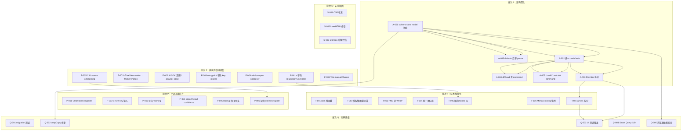

# ChartDB 全方位评估与后续优化手册

> 版本：v1.1（2026-07-03 修订：F-001 拆分、F-002 重定义、F-003 状态修正、A-001 解耦、批次 F 风险定性调整）
> 日期：2026-07-03
> 本地路径：`/Users/lynn/SynologyDrive/SynologyDrive/Code/ChartDB`
> 重构仓库：`https://github.com/Lynn-Lee/ChartDB`
> 依据文档：`docs/ChartDB自动开发任务计划.md`、`docs/ChartDB重构优化产品设计与研发计划.md`、`docs/ChartDB重构优化工程实施计划.md`
> 文档定位：Phase 0-8 重构完成后的全方位深度评估结果与后续优化任务编排手册。给后续自动开发 agent、dispatcher、reviewer 使用。

## 1. 文档背景

ChartDB 已完成 Phase 0 到 Phase 8 的首轮重构，共 42 个任务全部 `done`。本轮评估从**架构设计、安全漏洞、产品设计、技术栈与代码质量**四个维度对重构后的代码库进行了深度审查。

评估结论：重构方向正确，安全基线扎实（无 Critical/High 安全漏洞），分层意图清晰。但处于**重构进行中**的状态——架构边界有虚假层、Provider 未拆分、依赖冗余严重、部分功能为空壳。本手册把发现的问题转换为可自动派发、可验证、可回滚的任务队列。

## 2. 评估总览

### 2.1 健康方面（无需修复）

| 维度 | 评估 |
|------|------|
| 安全基线 | ✅ 无 Critical/High 安全漏洞；API key 不暴露；Markdown 无 XSS；CSP/安全头已配置 |
| OSS Core 边界 | ✅ 无登录/注册代码；无云端上传；AI 默认禁用；Phase 8 预研保持隔离 |
| TypeScript 严格性 | ✅ strict + noUnusedLocals + noUnusedParameters + noFallthroughCasesInSwitch |
| @ts-ignore 使用 | ✅ 仅 8 处，全部有文档注释 |
| any 类型 | ✅ 仅 6 处，都在 AST 解析和工具函数中 |
| ESLint 配置 | ✅ 全面（typescript-eslint + react-hooks + jsx-a11y + tailwindcss） |
| Storage 三层架构 | ✅ db → repositories → transactions 依赖方向干净 |
| Backup 格式 | ✅ 版本化 + Zod 校验 + diagramCount 防篡改 |
| Worker 通信协议 | ✅ 统一 envelope/response，fallback 可靠 |
| Command 纯函数设计 | ✅ apply* 函数无副作用 |
| 路由级代码分割 | ✅ React.lazy() 已用于路由和 Monaco 编辑器组件 |

### 2.2 问题统计

| 严重程度 | 数量 | 分布 |
|----------|------|------|
| Critical | 5 | 架构 2 + 技术栈 2 + 产品 1 |
| High | 8 | 架构 4 + 产品 5 + 技术栈 3（有交叉） |
| Medium | 12 | 安全 4 + 架构 4 + 产品 4 |
| Low | 10 | 架构 4 + 安全 4 + 产品 5（有交叉） |

## 3. 问题清单（按严重程度排序）

### 3.1 Critical 问题

| ID | 问题 | 维度 | 文件位置 |
|----|------|------|----------|
| C1 | `schema-core/model/` 是空壳重导出，真实模型在 `lib/domain/` | 架构 | `src/schema-core/model/*.ts` |
| C2 | `commandHistory` 数据从未被 undo/redo 使用，是死代码 | 架构 | `chartdb-provider.tsx` → `history-provider.tsx` |
| C3 | 三个未使用依赖直接打入 bundle（6+ MB 浪费） | 技术栈 | `package.json` — `@ai-sdk/openai`、`ai`、`motion`、`@uidotdev/usehooks` |
| C4 | 构建产物 83 MB，无 manualChunks 优化 | 技术栈 | `vite.config.ts` |
| C5 | ClickHouse 在 onboarding 中作为一等选项，但 DDL 导入会直接报错 | 产品 | `onboarding-dialog.tsx:38-45` → `sql-import/index.ts:224` |

### 3.2 High 问题

| ID | 问题 | 维度 | 文件位置 |
|----|------|------|----------|
| H1 | ChartDBProvider 是 2863 行 God Object | 架构 | `src/context/chartdb-context/chartdb-provider.tsx` |
| H2 | Diff 合并和 loadDiagram 绕过 Command 系统直接写 State | 架构 | `chartdb-provider.tsx:122-140`、`:2444-2484` |
| H3 | `dialects/` 层是薄封装，实际解析逻辑仍在 `lib/data/sql-import/` | 架构 | `src/dialects/*/importer.ts` → `@/lib/data/sql-import/*` |
| H4 | "Clear local diagrams" 按钮是空壳 | 产品 | `src/features/settings/privacy-settings.tsx:132-152` |
| H5 | BYOK session key 在设置中无输入入口 | 产品 | `privacy-settings.tsx:61-76`、`ai-mode.ts:36-40` |
| H6 | Oracle/ClickHouse/CockroachDB 导出静默走 PostgreSQL 格式 | 产品 | `export-sql-script.ts:172-186` |
| H7 | 50 个模板数据文件全部静态打包（~73,000 行） | 技术栈 | `src/templates-data/templates/*.ts` |
| H8 | i18n 22 种语言全部静态打包 | 技术栈 | `src/i18n/i18n.ts` |

### 3.3 Medium 问题

| ID | 问题 | 维度 | 文件位置 |
|----|------|------|----------|
| M1 | `entrypoint.sh` 仍将 `OPENAI_API_KEY` 列入 envsubst 白名单 | 安全 | `entrypoint.sh:4` |
| M2 | `window.open()` 6 处缺少 `noopener` 防护 | 安全 | `menu.tsx`、`editor-sidebar.tsx`、`star-us-dialog.tsx` |
| M3 | CSP `connect-src 'self' http: https:` 过于宽松 | 安全 | `default.conf.template:19` |
| M4 | `monaco-editor → dompurify@3.3.1` 多个 XSS 绕过 advisory | 安全 | 间接依赖 |
| M5 | `checkConstraint` 操作完全没有 Command 对应 | 架构 | `chartdb-provider.tsx:1345-1570` |
| M6 | `lib/utils` 工具函数依赖浏览器 API | 架构 | `lib/utils/utils.ts:17-43` |
| M7 | ImportResult 缺少 `confidence` 和 `diagnostics` 字段 | 产品 | `dialects/common/importer.ts` vs 产品文档 |
| M8 | Backup 恢复不展示 diagram 摘要预览 | 产品 | `storage/backup/backup-format.ts` |
| M9 | CockroachDB 和 ClickHouse 无 dialect wrapper | 产品 | `src/dialects/` 缺少两个目录 |
| M10 | Monaco config.ts 中 `import * as monaco` 是静态导入 | 技术栈 | `code-snippet/config.ts` |
| M11 | 三个 hooks 库并存，仅用 4 个 API | 技术栈 | `package.json` — `ahooks`、`react-use`、`@uidotdev/usehooks` |
| M12 | Vite 无 manualChunks，大型依赖未分离 | 技术栈 | `vite.config.ts` |

### 3.4 Low 问题

| ID | 问题 | 维度 | 文件位置 |
|----|------|------|----------|
| L1 | Dexie schema 版本迁移路径无测试覆盖 | 架构 | `storage/db/schema-versions.ts` |
| L2 | `deepCopy` 用 JSON 序列化丢失 Date 类型 | 架构 | `lib/utils/utils.ts:45` |
| L3 | `export-image-provider.tsx` 原始 innerHTML 赋值 | 安全 | `export-image-provider.tsx:158` |
| L4 | SQL export 缓存显式使用 localStorage | 安全 | `sql-export/export-sql-cache.ts` |
| L5 | 两套图标库并存 | 技术栈 | `@radix-ui/react-icons` + `lucide-react` |
| L6 | 模板缩略图 PNG 过大（~50MB），无 WebP 转换 | 技术栈 | `src/assets/templates/*.png` |
| L7 | `canvas.tsx` 1908 行，第二大组件 | 技术栈 | `src/pages/editor-page/canvas/canvas.tsx` |
| L8 | Smart Query wizard 关键安全提示未纳入 i18n | 产品 | `smart-query-instructions.tsx:82-112` |
| L9 | 测试覆盖率 20.6%，核心 UI 逻辑无测试 | 质量 | 139 测试 / 673 文件 |
| L10 | `updateTablesState` 的 `forceOverride` 是危险通配操作 | 架构 | `chartdb-provider.tsx:679-810` |

## 4. 任务卡

以下任务按批次组织，每个任务卡包含完整的文件范围、修复指引、验收命令和依赖关系。

### 批次 F：低风险快速修复

目标：移除未使用依赖、消除安全隐患、修复用户可见的功能断裂。其中 F-003 已完成、F-004 真正低风险可立即执行；F-001/F-002/F-006 涉及依赖树或构建产物，需在验证门禁下谨慎执行。

> 修订说明（2026-07-03）：原手册将本批次标为「零风险高收益」并声称 `motion` 在 `src/` 中零引用。经核对，`src/components/tree-view/tree-view.tsx:8` 直接 `import { motion, AnimatePresence } from 'framer-motion'`，而 `framer-motion` 是 `motion` 的传递依赖，直接删除 `motion` 会导致构建报错。同时 `src/` 中无任何 `ai` / `@ai-sdk/openai` 静态 import，F-002「改为动态 import」的标题不成立。本批次任务卡已据此拆分和重定义。

#### CHARTDB-F-001a：移除真正零引用的 @uidotdev/usehooks

```yaml
id: CHARTDB-F-001a
batch: 批次 F
type: CODE
priority: P0
title: 移除 @uidotdev/usehooks 依赖
status: queued
depends_on: []
owner_lane: tech-debt
branch: codex/chartdb-f-remove-usehooks
allowed_files:
    - package.json
    - package-lock.json
entry_context:
    - @uidotdev/usehooks (52KB) 在 src/ 中零引用（rg 确认无任何 import）
    - 注意：motion 不可在本任务删除，见 F-001b
implementation_contract:
    - 从 package.json dependencies 中仅删除 @uidotdev/usehooks
    - 运行 npm install 更新 lockfile
    - 确认无 import 报错
verification:
    - npm run lint
    - npm run test:ci
    - npm run build
    - rg -n "@uidotdev/usehooks" src package.json
acceptance:
    - package.json 不再包含 @uidotdev/usehooks
    - build 产物体积下降
    - 无任何 import 报错
```

#### CHARTDB-F-001b：处理 TreeView 动画依赖（motion → framer-motion）

```yaml
id: CHARTDB-F-001b
batch: 批次 F
type: CODE
priority: P0
title: 将 TreeView 动画依赖从 motion 切换为显式 framer-motion
status: queued
depends_on: []
owner_lane: tech-debt
branch: codex/chartdb-f-treeview-motion
allowed_files:
    - package.json
    - package-lock.json
    - src/components/tree-view/tree-view.tsx
entry_context:
    - src/components/tree-view/tree-view.tsx:8 直接 import { motion, AnimatePresence } from 'framer-motion'
    - package.json 只声明 "motion": "^12.23.6"，framer-motion 是 motion 的传递依赖
    - 直接删除 motion 会导致 framer-motion 解析失败、构建报错
    - TreeView 动画逻辑已成型，改 CSS/Radix 会扩大切片范围
implementation_contract:
    - 在 package.json 中将 motion 替换为显式 framer-motion（同版本约束）
    - 运行 npm install 更新 lockfile
    - 确认 tree-view.tsx 的 import 仍可解析（framer-motion 现为直接依赖）
    - 不修改 TreeView 动画实现，仅修正依赖声明
verification:
    - npm run lint
    - npm run test:ci
    - npm run build
    - rg -n "\"motion\"" package.json
    - rg -n "framer-motion" package.json src/components/tree-view/tree-view.tsx
acceptance:
    - package.json 不再包含 motion，改为显式 framer-motion
    - tree-view.tsx 动画行为不变
    - build 通过，无运行时错误
```

#### CHARTDB-F-002：移除未使用 AI SDK 依赖或做 AI adapter spike

```yaml
id: CHARTDB-F-002
batch: 批次 F
type: CODE
priority: P0
title: 移除未使用的 @ai-sdk/openai 和 ai 依赖，或做 AI adapter spike 预留加载路径
status: queued
depends_on: []
owner_lane: tech-debt
branch: codex/chartdb-f-ai-sdk-cleanup
allowed_files:
    - src/lib/ai/**
    - src/lib/data/sql-export/**
    - package.json
    - package-lock.json
entry_context:
    - src/ 中无任何 from 'ai' / from '@ai-sdk/openai' 静态 import（rg 确认）
    - export-sql-script.ts:19,756 只调用本地 buildAIExportRequest（来自 @/lib/ai/ai-mode），未静态加载 SDK
    - 原手册「改为动态 import」的标题不成立——根本没有静态 import 可改
    - 阶段验收记录 P0-002 已明确：AI SDK 依赖链保留 low advisory，避免破坏性迁移
implementation_contract:
    - 方案 A（推荐，最小切片）：从 package.json 删除 @ai-sdk/openai 和 ai，运行 npm install，确认 build/test 通过
    - 方案 B（若后续要启用 AI）：保留依赖，在 ai-mode.ts 中新增 adapter spike（接口 + 动态 import 占位），但不恢复真实模型调用
    - 无论选哪个方案，AI 默认禁用行为不变，不发送 schema 内容
    - 若选方案 A，需同步更新阶段验收记录中 P0-002 的 advisory 结论
verification:
    - npm run lint
    - npm run test:ci
    - npm run build
    - npm run build 后检查 dist 中是否仍包含 AI SDK chunk
acceptance:
    - AI SDK 不进入首屏 bundle
    - AI 默认禁用行为不变
    - 若选方案 A：package.json 不再包含 @ai-sdk/openai 和 ai
    - 若选方案 B：AI SDK 在独立 chunk 或完全不在 bundle 中，adapter 接口有测试
```

#### CHARTDB-F-003：entrypoint.sh 移除 OPENAI_API_KEY

```yaml
id: CHARTDB-F-003
batch: 批次 F
type: CODE
priority: P0
title: 从 entrypoint.sh 的 envsubst 白名单中移除 OPENAI_API_KEY
status: done
depends_on: []
owner_lane: security
branch: codex/chartdb-f-entrypoint-key
allowed_files:
    - entrypoint.sh
    - src/lib/security/__tests__/browser-key-exposure.test.ts
entry_context:
    - entrypoint.sh:4 将 ${OPENAI_API_KEY} 列入 envsubst 替换白名单
    - 虽然 default.conf.template 当前不输出该变量，但白名单存在意味着未来模板修改会直接暴露密钥
implementation_contract:
    - 从 entrypoint.sh 的 envsubst 变量列表中删除 ${OPENAI_API_KEY}
    - 保留 ${OPENAI_API_ENDPOINT}、${LLM_MODEL_NAME}、${HIDE_CHARTDB_CLOUD}、${DISABLE_ANALYTICS}
    - 在 browser-key-exposure.test.ts 中增加断言，确保 entrypoint.sh 不包含 OPENAI_API_KEY
verification:
    - npm run test:ci -- src/lib/security/__tests__/browser-key-exposure.test.ts
    - rg -n "OPENAI_API_KEY" entrypoint.sh
acceptance:
    - entrypoint.sh 不包含 OPENAI_API_KEY
    - 安全测试通过
completion:
    - 已从 entrypoint.sh 的 envsubst 白名单中移除 ${OPENAI_API_KEY}。
    - 已在 browser-key-exposure.test.ts 中增加 entrypoint.sh 断言，防止运行时配置白名单重新暴露 OpenAI API key。
    - 红灯验证确认旧白名单会失败；绿灯验证和完整门禁通过。
```

#### CHARTDB-F-004：window.open 添加 noopener 防护

```yaml
id: CHARTDB-F-004
batch: 批次 F
type: CODE
priority: P0
title: 为所有 window.open 调用添加 noopener noreferrer
status: queued
depends_on: []
owner_lane: security
branch: codex/chartdb-f-window-open-noopener
allowed_files:
    - src/lib/utils/utils.ts
    - src/pages/editor-page/top-navbar/menu/menu.tsx
    - src/pages/editor-page/editor-sidebar/editor-sidebar.tsx
    - src/dialogs/star-us-dialog/star-us-dialog.tsx
    - src/**/*.test.ts
entry_context:
    - 6 处 window.open(url, '_blank') 调用缺少 noopener noreferrer
    - 位置：menu.tsx:104,108、editor-sidebar.tsx:153,160,169、star-us-dialog.tsx:32
    - 存在反向 Tabnabbing 风险
implementation_contract:
    - 在 src/lib/utils/utils.ts 中新增 safeOpenUrl(url: string) 工具函数
    - 函数实现：window.open(url, '_blank', 'noopener,noreferrer')
    - 将 6 处 window.open 调用替换为 safeOpenUrl
    - 新增 safeOpenUrl 单元测试
verification:
    - npm run lint
    - npm run test:ci
    - npm run build
    - rg -n "window\.open\(" src | rg -v "noopener"
acceptance:
    - 全项目无缺少 noopener 的 window.open 调用
    - safeOpenUrl 有测试覆盖
```

#### CHARTDB-F-005：ClickHouse 从 onboarding 移除或标注

```yaml
id: CHARTDB-F-005
batch: 批次 F
type: CODE
priority: P0
title: 从 onboarding 数据库选项中移除 ClickHouse 或标注为 Smart Query only
status: queued
depends_on: []
owner_lane: product
branch: codex/chartdb-f-clickhouse-onboarding
allowed_files:
    - src/features/onboarding/onboarding-dialog.tsx
    - src/features/onboarding/__tests__/**
    - src/i18n/locales/zh_CN.ts
    - src/i18n/locales/en.ts
entry_context:
    - onboarding-dialog.tsx:38-45 将 ClickHouse 列为六大数据库选项之一
    - 但 sql-import/index.ts:224 对 clickhouse 抛出 Unsupported database type 错误
    - src/dialects/ 下无 clickhouse 目录
    - 用户选 ClickHouse → 导入 DDL → 技术错误，体验断裂
implementation_contract:
    - 方案 A（推荐）：从 DATABASE_OPTIONS 中移除 ClickHouse
    - 方案 B：保留但标注 "Smart Query only" 徽章，点击后引导到 Smart Query 路径而非 DDL 导入
    - 新增测试覆盖 onboarding 数据库选项与实际导入能力的一致性
verification:
    - npm run lint
    - npm run test:ci
    - npm run build
acceptance:
    - onboarding 不会引导用户进入会报错的 ClickHouse DDL 导入路径
    - 数据库选项与实际导入能力一致
```

#### CHARTDB-F-006：添加 Vite manualChunks 配置

```yaml
id: CHARTDB-F-006
batch: 批次 F
type: CODE
priority: P0
title: 为 Vite 构建添加 manualChunks 分离大型依赖
status: queued
depends_on: []
owner_lane: performance
branch: codex/chartdb-f-vite-manual-chunks
allowed_files:
    - vite.config.ts
entry_context:
    - vite.config.ts 的 build.rollupOptions 无 manualChunks 配置
    - editor-page chunk 11.5MB、code-editor 3.8MB、index 2.6MB
    - Monaco、node-sql-parser、@dbml/core 等大型依赖与业务代码混在一起
implementation_contract:
    - 在 vite.config.ts 的 build.rollupOptions.output 中添加 manualChunks
    - 分离策略：
      vendor-react: ['react', 'react-dom', 'react-router-dom']
      vendor-monaco: ['monaco-editor', '@monaco-editor/react']
      vendor-sql-parser: ['node-sql-parser']
      vendor-dbml: ['@dbml/core', '@dbml/parse']
      vendor-ui: ['@radix-ui/*', 'lucide-react']
      vendor-xyflow: ['@xyflow/react']
      vendor-i18n: ['i18next', 'react-i18next']
    - 确保不破坏现有的 assetFileNames 和 external 配置
verification:
    - npm run build
    - 检查 dist/assets/ 下 chunk 分离情况
acceptance:
    - 大型 vendor 依赖分离到独立 chunk
    - editor-page chunk 体积显著下降
    - build 通过，无运行时错误
```

### 批次 A：架构深化

目标：让 schema-core 真正独立、统一 undo/redo、拆分 God Object、补齐 command 覆盖。这些任务有严格的依赖顺序。

#### CHARTDB-A-001：schema-core model 真正独立

```yaml
id: CHARTDB-A-001
batch: 批次 A
type: CODE
priority: P0
title: 将领域模型从 lib/domain 迁移到 schema-core/model
status: queued
depends_on: []
owner_lane: core
branch: codex/chartdb-a-schema-core-model
allowed_files:
    - src/schema-core/model/**
    - src/lib/domain/**
    - src/types/**
    - tsconfig.json
    - src/schema-core/model/__tests__/**
entry_context:
    - src/schema-core/model/*.ts 全部是 export * from '@/lib/domain/xxx' 的单行重导出
    - 真实模型定义在 src/lib/domain/，schema-core 只是别名
    - 文档声称 schema-core 独立于 React、Dexie、Monaco、DOM，但通过 lib/domain → lib/utils 有间接浏览器依赖
implementation_contract:
    - 将 src/lib/domain/ 下的类型定义和纯函数迁移到 src/schema-core/model/ 对应文件
    - 保留 src/lib/domain/ 作为兼容 re-export 层（export * from '@/schema-core/model/xxx'）
    - 确保迁移后 schema-core/model/ 不依赖 React、Dexie、Monaco、DOM、window、localStorage
    - 更新 model-exports.test.ts 验证新位置的可解析性和依赖纯净性
    - 不修改业务行为，只移动代码位置
verification:
    - npm run lint
    - npm run test:ci
    - npm run build
    - rg -n "from 'react'|from 'dexie'|from 'monaco|window\.|localStorage" src/schema-core/model/
acceptance:
    - schema-core/model/ 包含真实模型定义，不再是空壳
    - schema-core/model/ 不依赖 React、Dexie、Monaco、DOM
    - 旧 import 路径通过 re-export 兼容
    - 无业务行为变化
```

#### CHARTDB-A-002：统一 undo/redo 到 Command 驱动

```yaml
id: CHARTDB-A-002
batch: 批次 A
type: CODE
priority: P1
title: 让 history-provider 实际使用 commandHistory 驱动 undo/redo
status: queued
depends_on:
    - CHARTDB-A-001
owner_lane: core
branch: codex/chartdb-a-command-history-unify
allowed_files:
    - src/schema-core/commands/**
    - src/context/history-context/**
    - src/context/chartdb-context/chartdb-provider.tsx
    - src/schema-core/commands/__tests__/**
entry_context:
    - chartdb-provider.tsx 有 48 处构建 commandHistory，但 history-provider.tsx 0 处读取
    - 两套 undo/redo 并存：旧的 RedoUndoAction 手写 handler 矩阵（287 行）+ 新的 CommandHistoryEntry（死代码）
    - 每个新增操作需要在两处添加代码，容易不同步
implementation_contract:
    - 让 history-provider 的 undo/redo 优先使用 commandHistory batch
    - commandHistory 存在时，通过 replay command 的 redo/undo command 来驱动状态变更
    - commandHistory 不存在时，fallback 到旧的 redoData/undoData handler
    - 逐步迁移：先支持 commandHistory 驱动，再逐步删除旧 handler
    - 本轮不要求一次性删除所有旧 handler，先让 commandHistory 成为权威路径
verification:
    - npm run test:ci
    - npm run build
acceptance:
    - history-provider 能读取并执行 commandHistory batch
    - undo/redo 通过 command 驱动时行为与旧 handler 一致
    - 旧 handler 作为 fallback 保留
```

#### CHARTDB-A-003：ChartDBProvider 拆分

```yaml
id: CHARTDB-A-003
batch: 批次 A
type: CODE
priority: P1
title: 将 ChartDBProvider 拆分为多个领域 hook
status: queued
depends_on:
    - CHARTDB-A-002
owner_lane: core
branch: codex/chartdb-a-provider-split
allowed_files:
    - src/context/chartdb-context/**
    - src/hooks/**
    - src/context/chartdb-context/__tests__/**
entry_context:
    - chartdb-provider.tsx 2863 行，94 个 useCallback，50+ useState
    - 处理 Table / Field / Index / Relationship / Dependency / Area / Note / CustomType / CheckConstraint 共 9 种实体 CRUD
    - 依赖数组极复杂，闭包过期 bug 易漏过 review
implementation_contract:
    - 按域拆分为独立 hook：
      useTableOperations、useFieldOperations、useRelationshipOperations
      useAreaOperations、useNoteOperations、useCustomTypeOperations
      useCheckConstraintOperations、useDependencyOperations
    - 各 hook 共享 commandContext 和 state setter
    - Provider 组件只负责组装 hook 和提供 context value
    - 目标：Provider 主体降到 800 行以内
    - 保持对外 API 不变，消费方无需修改
verification:
    - npm run lint
    - npm run test:ci
    - npm run build
acceptance:
    - chartdb-provider.tsx 主体不超过 800 行
    - 各领域操作在独立 hook 中
    - 对外 context API 不变
    - 无行为回归
```

#### CHARTDB-A-004：diff 合并和 loadDiagram 走 Command 管道

```yaml
id: CHARTDB-A-004
batch: 批次 A
type: CODE
priority: P1
title: diff 合并和 loadDiagram 不再绕过 Command 系统
status: queued
depends_on:
    - CHARTDB-A-002
owner_lane: core
branch: codex/chartdb-a-diff-load-command
allowed_files:
    - src/context/chartdb-context/**
    - src/schema-core/commands/**
    - src/schema-core/commands/__tests__/**
entry_context:
    - chartdb-provider.tsx:122-140 diffCalculatedHandler 直接 setTables/setRelationships/setAreas 绕过 command
    - chartdb-provider.tsx:2444-2484 loadDiagramFromData 用 9 个 setXxx 直接写状态
    - 这些变更不进 undo stack，无 validation，出错无法回滚
implementation_contract:
    - diff 合并：为每个 diff 新增的 table/field/area 创建对应 AddCommand 并执行
    - loadDiagram：创建 ReplaceDiagramCommand 来原子化整个加载
    - 或将 loadDiagram 视为特殊 "reset" 操作，明确标记不进 undo stack 但有 validation
    - 新增 command 测试覆盖 diff 合并和 load 路径
verification:
    - npm run test:ci
    - npm run build
acceptance:
    - diff 合并的变更经过 command 管道
    - loadDiagram 有 validation 或走 command
    - 出错时状态不会处于不一致的中间态
```

#### CHARTDB-A-005：checkConstraint 补齐 Command

```yaml
id: CHARTDB-A-005
batch: 批次 A
type: CODE
priority: P2
title: 为 checkConstraint 操作创建 command
status: queued
depends_on:
    - CHARTDB-A-002
owner_lane: core
branch: codex/chartdb-a-check-constraint-commands
allowed_files:
    - src/schema-core/commands/**
    - src/context/chartdb-context/**
    - src/schema-core/commands/__tests__/**
entry_context:
    - addCheckConstraint、removeCheckConstraint、updateCheckConstraint 直接 setTables 修改 state
    - src/schema-core/commands/ 无 check-constraint 相关 command
    - 其他 8 种实体都有完整 command，唯独 checkConstraint 缺失
implementation_contract:
    - 新增 src/schema-core/commands/check-constraint-commands.ts
    - 定义 check_constraint.add、check_constraint.update、check_constraint.delete command
    - 新增 apply-check-constraint-command.ts 纯函数
    - 包含 validation：重复 ID 检查、父表存在检查
    - ChartDBProvider 的 checkConstraint 入口接入 command
    - 新增测试覆盖 add/update/delete 和 validation error
verification:
    - npm run test:ci
    - npm run build
acceptance:
    - checkConstraint 增删改走 command
    - 有重复 ID 和父表存在 validation
    - undo/redo 可用
```

#### CHARTDB-A-006：dialects 层迁移 parser 逻辑

```yaml
id: CHARTDB-A-006
batch: 批次 A
type: CODE
priority: P2
title: 将 SQL parser 逻辑从 lib/data/sql-import 迁移到 dialects 子包
status: queued
depends_on:
    - CHARTDB-A-001
owner_lane: dialect
branch: codex/chartdb-a-dialect-parser-migration
allowed_files:
    - src/dialects/**
    - src/lib/data/sql-import/**
    - src/dialects/__tests__/**
entry_context:
    - 所有 src/dialects/*/importer.ts 直接调用 @/lib/data/sql-import/dialect-importers/*
    - dialects 层只添加了 DialectCapabilities 元数据和 warnings 提取
    - lib/data/sql-import/ 有 89 个文件，两处维护解析代码
implementation_contract:
    - 将各方言的 parser 核心逻辑迁移到 src/dialects/<dialect>/parser/ 目录
    - lib/data/sql-import/ 逐步变为 deprecated 层，保留 re-export 兼容
    - 按方言分批迁移：PostgreSQL → MySQL → SQLite → SQL Server → Oracle → MariaDB
    - 每个方言迁移后运行该方言的 regression 测试
    - 本轮可只迁移 PostgreSQL 作为模板，其余方言后续按相同模式迁移
verification:
    - npm run test:ci
    - npm run build
acceptance:
    - 至少 PostgreSQL parser 逻辑迁移到 src/dialects/postgresql/parser/
    - 旧路径通过 re-export 兼容
    - regression 测试通过
```

### 批次 P：产品功能补齐

目标：修复空壳功能、补齐缺失入口、完善 warning 和 preview。这些任务互相独立，可并行执行。

#### CHARTDB-P-001：实现 Clear local diagrams 功能

```yaml
id: CHARTDB-P-001
batch: 批次 P
type: CODE
priority: P1
title: 实现设置中心的清除本地数据功能
status: queued
depends_on: []
owner_lane: product
branch: codex/chartdb-p-clear-local-diagrams
allowed_files:
    - src/features/settings/**
    - src/context/storage-context/**
    - src/storage/repositories/**
    - src/features/settings/__tests__/**
entry_context:
    - privacy-settings.tsx:132-152 的 "Clear local diagrams" 按钮点击只显示 Alert
    - 不执行任何删除操作，按钮形同虚设
    - 用户期望能清除本地数据
implementation_contract:
    - 在 StorageProvider 或 repository 中新增 clearAllDiagrams() 方法
    - 使用 DiagramTransactionService 批量删除所有 diagram 及其子实体
    - 按钮点击后显示确认对话框（二次确认）
    - 确认后执行删除，显示进度和结果
    - 删除完成后刷新 diagram 列表
    - 新增测试覆盖删除流程
verification:
    - npm run lint
    - npm run test:ci
    - npm run build
acceptance:
    - 按钮点击后执行实际删除
    - 有二次确认
    - 删除后 diagram 列表刷新
    - 删除失败有错误提示
```

#### CHARTDB-P-002：BYOK key 输入入口

```yaml
id: CHARTDB-P-002
batch: 批次 P
type: CODE
priority: P1
title: 在设置中心或 SQL 导出对话框中添加 BYOK key 输入入口
status: queued
depends_on: []
owner_lane: product
branch: codex/chartdb-p-byok-key-input
allowed_files:
    - src/features/settings/**
    - src/lib/ai/**
    - src/lib/ai/__tests__/**
    - src/features/settings/__tests__/**
entry_context:
    - privacy-settings.tsx:61-76 选择 BYOK Session 模式后只显示 Alert，无 key 输入框
    - setBYOKSessionKey() 在 ai-mode.ts:36 已实现但无 UI 调用
    - 用户切到 BYOK 模式后找不到输入 key 的地方
implementation_contract:
    - 在隐私设置中选择 BYOK Session 模式时，显示 key 输入框
    - 输入框类型为 password，有明确的安全提示
    - 输入的 key 通过 setBYOKSessionKey() 仅保存在内存 session
    - 不写入 localStorage、sessionStorage、IndexedDB
    - 页面刷新后 key 清除，需重新输入
    - 新增测试覆盖 key 输入、清除和不持久化
verification:
    - npm run lint
    - npm run test:ci
    - npm run build
    - rg -n "localStorage.*OPENAI|indexedDB.*OPENAI|sessionStorage.*OPENAI" src
acceptance:
    - BYOK 模式下有 key 输入入口
    - key 仅在内存 session
    - 不持久化到任何存储
```

#### CHARTDB-P-003：Oracle/ClickHouse 导出 warning

```yaml
id: CHARTDB-P-003
batch: 批次 P
type: CODE
priority: P1
title: 不支持的方言导出时输出明确 warning 而非静默降级
status: queued
depends_on: []
owner_lane: product
branch: codex/chartdb-p-export-warning
allowed_files:
    - src/lib/data/sql-export/export-sql-script.ts
    - src/lib/data/sql-export/__tests__/**
entry_context:
    - export-sql-script.ts:172-186 的 default 分支让 Oracle/ClickHouse/CockroachDB 静默走 PostgreSQL 格式
    - 用户得到无效 Oracle DDL，无任何 warning
    - docs/方言能力矩阵.md 正确标注 Oracle export 为 unsupported，但代码未实现 warning
implementation_contract:
    - 在 exportBaseSQL 的 default 分支前加入 Oracle/ClickHouse/CockroachDB 检查
    - 不支持的组合返回 ExportResult，riskLevel 不低于 medium
    - warnings 包含明确的 code、severity 和说明
    - 输出 SQL 中包含注释说明使用了 PostgreSQL fallback 格式
verification:
    - npm run test:ci
    - npm run build
acceptance:
    - Oracle/ClickHouse/CockroachDB 导出有明确 warning
    - 输出 SQL 包含 fallback 格式注释
    - 不静默降级
```

#### CHARTDB-P-004：ImportResult 补充 confidence 字段

```yaml
id: CHARTDB-P-004
batch: 批次 P
type: CODE
priority: P2
title: 为 ImportResult 补充 confidence 和 diagnostics 字段
status: queued
depends_on: []
owner_lane: product
branch: codex/chartdb-p-import-confidence
allowed_files:
    - src/dialects/common/importer.ts
    - src/dialects/common/exporter.ts
    - src/features/import/import-preview.ts
    - src/features/import/import-preview-panel.tsx
    - src/dialects/__tests__/**
entry_context:
    - 产品设计文档定义 ImportResult 应包含 confidence: 'high'|'medium'|'low' 和 diagnostics
    - 实际 src/dialects/common/importer.ts 的 ImportResult 缺少这两个字段
    - preview panel 不展示可信度等级
implementation_contract:
    - 在 ImportResult 中补充 confidence 字段（可选，默认 'medium'）
    - 在 ImportResult 中补充 diagnostics 字段（可选 Diagnostic[]）
    - 各 dialect wrapper 根据解析质量设置 confidence
    - import-preview-panel.tsx 展示 confidence 等级
verification:
    - npm run test:ci
    - npm run build
acceptance:
    - ImportResult 包含 confidence 和 diagnostics 字段
    - preview panel 展示可信度
    - 旧 wrapper 默认 confidence 为 medium
```

#### CHARTDB-P-005：Backup 恢复预览

```yaml
id: CHARTDB-P-005
batch: 批次 P
type: CODE
priority: P2
title: 恢复 backup 前展示 diagram 摘要预览
status: queued
depends_on: []
owner_lane: product
branch: codex/chartdb-p-backup-preview
allowed_files:
    - src/storage/backup/**
    - src/features/settings/**
    - src/lib/export-import-utils.ts
    - src/storage/backup/__tests__/**
entry_context:
    - 当前恢复流程直接导入，用户无法在确认前查看将恢复的内容
    - docs/ChartDB重构优化工程实施计划.md:1059 标注 "恢复前展示 diagram 摘要" 为未完成
implementation_contract:
    - 新增 parseBackupSummary() 函数，只解析 backup metadata 和 diagram 摘要
    - 摘要包含：diagram count、各 diagram 的名称、table count、relationship count
    - 在设置中心的恢复入口，先展示摘要预览
    - 用户确认后才执行完整恢复
    - 参考 import preview 模式
verification:
    - npm run test:ci
    - npm run build
acceptance:
    - 恢复前展示 diagram 摘要
    - 用户确认后才执行恢复
    - 不兼容文件有明确错误
```

#### CHARTDB-P-006：CockroachDB 和 ClickHouse dialect wrapper

```yaml
id: CHARTDB-P-006
batch: 批次 P
type: CODE
priority: P2
title: 补充 CockroachDB 和 ClickHouse dialect wrapper
status: queued
depends_on:
    - CHARTDB-F-005
owner_lane: dialect
branch: codex/chartdb-p-missing-dialect-wrappers
allowed_files:
    - src/dialects/cockroachdb/**
    - src/dialects/clickhouse/**
    - src/dialects/__tests__/**
entry_context:
    - src/dialects/ 只有 7 个目录，缺少 cockroachdb 和 clickhouse
    - CockroachDB 在旧导入器中走 PostgreSQL fallback，但无 wrapper 输出 capabilities
    - ClickHouse DDL 导入完全不支持
    - docs/方言能力矩阵.md 记录了这两个方言但代码无对应 wrapper
implementation_contract:
    - 新增 src/dialects/cockroachdb/，复用 PostgreSQL parser，声明 experimental + fallback
    - 新增 src/dialects/clickhouse/，声明 DDL import unsupported，Smart Query only
    - 两者都输出 capabilities metadata 和 fallback warning
    - 新增测试覆盖 wrapper 和 warning
verification:
    - npm run test:ci
    - npm run build
acceptance:
    - src/dialects/ 包含 cockroachdb 和 clickhouse 目录
    - 两者有 capabilities 声明
    - fallback 或 unsupported 有明确 warning
```

### 批次 S：安全加固

目标：收紧 CSP、修复 innerHTML、评估 Monaco 升级。这些任务互相独立。

#### CHARTDB-S-001：CSP connect-src 收紧

```yaml
id: CHARTDB-S-001
batch: 批次 S
type: CODE
priority: P1
title: 收紧 CSP connect-src 策略
status: queued
depends_on: []
owner_lane: security
branch: codex/chartdb-s-csp-connect-src
allowed_files:
    - default.conf.template
    - src/lib/security/__tests__/nginx-security-headers.test.ts
    - docs/部署与安全配置.md
entry_context:
    - default.conf.template:19 的 connect-src 为 'self' http: https:
    - 允许向任意 HTTP/HTTPS 端点发起连接
    - 如果出现 XSS，攻击者可 exfiltrate 数据到任意域名
implementation_contract:
    - 将 connect-src 收紧为 'self' 加用户配置的 Gateway endpoint
    - 方案 A：通过 /config.js 动态设置 CSP（需要 Nginx 支持）
    - 方案 B：使用 Content-Security-Policy-Report-Only 过渡，先收集违规报告
    - 方案 C（最小改动）：connect-src 'self' https:（移除 http:，至少要求 HTTPS）
    - 更新安全测试
    - 更新部署文档说明 CSP 调整
verification:
    - npm run test:ci -- src/lib/security/__tests__/nginx-security-headers.test.ts
    - npm run build
acceptance:
    - connect-src 不再允许任意 http: 连接
    - 安全测试通过
    - 部署文档更新
```

#### CHARTDB-S-002：export-image-provider innerHTML 修复

```yaml
id: CHARTDB-S-002
batch: 批次 S
type: CODE
priority: P2
title: 用 DOM API 替换 export-image-provider 中的 innerHTML 赋值
status: queued
depends_on: []
owner_lane: security
branch: codex/chartdb-s-inner-html-fix
allowed_files:
    - src/context/export-image-context/export-image-provider.tsx
    - src/context/export-image-context/__tests__/**
entry_context:
    - export-image-provider.tsx:158 使用 defs.innerHTML = markerDefs.innerHTML
    - 虽然源元素是页面内已知 SVG，不是用户输入，但 innerHTML 是不受控的 DOM 操作模式
implementation_contract:
    - 替换为 DOM API：
      while (markerDefs.firstChild) { defs.appendChild(markerDefs.firstChild.cloneNode(true)); }
    - 或使用 markerDefs.childNodes.forEach(node => defs.appendChild(node.cloneNode(true)))
    - 新增测试确保 SVG marker 正确复制
verification:
    - npm run test:ci
    - npm run build
    - rg -n "innerHTML" src/context/export-image-context/
acceptance:
    - 不再使用 innerHTML 赋值
    - SVG marker 复制行为不变
```

#### CHARTDB-S-003：Monaco dompurify 升级评估

```yaml
id: CHARTDB-S-003
batch: 批次 S
type: SPIKE
priority: P2
title: 评估 Monaco Editor 升级路径以消除 dompurify advisory
status: queued
depends_on: []
owner_lane: security
branch: codex/chartdb-s-monaco-upgrade-spike
allowed_files:
    - docs/安全风险登记.md
entry_context:
    - monaco-editor 间接依赖 dompurify@3.3.1，有 16 个 moderate advisory
    - 包括 SAFE_FOR_TEMPLATES 绕过、FORBID_TAGS 绕过等
    - 当前 CodeSnippetEditor 仅用于 readOnly 语法高亮，风险较低
implementation_contract:
    - 调研 monaco-editor 最新版本是否升级了 dompurify
    - 评估升级 monaco-editor 的破坏性变化
    - 评估替代方案（如 CodeMirror 6）
    - 记录结论到 docs/安全风险登记.md
    - 不实际升级，只输出评估结论
verification:
    - rg -n "Monaco|dompurify|CodeMirror" docs/安全风险登记.md
acceptance:
    - 有明确的升级或替代方案结论
    - 有破坏性变化评估
    - 结论记录在安全风险登记中
```

### 批次 T：技术栈优化

目标：懒加载 i18n 和模板、统一图标库、精简 hooks 库、拆分大组件。

#### CHARTDB-T-001：i18n 懒加载

```yaml
id: CHARTDB-T-001
batch: 批次 T
type: CODE
priority: P1
title: i18n locale 文件改为按需动态加载
status: queued
depends_on: []
owner_lane: performance
branch: codex/chartdb-t-i18n-lazy
allowed_files:
    - src/i18n/i18n.ts
    - src/i18n/__tests__/**
    - vite.config.ts
entry_context:
    - src/i18n/i18n.ts 静态 import 所有 22 个 locale 文件
    - 每个 locale 约 560 行，总计 ~12,376 行
    - 即使用户只用一种语言，也要下载全部翻译
implementation_contract:
    - 使用 i18next backend 或动态 import 按需加载 locale
    - 首次检测到用户语言后只加载对应 locale
    - 语言切换时动态加载新 locale
    - 保留 fallback 语言（en）的同步加载
    - 新增测试覆盖语言检测和动态加载
verification:
    - npm run lint
    - npm run test:ci
    - npm run build
    - 检查 build 输出中 locale 是否分离到独立 chunk
acceptance:
    - 首屏只加载用户当前语言的 locale
    - 语言切换时动态加载
    - build 中 locale 分离到独立 chunk
```

#### CHARTDB-T-002：模板数据懒加载完善

```yaml
id: CHARTDB-T-002
batch: 批次 T
type: CODE
priority: P1
title: 确保所有模板数据通过 import() 动态加载
status: queued
depends_on: []
owner_lane: performance
branch: codex/chartdb-t-template-lazy-verify
allowed_files:
    - src/templates-data/**
    - src/templates-data/__tests__/**
entry_context:
    - P6-002 声称做了 lazy registry，但 50 个模板数据文件仍约 73,000 行
    - 最大的 monica-db.ts 13,653 行
    - 需要确认所有模板数据确实通过 import() 动态加载
implementation_contract:
    - 审查 template-manifest.ts 和 loadTemplateBySlug() 实现
    - 确认列表页不访问 template.diagram
    - 确认详情和 clone loader 只通过 per-template dynamic import
    - 如有遗漏，补充动态加载
    - 强化测试锁定列表 loader 不回退到完整模板聚合模块
verification:
    - npm run test:ci -- src/templates-data/__tests__/
    - npm run build
acceptance:
    - 所有模板数据通过 import() 动态加载
    - 列表页不加载完整 diagram
    - build 中每个模板是独立 chunk
```

#### CHARTDB-T-003：模板图片 PNG 转 WebP

```yaml
id: CHARTDB-T-003
batch: 批次 T
type: CODE
priority: P2
title: 模板缩略图 PNG 转换为 WebP 格式
status: queued
depends_on: []
owner_lane: performance
branch: codex/chartdb-t-webp-conversion
allowed_files:
    - src/assets/templates/**
    - src/templates-data/template-manifest.ts
    - src/pages/templates-page/**
entry_context:
    - 50 个模板各有 2 张缩略图（亮色+暗色），共 ~100 张 PNG
    - 最大 monica-db.png 达 848 KB
    - 所有模板图片合计 ~50 MB
    - PNG 转 WebP 可减少 40-60% 体积
implementation_contract:
    - 批量将 src/assets/templates/ 下的 PNG 转换为 WebP
    - 更新 template-manifest.ts 中的图片引用路径
    - 确保亮色和暗色主题都能正确加载
    - 保留原始 PNG 作为备份（可选）
verification:
    - npm run build
    - 检查 dist 中图片体积
acceptance:
    - 模板缩略图为 WebP 格式
    - 图片体积下降 40%+
    - 亮色和暗色主题正常显示
```

#### CHARTDB-T-004：统一图标库

```yaml
id: CHARTDB-T-004
batch: 批次 T
type: CODE
priority: P2
title: 统一到 lucide-react，移除 @radix-ui/react-icons
status: queued
depends_on: []
owner_lane: tech-debt
branch: codex/chartdb-t-unify-icons
allowed_files:
    - src/**
    - package.json
    - package-lock.json
entry_context:
    - 项目同时使用 @radix-ui/react-icons 和 lucide-react 两套图标库
    - lucide-react 图标更多、tree-shaking 更好
    - 两套图标库增加 bundle 冗余
implementation_contract:
    - 搜索所有 @radix-ui/react-icons 的 import
    - 在 lucide-react 中找到对应图标替换
    - 从 package.json 移除 @radix-ui/react-icons
    - 运行 npm install 更新 lockfile
verification:
    - npm run lint
    - npm run test:ci
    - npm run build
    - rg -n "@radix-ui/react-icons" src
acceptance:
    - 全项目无 @radix-ui/react-icons import
    - package.json 不包含该依赖
    - 图标显示正常
```

#### CHARTDB-T-005：精简 hooks 库

```yaml
id: CHARTDB-T-005
batch: 批次 T
type: CODE
priority: P2
title: 移除 @uidotdev/usehooks 并内联简单 hooks
status: queued
depends_on:
    - CHARTDB-F-001
owner_lane: tech-debt
branch: codex/chartdb-t-hooks-cleanup
allowed_files:
    - src/**
    - package.json
    - package-lock.json
entry_context:
    - @uidotdev/usehooks 已在 F-001 中确认零引用
    - ahooks 仅用 useEventEmitter(3处) 和 useDebounceFn(1处)
    - react-use 仅用 useClickAway(5处) 和 useKeyPressEvent(4处)
    - useClickAway 和 useKeyPressEvent 实现简单（各约 20 行）
implementation_contract:
    - 确认 @uidotdev/usehooks 已在 F-001 中移除
    - 将 useClickAway 内联为 src/hooks/use-click-away.ts
    - 将 useKeyPressEvent 内联为 src/hooks/use-key-press-event.ts
    - 评估是否保留 ahooks（useEventEmitter 和 useDebounceFn 较复杂，可保留）
    - 如保留 ahooks，从 package.json 移除 react-use
verification:
    - npm run lint
    - npm run test:ci
    - npm run build
    - rg -n "react-use|@uidotdev/usehooks" src
acceptance:
    - react-use 和 @uidotdev/usehooks 从 package.json 移除
    - 内联 hooks 行为一致
    - ahooks 保留或移除有明确决策
```

#### CHARTDB-T-006：Monaco config 惰性初始化

```yaml
id: CHARTDB-T-006
batch: 批次 T
type: CODE
priority: P2
title: Monaco config.ts 改为完全惰性初始化
status: queued
depends_on: []
owner_lane: performance
branch: codex/chartdb-t-monaco-config-lazy
allowed_files:
    - src/components/code-snippet/**
    - src/components/code-snippet/__tests__/**
entry_context:
    - code-snippet/config.ts 中 import * as monaco 是静态导入
    - 虽然编辑器组件通过 React.lazy() 懒加载，但 config.ts 的静态 import 会拉入 monaco core
    - P6-001 的懒加载不彻底
implementation_contract:
    - 将 config.ts 改为 ensureMonaco() 异步初始化函数
    - 仅在首次实际使用时动态 import monaco-editor
    - worker 配置移入 ensureMonaco() 内部
    - 编辑器组件调用 ensureMonaco() 后再渲染
verification:
    - npm run test:ci -- src/components/code-snippet/__tests__/
    - npm run build
acceptance:
    - config.ts 不再静态 import monaco-editor
    - Monaco core 不进入首屏 bundle
    - 编辑器功能正常
```

#### CHARTDB-T-007：canvas.tsx 拆分

```yaml
id: CHARTDB-T-007
batch: 批次 T
type: CODE
priority: P2
title: 将 canvas.tsx 拆分为子组件和 hooks
status: queued
depends_on:
    - CHARTDB-A-003
owner_lane: tech-debt
branch: codex/chartdb-t-canvas-split
allowed_files:
    - src/pages/editor-page/canvas/**
entry_context:
    - canvas.tsx 1908 行，是第二大组件
    - 包含拖拽、连线、节点渲染、选中状态、缩放、上下文菜单等
    - 产品设计文档计划拆分为 CanvasViewport、CanvasNodeLayer、CanvasEdgeLayer 等
implementation_contract:
    - 拆分为子组件：
      CanvasViewport（视口和缩放）
      CanvasNodeLayer（节点渲染）
      CanvasEdgeLayer（连线渲染）
      CanvasSelection（选中状态）
      CanvasContextMenu（上下文菜单）
    - 提取 hooks：useCanvasDrag、useCanvasSelection、useCanvasZoom
    - 保持对外行为不变
verification:
    - npm run lint
    - npm run test:ci
    - npm run build
acceptance:
    - canvas.tsx 主体不超过 500 行
    - 子组件和 hooks 在独立文件中
    - 无行为回归
```

### 批次 Q：代码质量

目标：补测试覆盖、修复工具函数、i18n 硬编码。

#### CHARTDB-Q-001：Dexie migration 测试覆盖

```yaml
id: CHARTDB-Q-001
batch: 批次 Q
type: TEST
priority: P2
title: 为 Dexie schema 版本迁移路径补充测试
status: queued
depends_on: []
owner_lane: test
branch: codex/chartdb-q-migration-tests
allowed_files:
    - src/storage/db/**
    - src/storage/db/__tests__/**
entry_context:
    - schema-versions.ts 有 7 个版本升级钩子（v2 v6 v9 v12 的 data migration）
    - 无任何测试验证从 v1→v13 的升级路径
    - 用户长时间未访问时本地 IndexedDB 可能停留在旧版本
implementation_contract:
    - 为每个 migration 钩子编写测试
    - 创建旧 schema 格式的 mock 数据
    - 运行 upgrade，验证输出格式正确
    - 覆盖 v1→v2、v5→v6、v8→v9、v11→v12 等关键路径
verification:
    - npm run test:ci -- src/storage/db/__tests__/
acceptance:
    - 每个 migration 钩子有测试覆盖
    - 升级路径数据完整性验证通过
```

#### CHARTDB-Q-002：deepCopy 修复

```yaml
id: CHARTDB-Q-002
batch: 批次 Q
type: CODE
priority: P3
title: 修复 deepCopy 丢失 Date 类型的问题
status: queued
depends_on:
    - CHARTDB-A-001
owner_lane: tech-debt
branch: codex/chartdb-q-deepcopy-fix
allowed_files:
    - src/lib/utils/utils.ts
    - src/lib/utils/__tests__/**
entry_context:
    - utils.ts:45 的 deepCopy 使用 JSON.parse(JSON.stringify(obj))
    - Diagram 包含 Date 类型（createdAt、updatedAt），JSON 序列化会丢失类型
    - 当前影响较小（deepCopy 主要用于 tables/relationships），但存在隐患
implementation_contract:
    - 为 deepCopy 增加 Date 类型处理
    - 或使用 structuredClone()（现代浏览器支持）
    - 为 Diagram 提供专用 cloneDiagram（lib/clone 中已存在）
    - 新增测试覆盖 Date 类型保留
verification:
    - npm run test:ci -- src/lib/utils/__tests__/
acceptance:
    - deepCopy 保留 Date 类型
    - 或明确标注 deepCopy 不用于含 Date 的对象
```

#### CHARTDB-Q-003：核心 UI 测试覆盖

```yaml
id: CHARTDB-Q-003
batch: 批次 Q
type: TEST
priority: P2
title: 为 ChartDBProvider 和 Canvas 补充测试覆盖
status: queued
depends_on:
    - CHARTDB-A-003
    - CHARTDB-T-007
owner_lane: test
branch: codex/chartdb-q-ui-test-coverage
allowed_files:
    - src/context/chartdb-context/__tests__/**
    - src/pages/editor-page/canvas/__tests__/**
entry_context:
    - 测试覆盖率 20.6%（139 测试 / 673 文件）
    - ChartDBProvider（2863 行）0 个测试文件
    - Canvas（1908 行）0 个测试文件
    - 核心 UI 逻辑覆盖率不足
implementation_contract:
    - 为 ChartDBProvider 的核心操作补充测试（addTable、updateTable、deleteTable 等）
    - 为 Canvas 的核心交互补充测试（节点拖拽、连线、选中）
    - 使用 Testing Library + happy-dom
    - 优先覆盖有 undo/redo 的操作和有 validation 的路径
verification:
    - npm run test:ci
acceptance:
    - ChartDBProvider 有核心操作测试
    - Canvas 有核心交互测试
    - 测试覆盖率提升
```

#### CHARTDB-Q-004：Smart Query i18n

```yaml
id: CHARTDB-Q-004
batch: 批次 Q
type: CODE
priority: P3
title: Smart Query wizard 关键安全提示纳入 i18n
status: queued
depends_on: []
owner_lane: i18n
branch: codex/chartdb-q-smart-query-i18n
allowed_files:
    - src/dialogs/common/import-database/instructions-section/instructions/smart-query-instructions.tsx
    - src/i18n/locales/zh_CN.ts
    - src/i18n/locales/en.ts
    - src/i18n/types.ts
entry_context:
    - smart-query-instructions.tsx:82-112 的 wizard 描述和安全提示是硬编码英文
    - "No database password is required" 等关键安全声明未走 i18n
    - 非英语用户无法理解安全承诺
implementation_contract:
    - 将 wizard 步骤描述、安全提示、五步流程文案提取为 i18n key
    - 在 zh_CN.ts 和 en.ts 中添加翻译
    - 更新 i18n types
    - 新增测试覆盖 i18n key 存在性
verification:
    - npm run lint
    - npm run test:ci
    - npm run build
acceptance:
    - Smart Query wizard 文案走 i18n
    - 中英文翻译完整
    - 无硬编码英文
```

#### CHARTDB-Q-005：lib/utils 浏览器依赖拆分

```yaml
id: CHARTDB-Q-005
batch: 批次 Q
type: CODE
priority: P3
title: 将浏览器 API 依赖从 lib/utils 拆分到 lib/browser-utils
status: queued
depends_on:
    - CHARTDB-A-001
owner_lane: tech-debt
branch: codex/chartdb-q-browser-utils-split
allowed_files:
    - src/lib/utils/utils.ts
    - src/lib/utils/__tests__/**
    - src/lib/browser-utils.ts
    - src/lib/browser-utils/__tests__/**
entry_context:
    - utils.ts:17-43 的 getOperatingSystem() 调用 window.navigator.userAgent
    - getWorkspaceId() 调用 localStorage.getItem/setItem
    - lib/domain 间接引用这些函数，导致 schema-core 有间接浏览器依赖
implementation_contract:
    - 将 getOperatingSystem、getWorkspaceId 等浏览器依赖函数移到 src/lib/browser-utils.ts
    - lib/utils/utils.ts 只保留纯计算函数（deepCopy、formatString 等）
    - 更新所有 import 路径
    - 新增 browser-utils 测试
verification:
    - npm run lint
    - npm run test:ci
    - npm run build
    - rg -n "window\.|localStorage" src/lib/utils/utils.ts
acceptance:
    - lib/utils/utils.ts 不直接依赖 window 或 localStorage
    - 浏览器依赖函数在 lib/browser-utils.ts
    - import 路径更新
```

## 5. 任务依赖图



## 6. 执行批次与优先级

### 6.1 批次执行顺序

```text
批次 F：低风险快速修复（F-003 已完成，F-004 真正低风险可立即执行；F-001/F-002/F-006 涉及依赖树或构建产物需谨慎）
  → 批次 A：架构深化（A-001 已解耦，可优先推进；其余有严格依赖顺序需串行）
    → 批次 P：产品功能补齐（互相独立，可并行）
    → 批次 S：安全加固（互相独立，可并行）
    → 批次 T：技术栈优化（部分依赖 A-003）
      → 批次 Q：代码质量（部分依赖 A 和 T）
```

### 6.2 批次 F：快速修复

任务：

- `CHARTDB-F-001` 到 `CHARTDB-F-006`

退出标准：

- 未使用依赖清零。
- AI SDK 不进入首屏 bundle。
- `entrypoint.sh` 不包含 `OPENAI_API_KEY`。
- 全项目无缺少 `noopener` 的 `window.open`。
- onboarding 不引导用户进入会报错的路径。
- Vite 构建有 manualChunks 分离大型依赖。

### 6.3 批次 A：架构深化

任务：

- `CHARTDB-A-001` 到 `CHARTDB-A-006`

退出标准：

- `schema-core/model/` 包含真实模型定义，不再是空壳。
- `commandHistory` 被 history-provider 实际使用或死代码已删除。
- ChartDBProvider 主体不超过 800 行。
- diff 合并和 loadDiagram 走 command 管道。
- checkConstraint 有完整 command 覆盖。
- 至少 PostgreSQL parser 迁移到 dialects 子包。

### 6.4 批次 P：产品功能补齐

任务：

- `CHARTDB-P-001` 到 `CHARTDB-P-006`

退出标准：

- "Clear local diagrams" 按钮执行实际删除。
- BYOK 模式有 key 输入入口。
- 不支持的方言导出有明确 warning。
- ImportResult 包含 confidence 字段。
- Backup 恢复前展示摘要预览。
- CockroachDB 和 ClickHouse 有 dialect wrapper。

### 6.5 批次 S：安全加固

任务：

- `CHARTDB-S-001` 到 `CHARTDB-S-003`

退出标准：

- CSP `connect-src` 不允许任意 http: 连接。
- 无不受控的 `innerHTML` 赋值。
- Monaco dompurify 升级路径有明确结论。

### 6.6 批次 T：技术栈优化

任务：

- `CHARTDB-T-001` 到 `CHARTDB-T-007`

退出标准：

- i18n locale 按需动态加载。
- 模板数据全部通过 `import()` 动态加载。
- 模板缩略图为 WebP 格式。
- 只使用一套图标库。
- hooks 库精简到必要最小集。
- Monaco config 完全惰性初始化。
- canvas.tsx 拆分为子组件。

### 6.7 批次 Q：代码质量

任务：

- `CHARTDB-Q-001` 到 `CHARTDB-Q-005`

退出标准：

- Dexie migration 有测试覆盖。
- deepCopy 保留 Date 类型。
- ChartDBProvider 和 Canvas 有测试覆盖。
- Smart Query wizard 文案走 i18n。
- lib/utils 不直接依赖浏览器 API。

## 7. 全局执行门禁

### 7.1 每个代码任务的默认验证

```bash
npm run lint
npm run test:ci
npm run build
git diff --check
```

### 7.2 涉及安全任务的额外验证

```bash
npm audit --omit=dev --audit-level=high
rg -n "VITE_OPENAI_API_KEY|OPENAI_API_KEY|window\.env|rehype-raw|dangerouslySetInnerHTML" src Dockerfile default.conf.template .github
```

### 7.3 涉及 UI 任务的额外验证

```bash
npm run dev
```

然后用浏览器检查桌面和移动宽度下的核心路径。

### 7.4 涉及性能任务的额外验证

```bash
npm run build
# 检查 dist/assets/ 下 chunk 大小和分离情况
```

## 8. 范围边界确认

本手册的所有任务不改变 OSS Core 默认本地优先模式：

- 不新增注册、登录、OAuth、SSO。
- 不新增云端 diagram 存储。
- 不新增团队 workspace 或成员管理。
- 不新增多人实时协作。
- 不把用户 schema 自动上传到任何远端服务。
- 不在前端持久化 AI API key。
- 不为了让 UI 更快完成而绕过 command、repository 或 schema-core。

## 9. 并发策略

### 9.1 可并发的批次

| 并发 lane | 可并发范围 | 不可同时修改 |
|-----------|------------|--------------|
| `security` | F-004、S-001、S-002（F-003 已完成） | default.conf.template |
| `product` | F-005、P-001 到 P-006 | onboarding-dialog.tsx |
| `performance` | F-006、T-001 到 T-006 | vite.config.ts |
| `dialect` | A-006、P-006 | src/dialects/ 同一目录 |
| `test` | Q-001 到 Q-005 | 共享 test setup |

### 9.2 必须串行的任务

以下任务有严格依赖，必须串行：

1. ~~`CHARTDB-F-001` → `CHARTDB-F-002` → `CHARTDB-F-006`~~（已解耦：F-001a/F-001b/F-002/F-006 互相独立，A-001 不再依赖 F-006）
2. `CHARTDB-A-001` → `CHARTDB-A-002` → `CHARTDB-A-003`
3. `CHARTDB-A-002` → `CHARTDB-A-004`、`CHARTDB-A-005`
4. `CHARTDB-A-003` → `CHARTDB-T-007` → `CHARTDB-Q-003`

## 10. 首轮执行建议

> 修订说明（2026-07-03）：原手册建议从 F-001 开始，但 F-001 的 `motion` 零引用假设不成立（见 F-001b）。下一项实际代码任务建议从 **CHARTDB-F-004**（window.open noopener，真正低风险、独立、已核实 6 处）开始，而不是继续按原手册从 F-001 开始。

建议先创建第一个任务分支：

```bash
git switch -c codex/chartdb-f-window-open-noopener
```

然后执行：

```bash
npm install
npm run test:ci
```

确认基线通过后，按 F-004 → F-001a/F-001b/F-002/F-005/F-006（可并行）→ A-001（已解耦，可优先）→ A-002 → P/S/T → Q 的顺序推进。每个任务完成后：

1. 运行验证门禁。
2. 提交任务分支。
3. 合并到 main。
4. 再次运行快速验证。
5. 推送到 origin/main。
6. 更新本手册中对应任务卡的 `status` 为 `done`。
7. 在 `docs/阶段验收记录.md` 中记录验收结果。

## 11. 任务状态总览

| 任务 ID | 标题 | 批次 | 优先级 | 状态 | 依赖 |
|---------|------|------|--------|------|------|
| F-001a | 移除 @uidotdev/usehooks | F | P0 | queued | - |
| F-001b | TreeView motion → framer-motion | F | P0 | queued | - |
| F-002 | AI SDK 清理 / adapter spike | F | P0 | queued | - |
| F-003 | entrypoint 移除 key | F | P0 | done | - |
| F-004 | window.open noopener | F | P0 | queued | - |
| F-005 | ClickHouse onboarding | F | P0 | queued | - |
| F-006 | Vite manualChunks | F | P0 | queued | - |
| A-001 | schema-core model 独立 | A | P0 | queued | - |
| A-002 | 统一 undo/redo | A | P1 | queued | A-001 |
| A-003 | Provider 拆分 | A | P1 | queued | A-002 |
| A-004 | diff/load 走 command | A | P1 | queued | A-002 |
| A-005 | checkConstraint command | A | P2 | queued | A-002 |
| A-006 | dialects 迁移 parser | A | P2 | queued | A-001 |
| P-001 | Clear local diagrams | P | P1 | queued | - |
| P-002 | BYOK key 输入 | P | P1 | queued | - |
| P-003 | 导出 warning | P | P1 | queued | - |
| P-004 | ImportResult confidence | P | P2 | queued | - |
| P-005 | Backup 恢复预览 | P | P2 | queued | - |
| P-006 | 缺失 dialect wrapper | P | P2 | queued | F-005 |
| S-001 | CSP 收紧 | S | P1 | queued | - |
| S-002 | innerHTML 修复 | S | P2 | queued | - |
| S-003 | Monaco 升级评估 | S | P2 | queued | - |
| T-001 | i18n 懒加载 | T | P1 | queued | - |
| T-002 | 模板懒加载完善 | T | P1 | queued | - |
| T-003 | PNG 转 WebP | T | P2 | queued | - |
| T-004 | 统一图标库 | T | P2 | queued | - |
| T-005 | 精简 hooks 库 | T | P2 | queued | F-001a |
| T-006 | Monaco config 惰性 | T | P2 | queued | - |
| T-007 | canvas 拆分 | T | P2 | queued | A-003 |
| Q-001 | migration 测试 | Q | P2 | queued | - |
| Q-002 | deepCopy 修复 | Q | P3 | queued | A-001 |
| Q-003 | UI 测试覆盖 | Q | P2 | queued | A-003, T-007 |
| Q-004 | Smart Query i18n | Q | P3 | queued | - |
| Q-005 | 浏览器依赖拆分 | Q | P3 | queued | A-001 |
