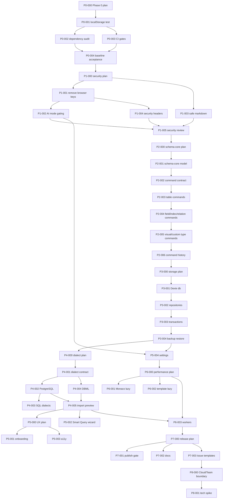

# ChartDB 自动开发任务计划

> 版本：v1.0
> 日期：2026-07-01
> 本地路径：`/Users/lynn/SynologyDrive/SynologyDrive/Code/ChartDB`
> 重构仓库：`https://github.com/Lynn-Lee/ChartDB`
> 依据文档：`docs/ChartDB重构优化产品设计与研发计划.md`、`docs/ChartDB重构优化工程实施计划.md`、SchemaPilot roadmap dispatcher 执行规则
> 文档定位：给后续自动开发 agent、dispatcher、reviewer 使用的任务编排手册。

## 1. 总目标

本计划把 ChartDB 重构拆成可自动派发、可验证、可回滚的小任务队列。它不是新的产品范围扩张，而是把现有产品设计和工程实施计划转换为 Roadmap Dispatcher 可执行的任务协议。

核心目标：

- 先把 ChartDB 当前安全、测试和发布基线恢复到可信状态。
- 保留无账号、无数据库密码、本地优先的 OSS Core 模式。
- 按阶段逐步拆出 `schema-core`、`storage`、`dialects`、`ai`、`features`、`workers` 等工程边界。
- 每个任务都必须有明确输入、文件范围、验收命令、风险门禁和交付物。
- Phase 0 到 Phase 7 不实现账号登录、团队空间、云同步、实时协作、评论和权限模型。
- Phase 8 只做可选 Cloud/Team 的架构预研与接口边界，不进入首轮自动编码队列。

## 2. SchemaPilot Dispatcher 规则映射

SchemaPilot 的 roadmap dispatcher 思路不依赖某个单独脚本，而是依赖一组强执行规则。ChartDB 自动开发队列采用以下映射：

| SchemaPilot 规则                                | ChartDB 任务计划中的落地方式                                                                                          |
| ----------------------------------------------- | --------------------------------------------------------------------------------------------------------------------- |
| 每个 Phase 开始前先写更细的 implementation plan | 每个 Phase 的第一个任务都是 `PLAN` 类型，更新本 Phase 的执行清单和验收记录                                            |
| 每个功能先写测试或验收脚本                      | 每个 `CODE` 类型任务必须先补测试、fixture、smoke 脚本或人工验收步骤                                                   |
| 共享 SchemaModel 是权威状态                     | ChartDB 对应为 `schema-core` 是 diagram/domain 的权威模型，UI state 不能绕过 command 写入                             |
| 后端 API、共享模型、前端 UI 必须同时更新        | ChartDB 首轮没有后端；涉及模型的任务必须同时更新 domain type、storage 映射、UI 调用和 import/export 适配              |
| 所有关键状态变更必须写 AuditLog                 | ChartDB OSS Core 对应为 local operation history、backup metadata、migration log；Cloud/Team 预研再定义服务端 AuditLog |
| 高风险变更必须能被 Risk Analyzer 识别           | ChartDB 对应为 destructive schema command、SQL export、AI-assisted export 必须返回 warning/risk 标记                  |
| 权限相关功能必须有 negative tests               | Phase 0 到 Phase 7 不做权限；Phase 8 预研文档必须列出 negative test 目录                                              |
| 不允许为了 UI 快速推进绕过服务端权威模型        | ChartDB 对应为不允许 UI 直接改多个状态源；所有 diagram 变更走 command 或 repository API                               |
| 不允许在前端保存密钥                            | ChartDB Phase 1 硬门禁：前端不得持久化 API key，不得把构建期密钥写入 bundle 或 `/config.js`                           |

## 3. Dispatcher 状态协议

### 3.1 任务状态

| 状态          | 含义                                   | 允许转移                 |
| ------------- | -------------------------------------- | ------------------------ |
| `queued`      | 已进入任务池，依赖未全部完成或尚未领取 | `in_progress`、`blocked` |
| `in_progress` | 已有 agent 领取并开始执行              | `review`、`blocked`      |
| `blocked`     | 当前任务无法继续，必须记录阻塞证据     | `queued`、`in_progress`  |
| `review`      | 代码或文档已完成，等待验证和审查       | `done`、`in_progress`    |
| `done`        | 验收命令和审查通过                     | 不再转移                 |

### 3.2 任务类型

| 类型     | 用途                       | 必须产物                     |
| -------- | -------------------------- | ---------------------------- |
| `PLAN`   | 细化 Phase 内执行步骤      | Phase 执行清单、验收记录模板 |
| `CODE`   | 修改源码或配置             | 代码、测试、验证结果         |
| `TEST`   | 增补测试、fixture、smoke   | 可重复执行的测试资产         |
| `DOC`    | 更新工程文档或用户文档     | 中文文档、命令说明、边界说明 |
| `REVIEW` | 做安全、性能、可维护性审查 | findings、风险等级、修复建议 |
| `SPIKE`  | 选型或预研                 | 结论、证据、取舍说明         |

### 3.3 优先级

| 优先级 | 处理原则                                   |
| ------ | ------------------------------------------ |
| `P0`   | 阻断后续开发或存在高安全风险，必须优先处理 |
| `P1`   | 影响核心架构、主要流程或发布可信度         |
| `P2`   | 改善体验、性能和可维护性                   |
| `P3`   | 可规划但不阻断首轮重构                     |

### 3.4 任务卡字段

每个自动任务必须包含以下字段：

```yaml
id: CHARTDB-P0-001
phase: Phase 0
type: CODE
priority: P0
title: 修复测试环境 localStorage 失败
status: done
depends_on: []
owner_lane: baseline
branch: codex/chartdb-p0-localstorage-test
allowed_files:
    - src/lib/utils/utils.ts
    - src/**/*.test.ts
    - vitest.config.ts
    - src/test/**
forbidden_scope:
    - 账号登录
    - 云端存储
    - 团队权限
entry_context:
    - npm run test:ci 当前失败在 src/lib/utils/utils.ts:18
implementation_contract:
    - 先补复现测试或测试环境 shim
    - 修复后不改变浏览器运行时 localStorage 行为
verification:
    - npm run test:ci
    - npm run build
acceptance:
    - test:ci 不再因 localStorage.getItem 报错
    - build 通过
```

## 4. 全局执行门禁

### 4.1 开始任何任务前

每个 agent 领取任务后必须先执行：

```bash
git status --short --branch
git remote -v
npm install
```

如果工作树存在与当前任务无关的用户改动：

- 不回滚。
- 不格式化无关文件。
- 不把无关文件纳入 commit。
- 如果改动影响当前任务，先读取并顺着现状处理。

远端规则：

- `origin` 必须指向 `https://github.com/Lynn-Lee/ChartDB.git`。
- 后续重构分支、提交和 PR 默认面向 `origin`。
- 不再配置或校验除 `origin` 以外的其它远端。

### 4.2 每个代码任务的默认验证

除非任务卡另有说明，代码任务完成后执行：

```bash
npm run lint
npm run test:ci
npm run build
```

涉及安全依赖或运行时密钥的任务额外执行：

```bash
npm audit --omit=dev --audit-level=high
rg -n "VITE_OPENAI_API_KEY|OPENAI_API_KEY|window\\.env|rehype-raw|dangerouslySetInnerHTML" src Dockerfile default.conf.template
```

涉及 UI 的任务额外执行：

```bash
npm run dev
```

然后用浏览器检查桌面和移动宽度下的核心路径。

### 4.3 阻塞条件

出现以下情况时必须把任务标记为 `blocked`，并写清证据：

- 依赖任务未完成。
- 基线测试失败且失败原因不属于当前任务范围。
- 安全 high 或 critical advisory 无法通过升级或替代方案解决。
- 任务需要第三方凭据、生产环境或私有服务。
- 任务会强行引入账号登录、云同步或团队权限，违反 Phase 0 到 Phase 7 边界。

### 4.4 线程收口

每轮自动任务最终响应前必须执行线程收口判断：

- 若当前线程是本自动化创建的 dispatcher 线程，调用 Codex 的 `set_thread_archived` 工具归档当前线程。
- 只归档本轮自动化线程，不归档人工对话线程、重要排查线程或仍在等待用户决策的 blocker 线程。
- 如果归档工具不可用，在最终响应中说明“未能自动归档”。

### 4.5 禁止事项

Phase 0 到 Phase 7 禁止：

- 新增注册、登录、OAuth、SSO。
- 新增云端 diagram 存储。
- 新增团队 workspace 或成员管理。
- 新增多人实时协作。
- 把用户 schema 自动上传到任何远端服务。
- 在前端持久化 AI API key。
- 为了让 UI 更快完成而绕过 command、repository 或 schema-core。

## 5. 并发策略

### 5.1 串行阶段

以下阶段必须严格串行：

1. Phase 0：基线修复。
2. Phase 1：安全重构。
3. Phase 2 前半段：`schema-core` 和 command contract 建立。

原因：这些阶段会改变测试可信度、安全边界和领域模型入口，其他任务必须以它们为基础。

### 5.2 可并发阶段

满足依赖后可以并行：

| 并发 lane     | 可并发范围                                             | 不可同时修改              |
| ------------- | ------------------------------------------------------ | ------------------------- |
| `dialect`     | PostgreSQL、MySQL、SQLite、SQL Server、Oracle 方言迁移 | 同一个方言目录            |
| `ux`          | 首次进入、设置中心、可访问性修复                       | 同一个页面组件            |
| `performance` | Monaco lazy、模板 lazy、worker spike                   | Vite 配置和路由入口需协调 |
| `docs`        | 发布清单、贡献说明、issue template                     | README 同一段落           |
| `test`        | fixture、regression、smoke                             | 共享 test setup           |

### 5.3 合并顺序

推荐合并顺序：

```text
Phase 0 baseline
  -> Phase 1 security
    -> Phase 2 schema-core contract
      -> Phase 2 command migration
        -> Phase 3 storage
          -> Phase 4 dialect pipeline
            -> Phase 5 UX and a11y
              -> Phase 6 performance
                -> Phase 7 release docs
                  -> Phase 8 Cloud/Team research
```

## 6. Phase 0：基线修复

目标：恢复可信测试、安全和 CI 基线。Phase 0 未完成前不允许进入大规模架构拆分。

### CHARTDB-P0-000：Phase 0 执行清单

```yaml
id: CHARTDB-P0-000
phase: Phase 0
type: PLAN
priority: P0
title: 编写 Phase 0 细化执行清单
status: queued
depends_on: []
owner_lane: baseline
branch: codex/chartdb-p0-plan
allowed_files:
    - docs/阶段验收记录.md
    - docs/ChartDB自动开发任务计划.md
verification:
    - rg -n "Phase 0|CHARTDB-P0" docs
acceptance:
    - Phase 0 每个任务都有责任范围、验收命令和退出标准
    - 阶段验收记录包含 test、build、audit、CI 四类结果
```

### CHARTDB-P0-001：修复测试环境 localStorage 失败

```yaml
id: CHARTDB-P0-001
phase: Phase 0
type: CODE
priority: P0
title: 修复 npm run test:ci 中 localStorage.getItem 失败
status: done
depends_on:
    - CHARTDB-P0-000
owner_lane: baseline
branch: codex/chartdb-p0-localstorage-test
allowed_files:
    - src/lib/utils/utils.ts
    - src/**/*.test.ts
    - src/test/**
    - vitest.config.ts
verification:
    - npm run test:ci
    - npm run build
acceptance:
    - test:ci 不再因 localStorage.getItem 报错
    - 修复不会改变浏览器正常 localStorage 读取逻辑
    - 如果增加 test setup，必须只影响测试环境
completion:
    - commit: 8a2f788
    - verified: npm run lint, npm run test:ci, npm run build, git diff --check
```

### CHARTDB-P0-002：建立安全依赖基线

```yaml
id: CHARTDB-P0-002
phase: Phase 0
type: CODE
priority: P0
title: 升级 critical/high 生产依赖并记录剩余 advisory
status: done
depends_on:
    - CHARTDB-P0-001
owner_lane: security
branch: codex/chartdb-p0-dependency-audit
allowed_files:
    - package.json
    - package-lock.json
    - docs/阶段验收记录.md
verification:
    - npm audit --omit=dev --audit-level=high
    - npm run test:ci
    - npm run build
acceptance:
    - 生产依赖 critical/high advisory 清零，或每个剩余项都有不可升级原因和临时缓解措施
    - 没有为了升级依赖引入 React、Vite、Monaco 大版本破坏性迁移
    - lockfile 与 package.json 一致
completion:
    - commit: 本轮提交，见自动化运行日志
    - verified: npm audit --omit=dev --audit-level=high, npm run lint, npm run test:ci, npm run build, git diff --check
    - remaining_advisory: AI SDK 链保留 low，Monaco/DOMPurify 保留 moderate；修复需破坏性升级或降级，转入 Phase 1 安全评估
```

### CHARTDB-P0-003：补齐 CI 安全门禁

```yaml
id: CHARTDB-P0-003
phase: Phase 0
type: CODE
priority: P0
title: 在 CI 中加入 audit gate 和构建门禁
status: done
depends_on:
    - CHARTDB-P0-001
    - CHARTDB-P0-002
owner_lane: release
branch: codex/chartdb-p0-ci-gates
allowed_files:
    - .github/workflows/ci.yaml
    - .github/workflows/publish.yaml
    - docs/阶段验收记录.md
verification:
    - npm run lint
    - npm run test:ci
    - npm run build
    - npm audit --omit=dev --audit-level=high
acceptance:
    - PR CI 至少包含 lint、test、build、prod audit
    - publish 前必须跑 test 和 build
    - workflow 不依赖本机私有路径或私有凭据
completion:
    - commit: 本轮提交，见自动化运行日志
    - verified: npm run lint, npm run test:ci, npm run build, git diff --check, npm audit --omit=dev --audit-level=high
    - ci: PR workflow 在 npm ci 后运行生产依赖 high audit，再执行 lint、build、test
    - publish: tag publish 在 Docker 构建前运行生产依赖 high audit、lint、test、build
```

### CHARTDB-P0-004：Phase 0 验收记录

```yaml
id: CHARTDB-P0-004
phase: Phase 0
type: DOC
priority: P0
title: 完成 Phase 0 验收记录
status: done
depends_on:
    - CHARTDB-P0-001
    - CHARTDB-P0-002
    - CHARTDB-P0-003
owner_lane: baseline
branch: codex/chartdb-p0-acceptance
allowed_files:
    - docs/阶段验收记录.md
verification:
    - rg -n "Phase 0|npm run test:ci|npm audit|npm run build" docs/阶段验收记录.md
acceptance:
    - 记录实际命令、结果、失败证据和剩余风险
    - 没有未填写内容
completion:
    - commit: 本轮提交，见自动化运行日志
    - verified: rg -n "Phase 0|npm run test:ci|npm audit|npm run build" docs/阶段验收记录.md, npm run lint, npm run test:ci, npm run build, git diff --check, npm audit --omit=dev --audit-level=high
    - exit_gate: Phase 0 已通过，允许进入 CHARTDB-P1-000
```

## 7. Phase 1：安全重构

目标：关闭最高风险安全面，明确 AI 能力边界，让本地优先承诺可信。

### CHARTDB-P1-000：Phase 1 执行清单

```yaml
id: CHARTDB-P1-000
phase: Phase 1
type: PLAN
priority: P0
title: 编写 Phase 1 安全实施清单
status: done
depends_on:
    - CHARTDB-P0-004
owner_lane: security
branch: codex/chartdb-p1-plan
allowed_files:
    - docs/安全模型与AI边界.md
    - docs/阶段验收记录.md
verification:
    - rg -n "AI|BYOK|Gateway|Markdown|CSP|密钥" docs/安全模型与AI边界.md
acceptance:
    - 明确 Disabled、BYOK Session、Self-hosted Gateway 三种 AI mode
    - 明确本地数据默认不出浏览器
result:
    - 已新增 `docs/安全模型与AI边界.md`
    - 已定义密钥、BYOK Session、Self-hosted Gateway、Markdown、CSP 和剩余 advisory 的 Phase 1 实施边界
```

### CHARTDB-P1-001：移除构建期和运行时 API key 暴露

```yaml
id: CHARTDB-P1-001
phase: Phase 1
type: CODE
priority: P0
title: 删除 Dockerfile 和 config.js 中的 OPENAI key 注入
status: done
depends_on:
  - CHARTDB-P1-000
owner_lane: security
branch: codex/chartdb-p1-remove-browser-keys
allowed_files:
  - Dockerfile
  - default.conf.template
  - src/lib/env.ts
  - src/lib/data/sql-export/export-sql-script.ts
  - docs/安全模型与AI边界.md
verification:
  - rg -n "VITE_OPENAI_API_KEY|OPENAI_API_KEY" Dockerfile default.conf.template src
  - npm run test:ci
  - npm run build
acceptance:
  - 构建产物不需要 OPENAI_API_KEY
  - `/config.js` 不输出 API key
  - deterministic SQL export 不依赖 AI key
result:
  - 已移除 `Dockerfile` 中的 `VITE_OPENAI_API_KEY` build arg 和 `.env` 写入。
  - 已移除 `default.conf.template` 中 `/config.js` 输出 API key 的逻辑，仅保留 endpoint、model 和非敏感开关。
  - 已移除 `src/lib/env.ts` 与 SQL export 对浏览器端长期 API key 的读取。
  - 已暂停非 deterministic 的 AI-assisted SQL export fallback，避免在 `CHARTDB-P1-002` 前把 OpenAI SDK 和 key fallback 打入浏览器产物。
  - 已新增安全回归测试，防止 Docker、Nginx runtime config 和 env module 重新暴露 API key。
```

### CHARTDB-P1-002：实现 AI mode gating

```yaml
id: CHARTDB-P1-002
phase: Phase 1
type: CODE
priority: P0
title: 增加 Disabled、BYOK Session、Gateway 三种 AI mode
status: done
depends_on:
    - CHARTDB-P1-001
owner_lane: ai
branch: codex/chartdb-p1-ai-mode-gating
allowed_files:
    - src/lib/ai/**
    - src/lib/env.ts
    - src/lib/data/sql-export/**
    - src/pages/**
    - src/components/**
verification:
    - npm run test:ci
    - npm run build
    - rg -n "localStorage.*OPENAI|indexedDB.*OPENAI|OPENAI_API_KEY" src
acceptance:
    - 默认 AI mode 为 Disabled
    - BYOK key 仅保存在内存 session，不写 localStorage、IndexedDB 或 URL
    - Gateway mode 只接受 endpoint，不接受浏览器端长期密钥
    - AI-assisted export 前展示数据发送提示
completion:
    - 已新增 `src/lib/ai/ai-mode.ts`，集中定义 Disabled、BYOK Session、Self-hosted Gateway gate。
    - 已新增 `src/lib/ai/__tests__/ai-mode.test.ts`，覆盖默认禁用、BYOK 内存 key、schema transfer 确认和 Gateway 非敏感配置。
    - 已将 `exportSQL()` 接入 AI mode gate；非 deterministic export 默认 Disabled，BYOK/Gateway 在确认 schema transfer 前拒绝继续。
    - 本轮不恢复真实模型调用，不新增设置页或账号能力；完整 AI 设置 UI 仍归入后续设置中心任务。
```

### CHARTDB-P1-003：Note Markdown 安全渲染

```yaml
id: CHARTDB-P1-003
phase: Phase 1
type: CODE
priority: P0
title: 移除 raw HTML Markdown 渲染风险
status: done
depends_on:
    - CHARTDB-P1-000
owner_lane: security
branch: codex/chartdb-p1-safe-markdown
allowed_files:
    - src/pages/editor-page/canvas/note-node/note-node.tsx
    - src/pages/editor-page/**
    - src/lib/security/**
    - src/**/*.test.tsx
verification:
    - npm run test:ci
    - npm run build
    - rg -n "rehype-raw|dangerouslySetInnerHTML" src
acceptance:
    - note 不执行 raw HTML
    - 链接协议限制为 http、https、mailto
    - 恶意 markdown fixture 渲染为安全文本或被过滤
completion:
    - 已移除 `note-node.tsx` 对 `rehype-raw` 的使用，Note Markdown 预览不再把 raw HTML 转为真实 DOM 元素。
    - 已卸载 `rehype-raw` 生产依赖，减少 Markdown 渲染供应面。
    - 已新增 `note-markdown-safety.test.tsx`，覆盖 `<script>`、`iframe`、`img onerror` 和 `javascript:` 链接 fixture。
    - 已为 Note 链接增加协议 gate，仅允许 `http`、`https`、`mailto`；危险链接降级为不可点击文本。
```

### CHARTDB-P1-004：Docker 和 Nginx 安全头

```yaml
id: CHARTDB-P1-004
phase: Phase 1
type: CODE
priority: P1
title: 增加基础 CSP、X-Content-Type-Options、Referrer-Policy
status: done
depends_on:
    - CHARTDB-P1-001
owner_lane: security
branch: codex/chartdb-p1-nginx-security-headers
allowed_files:
    - default.conf.template
    - Dockerfile
    - docs/部署与安全配置.md
verification:
    - npm run build
    - docker build -t chartdb-security-smoke .
acceptance:
    - Nginx 配置包含基础安全头
    - CSP 不破坏 Vite 构建后的静态资源加载
    - 文档说明 self-hosted 需要如何配置 AI gateway endpoint
completion:
    - 已在 `default.conf.template` 为静态页面和 `/config.js` 增加 CSP、nosniff、Referrer-Policy、X-Frame-Options 和 Permissions-Policy。
    - 已为 `/config.js` 增加 `Cache-Control: no-store`，避免 runtime config 跨部署缓存。
    - 已在 `Dockerfile` builder 阶段设置 `NODE_OPTIONS=--max-old-space-size=4096`，避免 Docker 内生产构建在 Vite transform 阶段触发 Node heap OOM。
    - 已新增 `docs/部署与安全配置.md`，说明 self-hosted gateway endpoint 和 CSP 调整边界。
    - 已新增 Nginx 安全头回归测试，覆盖 Vite 静态资源、worker、gateway connect-src 和 runtime config 缓存策略。
```

### CHARTDB-P1-005：Phase 1 安全审查

```yaml
id: CHARTDB-P1-005
phase: Phase 1
type: REVIEW
priority: P0
title: 完成密钥、Markdown、Docker 安全审查
status: done
depends_on:
    - CHARTDB-P1-002
    - CHARTDB-P1-003
    - CHARTDB-P1-004
owner_lane: security
branch: codex/chartdb-p1-security-review
allowed_files:
    - docs/阶段验收记录.md
verification:
    - rg -n "VITE_OPENAI_API_KEY|OPENAI_API_KEY|rehype-raw|dangerouslySetInnerHTML" src Dockerfile default.conf.template
    - npm audit --omit=dev --audit-level=high
acceptance:
    - 所有命中项都有安全解释或已移除
    - Phase 1 剩余风险按 high、medium、low 分类记录
completion:
    - 已新增 `docs/安全风险登记.md`，记录 High、Medium、Low 风险分级、缓解措施和后续处理路径。
    - 已确认生产依赖 high/critical advisory 为 0，剩余 5 个 low 和 1 个 moderate 不阻断 Phase 2。
    - 已确认安全扫描仅剩 `default.conf.template` 的非敏感 `window.env` runtime object。
```

## 8. Phase 2：Schema Core 与 Command 架构

目标：把 diagram 领域模型、变更命令、校验和 undo/redo 从 React Provider 中拆出。

### CHARTDB-P2-000：Phase 2 执行清单

```yaml
id: CHARTDB-P2-000
phase: Phase 2
type: PLAN
priority: P1
title: 定义 schema-core 拆分顺序和兼容层
status: done
depends_on:
    - CHARTDB-P1-005
owner_lane: core
branch: codex/chartdb-p2-plan
allowed_files:
    - docs/schema-core设计.md
    - docs/阶段验收记录.md
verification:
    - rg -n "schema-core|command|validator|diff|undo|redo" docs/schema-core设计.md
acceptance:
    - 明确旧类型到新 domain type 的映射
    - 明确兼容层保留周期
completion:
    - 已新增 `docs/schema-core设计.md`，明确 schema-core 边界、目录、旧类型映射、command contract、validator、diff、undo/redo 兼容层和 P2-001 到 P2-006 的自动开发顺序。
    - 下一项进入 `CHARTDB-P2-001`，只建立 `src/schema-core/model` 与旧路径 re-export，不修改业务行为。
```

### CHARTDB-P2-001：建立 schema-core 目录和领域模型出口

```yaml
id: CHARTDB-P2-001
phase: Phase 2
type: CODE
priority: P1
title: 创建 src/schema-core 并迁移纯类型出口
status: done
depends_on:
    - CHARTDB-P2-000
owner_lane: core
branch: codex/chartdb-p2-schema-core-model
allowed_files:
    - src/schema-core/**
    - src/lib/domain/**
    - src/types/**
    - tsconfig.json
verification:
    - npm run lint
    - npm run test:ci
    - npm run build
acceptance:
    - schema-core 不依赖 React、Dexie、Monaco、DOM
    - 旧 import 路径通过 re-export 兼容
    - 没有业务行为变化
completion:
    - 已新增 `src/schema-core/model`，按 Diagram、Table、Field、Index、Relationship、Area、Note、CustomType 等领域对象提供 re-export 出口。
    - 已新增 `src/schema-core/model/__tests__/model-exports.test.ts`，覆盖新入口可解析既有 domain schema，且 `schema-core` 文件不直接依赖 React、Dexie、Monaco、DOM 或浏览器 storage。
    - 旧 `src/lib/domain` import path 保持不变，本轮未迁移业务逻辑。
    - 下一项进入 `CHARTDB-P2-002`，定义 DiagramCommand、CommandResult、CommandContext 和 risk metadata。
```

### CHARTDB-P2-002：定义 DiagramCommand 基础类型

```yaml
id: CHARTDB-P2-002
phase: Phase 2
type: CODE
priority: P1
title: 增加 command contract、command result 和 risk metadata
status: done
depends_on:
    - CHARTDB-P2-001
owner_lane: core
branch: codex/chartdb-p2-command-contract
allowed_files:
    - src/schema-core/commands/**
    - src/schema-core/validation/**
    - src/schema-core/model/**
    - src/schema-core/**/*.test.ts
verification:
    - npm run test:ci
    - npm run build
acceptance:
    - command 输入和输出类型稳定
    - command result 可表达 success、validation error、risk warning
    - destructive command 有 risk metadata
completion:
    - 已新增 `src/schema-core/commands` 基础 contract，包含 `DiagramCommand`、`CommandContext`、`CommandResult`、`CommandRisk`、`ValidationIssue` 和创建 helper。
    - 已新增 `src/schema-core/commands/__tests__/diagram-command.test.ts`，覆盖 command 创建、success result、validation error result 和 destructive risk metadata。
    - 本轮不接入 Provider、不迁移业务行为，下一项进入 `CHARTDB-P2-003`。
```

### CHARTDB-P2-003：迁移 Table command

```yaml
id: CHARTDB-P2-003
phase: Phase 2
type: CODE
priority: P1
title: 迁移 AddTable、UpdateTable、DeleteTable
status: done
depends_on:
  - CHARTDB-P2-002
owner_lane: core
branch: codex/chartdb-p2-table-commands
allowed_files:
  - src/schema-core/commands/**
  - src/context/chartdb-context/**
  - src/pages/editor-page/**
  - src/schema-core/**/*.test.ts
verification:
  - npm run test:ci
  - npm run build
acceptance:
  - 新增、编辑、删除表走 command
  - 删除表能返回关系和 dependency 影响；字段、索引仍随 table payload 保留，细粒度 field/index 影响进入 P2-004
  - undo/redo 旧行为保持可用
completion:
  - 已新增 `src/schema-core/commands/table-commands.ts` 和 `src/schema-core/commands/apply-table-command.ts`，支持 `table.add`、`table.update`、`table.delete` 与 `table.restore`。
  - 已新增 `src/schema-core/commands/__tests__/table-commands.test.ts`，覆盖 Add table、Update table name、missing table validation 和 Delete table cascade risk。
  - `ChartDBProvider` 的 `addTables`、`updateTable`、`removeTables` 已通过 table command 计算下一状态，同时保留既有 Dexie 写入、事件和旧 undo/redo 数据结构。
  - 下一项进入 `CHARTDB-P2-004`，迁移 Field、Index、Relationship command。
```

### CHARTDB-P2-004：迁移 Field、Index、Relationship command

```yaml
id: CHARTDB-P2-004
phase: Phase 2
type: CODE
priority: P1
title: 迁移字段、索引和关系变更命令
status: done
depends_on:
    - CHARTDB-P2-003
owner_lane: core
branch: codex/chartdb-p2-field-index-relation-commands
allowed_files:
    - src/schema-core/commands/**
    - src/context/chartdb-context/**
    - src/hooks/**
    - src/pages/editor-page/**
verification:
    - npm run test:ci
    - npm run build
acceptance:
    - 字段删除能识别索引、关系和 custom type 引用影响
    - 外键创建前校验 source、target、column 引用
    - index command 保留唯一索引、主键索引、普通索引语义
completion:
    - 已新增 `field-commands`、`index-commands`、`relationship-commands` 和对应 apply 纯函数，覆盖 add/update/delete/restore 或 undo command 语义。
    - 已新增 `src/schema-core/commands/__tests__/field-index-relationship-commands.test.ts`，覆盖删除 field 时清理 relationship、收缩/删除 index、relationship 引用校验、cardinality 更新和 index 语义保留。
    - `ChartDBProvider` 的 field、index、relationship 入口已接入 command 计算下一状态，并继续沿用既有 Dexie 写入、事件和 undo/redo action；删除 field 的 undo 会恢复被级联移除的 relationship。
    - 下一项进入 `CHARTDB-P2-005`，迁移 Area、Note、CustomType command。
```

### CHARTDB-P2-005：迁移 Area、Note、CustomType command

```yaml
id: CHARTDB-P2-005
phase: Phase 2
type: CODE
priority: P1
title: 迁移画布辅助对象和自定义类型命令
status: done
depends_on:
    - CHARTDB-P2-004
owner_lane: core
branch: codex/chartdb-p2-visual-customtype-commands
allowed_files:
    - src/schema-core/commands/**
    - src/context/chartdb-context/**
    - src/pages/editor-page/**
verification:
    - npm run test:ci
    - npm run build
acceptance:
    - Area、Note 操作可撤销
    - CustomType 删除前检查字段引用
    - Note 内容仍经过安全 markdown 渲染
completion:
    - 已新增 `area-commands`、`note-commands`、`custom-type-commands` 和对应 apply 纯函数，覆盖 add/update/delete 以及 undo command 语义。
    - 已新增 `src/schema-core/commands/__tests__/visual-custom-type-commands.test.ts`，覆盖 Area add/delete undo、Note markdown 内容透明更新和 CustomType 被字段引用时禁止删除。
    - `ChartDBProvider` 的 area、note、custom type 入口已接入 command 计算下一状态，并继续沿用既有 Dexie 写入和 undo/redo action。
    - 下一项进入 `CHARTDB-P2-006`，接入统一 undo/redo command history。
```

### CHARTDB-P2-006：接入统一 undo/redo command history

```yaml
id: CHARTDB-P2-006
phase: Phase 2
type: CODE
priority: P1
title: 用 command history 收敛 undo/redo
status: done
depends_on:
    - CHARTDB-P2-005
owner_lane: core
branch: codex/chartdb-p2-command-history
allowed_files:
    - src/schema-core/commands/**
    - src/context/chartdb-context/**
    - src/pages/editor-page/**
verification:
    - npm run test:ci
    - npm run build
acceptance:
    - undo/redo 不依赖散落的 action 字符串
    - 每个 command 都能生成 redoData 和 undoData
    - 大对象历史记录不明显放大内存占用
completion:
    - 已新增 `src/schema-core/commands/command-history.ts`，将成功 command result 收敛为包含 redo command、undo command、affected entity ids 和 risk snapshot 的 history entry。
    - 已新增 `src/schema-core/commands/__tests__/command-history.test.ts`，覆盖成功结果生成 history entry，以及 validation error 不写入 command history。
    - `RedoUndoAction` 已支持可选 `commandHistory` batch；`ChartDBProvider` 中已迁移的 table、field、index、relationship、area、note 和 custom type 操作会在保留旧 undo/redo 行为的同时写入 command metadata。
    - 下一项进入 `CHARTDB-P3-000`，定义 storage repository 和 migration 计划。
```

## 9. Phase 3：Storage 与备份恢复

目标：把 Dexie schema、migration、repository、transaction、backup/restore 从 Provider 中拆出。

### CHARTDB-P3-000：Phase 3 执行清单

```yaml
id: CHARTDB-P3-000
phase: Phase 3
type: PLAN
priority: P1
title: 定义 storage repository 和 migration 计划
status: done
depends_on:
    - CHARTDB-P2-006
owner_lane: storage
branch: codex/chartdb-p3-plan
allowed_files:
    - docs/storage设计.md
    - docs/阶段验收记录.md
verification:
    - rg -n "Dexie|repository|transaction|backup|restore|migration" docs/storage设计.md
acceptance:
    - 明确 IndexedDB 表结构、迁移顺序和备份格式版本
completion:
    - 已新增 `docs/storage设计.md`，记录当前 Dexie 版本、表结构、migration 风险、目标 storage 目录和 repository / transaction / backup 边界。
    - 已明确 `CHARTDB-P3-001` 到 `CHARTDB-P3-004` 的自动开发顺序：先抽 Dexie schema，再抽 repository，再做 diagram transaction，最后做 backup/restore 版本化。
    - 下一项进入 `CHARTDB-P3-001`，创建 `src/storage/db` 并集中 Dexie schema。
```

### CHARTDB-P3-001：抽离 Dexie 数据库定义

```yaml
id: CHARTDB-P3-001
phase: Phase 3
type: CODE
priority: P1
title: 创建 storage/db 并集中 Dexie schema
status: done
depends_on:
    - CHARTDB-P3-000
owner_lane: storage
branch: codex/chartdb-p3-dexie-db
allowed_files:
    - src/storage/db/**
    - src/context/storage-context/**
    - src/**/*.test.ts
verification:
    - npm run test:ci
    - npm run build
acceptance:
    - StorageProvider 不再直接定义完整 Dexie schema
    - migration 版本集中可读
    - 不破坏现有本地 diagram 读取
completion:
    - 已新增 `src/storage/db/chartdb-dexie.ts` 和 `src/storage/db/schema-versions.ts`，集中 `ChartDB` Dexie 名称、当前版本 `13`、stores 和既有 upgrade migration。
    - `StorageProvider` 已改为通过 `createChartDBDexie()` 获取已声明 schema 的 typed db instance，CRUD 逻辑仍保留在 Provider，repository 抽离留给 `CHARTDB-P3-002`。
    - 已新增 `src/storage/db/__tests__/chartdb-dexie.test.ts`，覆盖数据库名、当前版本和全部当前 store 名称。
    - 下一项进入 `CHARTDB-P3-002`，抽 Repository API。
```

### CHARTDB-P3-002：抽 Repository API

```yaml
id: CHARTDB-P3-002
phase: Phase 3
type: CODE
priority: P1
title: 增加 diagram、dependency、area、note repository
status: done
depends_on:
    - CHARTDB-P3-001
owner_lane: storage
branch: codex/chartdb-p3-repositories
allowed_files:
    - src/storage/repositories/**
    - src/context/storage-context/**
    - src/context/chartdb-context/**
verification:
    - npm run test:ci
    - npm run build
acceptance:
    - Provider 只消费 repository API
    - repository 有单元测试覆盖读写和错误路径
completion:
    - 新增 `src/storage/repositories/chartdb-repositories.ts`，集中当前 StorageContext 所需的 config、diagram filter、diagram、table、relationship、dependency、area、custom type 和 note repository API。
    - `StorageProvider` 已收敛为 repository 组合适配层，不再直接访问 Dexie table。
    - 新增 `src/storage/repositories/__tests__/chartdb-repositories.test.ts`，覆盖 diagram 组合读取、relationship/custom type 排序、diagram id 级联更新、缺失实体返回 undefined，以及 Provider repository 边界。
    - 下一项进入 `CHARTDB-P3-003`，实现 diagram transaction service。
```

### CHARTDB-P3-003：实现 diagram transaction service

```yaml
id: CHARTDB-P3-003
phase: Phase 3
type: CODE
priority: P1
title: 为 diagram 级写操作增加事务封装
status: done
depends_on:
    - CHARTDB-P3-002
owner_lane: storage
branch: codex/chartdb-p3-diagram-transaction
allowed_files:
    - src/storage/transactions/**
    - src/storage/repositories/**
    - src/context/chartdb-context/**
verification:
    - npm run test:ci
    - npm run build
acceptance:
    - 创建、删除、导入 diagram 时相关对象保持一致
    - 失败时不留下半成品 diagram
completion:
    - 新增 `src/storage/transactions/diagram-transaction-service.ts`，将 diagram 创建、删除和替换封装到 Dexie `transaction('rw')`。
    - `createChartDBRepositories()` 的 diagram add/delete 已接入 transaction service，删除 diagram 会同步清理 tables、relationships、dependencies、areas、custom types、notes 和 diagram filter。
    - 新增 `src/storage/transactions/__tests__/diagram-transaction-service.test.ts`，覆盖 child write 失败回滚和 delete filter 清理；repository 测试补充 delete diagram filter 边界。
    - 下一项进入 `CHARTDB-P3-004`，备份恢复版本化。
```

### CHARTDB-P3-004：备份恢复版本化

```yaml
id: CHARTDB-P3-004
phase: Phase 3
type: CODE
priority: P1
title: 增加 backup schema version、校验和迁移
status: done
depends_on:
    - CHARTDB-P3-003
owner_lane: storage
branch: codex/chartdb-p3-backup-restore
allowed_files:
    - src/storage/backup/**
    - src/features/**
    - src/pages/**
    - docs/备份恢复格式.md
verification:
    - npm run test:ci
    - npm run build
acceptance:
    - backup 文件包含 schemaVersion、createdAt、diagram count
    - restore 前校验格式和版本
    - 不兼容文件给出可理解错误
completion:
    - 新增 `src/storage/backup` 版本化 backup contract，当前格式为 `chartdb.backup` + `schemaVersion: 1`。
    - 现有 JSON 导出入口改为写出 backup metadata、diagram count 和完整 diagram payload。
    - restore 入口先校验 backup format、schemaVersion 和 diagram count；不兼容文件抛出可理解错误，旧单 diagram JSON 暂保留兼容导入。
    - 新增 `docs/备份恢复格式.md` 记录文件格式、恢复规则和后续 migration 边界。
    - 下一项进入 `CHARTDB-P4-000`，定义 dialect contract 和迁移顺序。
```

## 10. Phase 4：Importer / Exporter 插件化

目标：把数据库方言能力变成明确 contract，导入导出有 capability matrix、fixture 和 warning。

### CHARTDB-P4-000：Phase 4 执行清单

```yaml
id: CHARTDB-P4-000
phase: Phase 4
type: PLAN
priority: P1
title: 定义 dialect contract 和迁移顺序
status: done
depends_on:
    - CHARTDB-P3-004
owner_lane: dialect
branch: codex/chartdb-p4-plan
allowed_files:
    - docs/方言能力矩阵.md
    - docs/阶段验收记录.md
verification:
    - rg -n "PostgreSQL|MySQL|SQLite|SQL Server|Oracle|DBML|capability|warning" docs/方言能力矩阵.md
acceptance:
    - 每个方言都有 import、export、unsupported syntax、warning 规则
```

完成记录：

- 新增 `docs/方言能力矩阵.md`，记录 PostgreSQL、MySQL、MariaDB、SQLite、SQL Server、Oracle、CockroachDB、ClickHouse 和 DBML 的 import/export 当前状态、unsupported syntax 和 warning 规则。
- 明确 Phase 4 统一 contract：`ImportResult`、`ExportResult`、`warnings`、`unsupportedObjects`、`sourceMap` 和 `riskLevel`。
- 明确迁移顺序：先做 `CHARTDB-P4-001` common contract，再迁移 PostgreSQL importer，之后补齐其它 dialect wrapper 和 exporter result。
- 下一项进入 `CHARTDB-P4-001`，创建 dialect contract 和 result type。

### CHARTDB-P4-001：定义 importer/exporter contract

```yaml
id: CHARTDB-P4-001
phase: Phase 4
type: CODE
priority: P1
title: 创建 dialect contract 和 result type
status: done
depends_on:
    - CHARTDB-P4-000
owner_lane: dialect
branch: codex/chartdb-p4-dialect-contract
allowed_files:
    - src/dialects/**
    - src/schema-core/**
    - src/lib/data/sql-import/**
    - src/lib/data/sql-export/**
verification:
    - npm run test:ci
    - npm run build
acceptance:
    - import result 包含 diagram、warnings、unsupportedObjects、sourceMap
    - export result 包含 output、warnings、riskLevel
    - 旧 import/export 调用通过 adapter 兼容
```

完成记录：

- 新增 `src/dialects/common/importer.ts`、`src/dialects/common/exporter.ts`、`src/dialects/common/capability-matrix.ts` 和统一出口 `src/dialects/common/index.ts`。
- `ImportResult` 已包含 `diagram`、`sourceDialect`、`warnings`、`unsupportedObjects` 和 `sourceMap`。
- `ExportResult` 已包含 `output`、`targetDialect`、`warnings`、`unsupportedObjects` 和 `riskLevel`。
- `wrapLegacySchemaImporter`、`wrapLegacySchemaExporter` 可把旧 import/export 函数包装成统一 contract，默认保留旧输出并返回空 warning/unsupported/sourceMap。
- 下一项进入 `CHARTDB-P4-002`，迁移 PostgreSQL importer。

### CHARTDB-P4-002：迁移 PostgreSQL importer

```yaml
id: CHARTDB-P4-002
phase: Phase 4
type: CODE
priority: P1
title: 将 PostgreSQL importer 拆进 dialect pipeline
status: done
depends_on:
    - CHARTDB-P4-001
owner_lane: dialect
branch: codex/chartdb-p4-postgresql-importer
allowed_files:
    - src/dialects/postgresql/**
    - src/lib/data/sql-import/dialect-importers/postgresql/**
verification:
    - npm run test:ci -- --runInBand
    - npm run build
acceptance:
    - 现有 PostgreSQL regression tests 通过
    - importer 文件职责拆分为 parser、mapper、warnings、fixtures
    - RLS、policy、extension 等 unsupported 对象进入 warning
```

完成记录：

- 新增 `src/dialects/postgresql/importer.ts`、`src/dialects/postgresql/capabilities.ts`、`src/dialects/postgresql/parser/legacy-parser.ts`、`src/dialects/postgresql/warnings.ts` 和统一出口 `src/dialects/postgresql/index.ts`。
- `postgresqlSchemaImporter.importSchema()` 复用旧 PostgreSQL parser，输出统一 `ImportResult`，并保持旧 diagram normalize、排序和 primary key index 行为。
- RLS、policy、extension、trigger 和 function 已进入 `unsupportedObjects` 与结构化 `warnings`，包含 code、severity、statementType 和 sourceRange。
- 新增 `src/dialects/postgresql/__tests__/importer.test.ts`，覆盖 wrapper fixture、capability levels 和 unsupported warning。
- 下一项进入 `CHARTDB-P4-003`，迁移 MySQL、MariaDB、SQLite、SQL Server 和 Oracle。

### CHARTDB-P4-003：迁移 MySQL、MariaDB、SQLite、SQL Server、Oracle

```yaml
id: CHARTDB-P4-003
phase: Phase 4
type: CODE
priority: P1
title: 迁移剩余 SQL dialect importer/exporter
status: done
depends_on:
    - CHARTDB-P4-002
owner_lane: dialect
branch: codex/chartdb-p4-sql-dialects
allowed_files:
    - src/dialects/mysql/**
    - src/dialects/mariadb/**
    - src/dialects/sqlite/**
    - src/dialects/sqlserver/**
    - src/dialects/oracle/**
    - src/lib/data/sql-import/dialect-importers/**
verification:
    - npm run test:ci
    - npm run build
acceptance:
    - 每个方言至少保留现有 regression 覆盖
    - 每个方言输出 capability metadata
    - 不支持语法不静默丢失
```

完成记录：

- 新增 `src/dialects/mysql`、`src/dialects/mariadb`、`src/dialects/sqlite`、`src/dialects/sqlserver` 和 `src/dialects/oracle` wrapper，复用旧 parser 并返回统一 `ImportResult`。
- 新增 `src/dialects/common/legacy-sql-importer.ts`，统一旧 SQL parser 到 `Diagram` 的转换、排序和 primary key index normalize。
- 每个方言输出 capability metadata；MariaDB 明确标注 MySQL fallback 与 experimental 支持等级。
- MySQL ENGINE/charset、MariaDB sequence/engine、SQLite virtual table、SQL Server procedure、Oracle sequence/package 等 unsupported 或降级语义进入结构化 `warnings` / `unsupportedObjects`。
- 新增 `src/dialects/__tests__/sql-dialect-importers.test.ts` 覆盖五个 wrapper；现有 MySQL、SQLite、SQL Server 和 Oracle regression 继续通过。
- 下一项进入 `CHARTDB-P4-004`，DBML 进入 dialect pipeline。

### CHARTDB-P4-004：DBML 进入 dialect pipeline

```yaml
id: CHARTDB-P4-004
phase: Phase 4
type: CODE
priority: P1
title: DBML import/export 统一走 dialect contract
status: done
depends_on:
    - CHARTDB-P4-001
owner_lane: dialect
branch: codex/chartdb-p4-dbml-pipeline
allowed_files:
    - src/dialects/dbml/**
    - src/lib/data/dbml-import/**
    - src/lib/data/dbml-export/**
verification:
    - npm run test:ci
    - npm run build
acceptance:
    - DBML round-trip fixture 通过
    - DBML warning 与 SQL warning 使用同一结构
```

完成记录：

- 新增 `src/dialects/dbml` wrapper，提供 `dbmlSchemaImporter.importSchema()` 和 `dbmlSchemaExporter.exportSchema()`，复用既有 DBML import/export 内部逻辑并输出统一 `ImportResult` / `ExportResult`。
- 新增 `dbmlCapabilities`，声明 DBML import/export 对 table、field、relationship、index、schema、custom type、comment、check 和 view 的支持等级。
- 新增 DBML warning 提取：`TableGroup`、standalone `Note`、空表和重复表会进入统一 `warnings` / `unsupportedObjects`，其中 export 发生静默丢弃风险时 `riskLevel` 不低于 `medium`。
- 新增 `src/dialects/dbml/__tests__/dbml-pipeline.test.ts`，覆盖 DBML round-trip wrapper、capability levels 和 structured warning。
- 下一项进入 `CHARTDB-P4-005`，导入前展示 preview、warnings 和 object counts。

### CHARTDB-P4-005：导入 Preview Flow

```yaml
id: CHARTDB-P4-005
phase: Phase 4
type: CODE
priority: P1
title: 导入前展示 preview、warnings 和 object counts
status: done
depends_on:
    - CHARTDB-P4-002
    - CHARTDB-P4-004
owner_lane: ux
branch: codex/chartdb-p4-import-preview
allowed_files:
    - src/features/import/**
    - src/pages/**
    - src/components/**
verification:
    - npm run test:ci
    - npm run build
acceptance:
    - 用户确认前不写入 IndexedDB
    - preview 显示 tables、relationships、customTypes、warnings
    - import error 可定位到输入片段或方言规则
```

完成记录：

- 新增 `src/features/import/import-preview.ts`，将统一 `ImportResult` 汇总为 preview summary，包含 tables、relationships、customTypes、warnings 和 unsupportedObjects 计数。
- 新增 `src/features/import/import-preview-panel.tsx`，在导入对话框中展示 preview、warning 和 unsupported object 摘要。
- `ImportDatabaseDialog` 改为两步导入：首次点击只解析并暂存 preview，不写入 IndexedDB；用户再次确认后才写入 tables、relationships 和 customTypes。
- DBML 与 SQL DDL 导入 preview 走 Phase 4 dialect wrapper，Smart Query JSON 保持 metadata import 兼容路径。
- 下一项进入 `CHARTDB-P5-000`，定义 UX 和可访问性验收矩阵。

## 11. Phase 5：产品体验与可访问性

目标：优化核心流程的可理解性、可访问性和设置边界。

### CHARTDB-P5-000：Phase 5 执行清单

```yaml
id: CHARTDB-P5-000
phase: Phase 5
type: PLAN
priority: P2
title: 定义 UX 和可访问性验收矩阵
status: done
depends_on:
    - CHARTDB-P4-005
owner_lane: ux
branch: codex/chartdb-p5-plan
allowed_files:
    - docs/可访问性与核心流程验收.md
    - docs/ChartDB重构优化产品设计与研发计划.md
    - docs/ChartDB重构优化工程实施计划.md
    - docs/ChartDB自动开发任务计划.md
    - docs/阶段验收记录.md
verification:
    - rg -n "首次进入|Smart Query|aria|键盘|设置" docs/可访问性与核心流程验收.md
acceptance:
    - 核心流程有桌面和移动验收步骤
```

本轮结果：已新增 `docs/可访问性与核心流程验收.md`，定义首次进入、Smart Query、导入 Preview、编辑画布和设置中心的桌面、移动、键盘、可访问性与失败状态验收矩阵。Phase 5 后续代码任务必须按该矩阵回归 UI smoke、可访问名称、Dialog 焦点、Disabled 原因和错误提示。下一项进入 `CHARTDB-P5-001`，重做首次进入入口。

### CHARTDB-P5-001：重做首次进入入口

```yaml
id: CHARTDB-P5-001
phase: Phase 5
type: CODE
priority: P2
title: 首屏提供导入、新建空白图、模板示例三入口
status: done
depends_on:
    - CHARTDB-P5-000
owner_lane: ux
branch: codex/chartdb-p5-onboarding
allowed_files:
    - src/features/onboarding/**
    - src/pages/**
    - src/components/**
verification:
    - npm run test:ci
    - npm run build
acceptance:
    - 未选择数据库时继续按钮有可理解提示
    - 移动端第一屏可看到主要动作
    - 创建失败不留下半成品 diagram
```

本轮结果：已新增 `src/features/onboarding/onboarding-dialog.tsx` 和组件测试。首次无本地 diagram 时不再直接打开旧建图弹窗，而是在编辑页展示 onboarding dialog；首屏提供数据库选择、导入现有数据库、新建空白图、模板示例和 JSON backup 导入入口。未选择数据库或启动方式时继续按钮会显示可理解提示；新建空白图在 `addDiagram` 或 `updateConfig` 失败时回滚 diagram，避免留下半成品。下一项进入 `CHARTDB-P5-002`，把 Smart Query 拆成结构化向导。

### CHARTDB-P5-002：Smart Query Wizard

```yaml
id: CHARTDB-P5-002
phase: Phase 5
type: CODE
priority: P2
title: 把 Smart Query 拆成结构化向导
status: done
depends_on:
    - CHARTDB-P4-005
owner_lane: ux
branch: codex/chartdb-p5-smart-query-wizard
allowed_files:
    - src/features/import/**
    - src/pages/**
    - src/components/**
verification:
    - npm run test:ci
    - npm run build
acceptance:
    - 用户明确看到不输入数据库密码的原则
    - 复制 SQL、粘贴结果、解析 preview 分步清晰
    - 错误信息能指向 SQL 或方言限制
```

本轮结果：Smart Query instructions 已展示 `Smart Query Wizard`，明确 ChartDB 不要求数据库密码，按选择数据库、复制 Smart Query、粘贴 JSON、Preview tables/relationships/warnings、Confirm import 五步说明流程。导入 preview 解析失败或无可导入对象时，会在粘贴区显示可操作错误，指向 Smart Query JSON、SQL syntax 或 dialect limitations。新增组件测试覆盖无密码原则和五步文案。下一项进入 `CHARTDB-P5-003`，全局 aria-label 和键盘路径修复。

### CHARTDB-P5-003：全局 aria-label 和键盘路径修复

```yaml
id: CHARTDB-P5-003
phase: Phase 5
type: CODE
priority: P2
title: 修复核心按钮、radio、dialog 的可访问名称
status: done
depends_on:
    - CHARTDB-P5-000
owner_lane: ux
branch: codex/chartdb-p5-a11y
allowed_files:
    - src/components/**
    - src/pages/**
    - src/features/**
verification:
    - npm run lint
    - npm run test:ci
    - npm run build
acceptance:
    - 数据库选择控件名称唯一
    - Dialog 可键盘关闭和确认
    - Icon button 有 aria-label 或 tooltip
```

本轮结果：已新增 `src/lib/accessibility/__tests__/phase5-a11y-contract.test.ts`，以 Phase 5 契约覆盖核心 icon-only controls 和 Monaco 编辑器用途名称；`CodeSnippet` 的复制/附加动作按钮、Dialog back 按钮、画布 Toolbar、Smart Query/SQL/DBML 编辑区均补充可访问名称。下一项进入 `CHARTDB-P5-004`，建设设置中心。

### CHARTDB-P5-004：设置中心

```yaml
id: CHARTDB-P5-004
phase: Phase 5
type: CODE
priority: P2
title: 集中管理本地隐私、AI mode、导出默认项和数据管理
status: done
depends_on:
    - CHARTDB-P1-002
    - CHARTDB-P3-004
owner_lane: ux
branch: codex/chartdb-p5-settings-center
allowed_files:
    - src/features/settings/**
    - src/pages/**
    - src/components/**
verification:
    - npm run test:ci
    - npm run build
acceptance:
    - 设置页说明本地数据存储位置
    - AI mode 可查看和切换
    - 数据导出、清理、恢复入口集中
```

本轮结果：已新增 `src/features/settings` 设置中心，并通过左侧 Sidebar 的 `Settings` 入口打开。设置中心集中展示 theme、language、minimap、field attributes、scroll action、AI mode、Self-hosted Gateway endpoint/model、导出 backup、恢复 backup 和清理本地 diagram 的危险操作入口；BYOK key 仍只允许 session-only，不写入 localStorage。`LocalConfigProvider` 已为 localStorage 读写增加 try/catch 容错，浏览器存储不可用时设置中心会显示 session-only 降级说明。下一项进入 `CHARTDB-P6-000`，定义 Phase 6 性能优化执行清单。

## 12. Phase 6：性能优化

目标：降低首屏 bundle、避免大 schema 阻塞主线程，建立可重复性能基线。

### CHARTDB-P6-000：Phase 6 执行清单

```yaml
id: CHARTDB-P6-000
phase: Phase 6
type: PLAN
priority: P2
title: 定义 bundle、worker 和大 schema 性能指标
status: done
depends_on:
    - CHARTDB-P5-004
owner_lane: performance
branch: codex/chartdb-p6-plan
allowed_files:
    - docs/性能基线与优化计划.md
verification:
    - rg -n "bundle|Monaco|worker|large schema|首屏" docs/性能基线与优化计划.md
acceptance:
    - 指标包含首屏 JS、Monaco chunk、大 schema import 时间
```

完成记录：

- 新增 `docs/性能基线与优化计划.md`，定义 Phase 6 的 bundle、Monaco chunk、templates chunk、large schema import、layout worker 和 CI 性能预算指标。
- 明确 Phase 6 执行顺序为 Monaco 懒加载、模板 lazy registry、Parser/layout worker 化和 bundle budget。
- 下一项进入 `CHARTDB-P6-001`，仅在代码编辑器路径加载 Monaco，并记录 `npm run build` chunk 变化。

### CHARTDB-P6-001：Monaco 懒加载

```yaml
id: CHARTDB-P6-001
phase: Phase 6
type: CODE
priority: P2
title: 仅在代码编辑器路径加载 Monaco
status: done
depends_on:
    - CHARTDB-P6-000
owner_lane: performance
branch: codex/chartdb-p6-monaco-lazy
allowed_files:
    - src/components/code-snippet/**
    - src/features/**
    - src/pages/**
    - vite.config.ts
verification:
    - npm run test -- src/components/code-snippet/__tests__/monaco-lazy-loading.test.ts
    - npm run build
acceptance:
    - 首屏入口不主动加载 Monaco
    - code editor route 仍正常工作
    - build 输出记录 chunk 变化
```

完成记录：

- 新增 `src/components/code-snippet/__tests__/monaco-lazy-loading.test.ts`，锁定 `CodeSnippet` 外层模块和 DBML highlight helper 不再静态加载 Monaco runtime。
- 新增 `src/components/code-snippet/code-snippet-editor.tsx`，把 `useMonaco`、theme setup 和 worker config 移入懒加载编辑器子组件；`CodeSnippet` 外层只保留复制/动作按钮和 Suspense 壳。
- `src/components/code-snippet/dbml/utils.ts` 改为 type-only Monaco 引用，使用 Monaco 兼容的 plain range object，避免编辑器页为错误高亮提前加载 Monaco runtime。
- build chunk 变化：基线 `code-editor-DNXSDyTK.js` 为 `15,279.59 kB` / gzip `2,787.98 kB`；本轮后 `code-editor-BHvScKzX.js` 为 `3,788.30 kB` / gzip `976.92 kB`。入口 `index` 仍为 `2,609.63 kB` / gzip `513.31 kB`；剩余 `editor-page-T0odRZ2l.js` 为 `11,472.77 kB` / gzip `1,806.40 kB`，主要转入 DBML/parser 与后续 worker 化治理。
- 下一项进入 `CHARTDB-P6-002`，模板 lazy registry。

### CHARTDB-P6-002：模板 lazy registry

```yaml
id: CHARTDB-P6-002
phase: Phase 6
type: CODE
priority: P2
title: 大模板数据按需加载
status: done
depends_on:
    - CHARTDB-P6-000
owner_lane: performance
branch: codex/chartdb-p6-template-lazy
allowed_files:
    - src/templates-data/**
    - src/pages/templates-page/**
    - src/pages/examples-page/**
    - src/pages/template-page/**
    - src/pages/clone-template-page/**
    - src/router.tsx
verification:
    - npm run test -- src/templates-data/__tests__/template-lazy-registry.test.ts
    - npm run test:ci
    - npm run build
acceptance:
    - 模板列表不一次性加载全部大型 schema
    - 打开单个模板时按需加载详情
```

完成记录：

- 新增 `src/templates-data/template-manifest.ts`，把模板列表需要的 slug、名称、描述、标签、数据库类型、预览图和 featured 标记拆成 metadata-only manifest。
- `src/templates-data/templates-data.ts` 不再静态 import 全部 `src/templates-data/templates/*` 大 diagram；详情和 clone loader 改为通过 `loadTemplateBySlug()` 动态加载单个完整模板。
- `src/templates-data/template-utils.ts`、`src/pages/templates-page/templates-page.tsx` 和模板卡片改为消费 `TemplateManifest`，列表筛选不访问 `template.diagram`。
- 新增 `src/templates-data/__tests__/template-lazy-registry.test.ts`，锁定列表 loader 不回退到完整模板聚合模块，且完整模板模块只能经 per-template dynamic import 加载。
- build 输出已拆出每个模板的独立 JS chunk，例如 `employee-db-romprqJV.js`、`wordpress-db-B8pCH5_j.js`、`monica-db-Bj9lUCcR.js`；入口 `index` 保持约 `2,609.63 kB` / gzip `513.32 kB`，`editor-page` 仍约 `11,472.80 kB` / gzip `1,806.46 kB`，继续进入 `CHARTDB-P6-003`。
- 下一项进入 `CHARTDB-P6-003`，Parser 和 layout worker 化。

### CHARTDB-P6-003：Parser 和 layout worker 化

```yaml
id: CHARTDB-P6-003
phase: Phase 6
type: CODE
priority: P2
title: 将大 schema import 和布局计算迁移到 worker
status: done
depends_on:
    - CHARTDB-P4-005
    - CHARTDB-P6-000
owner_lane: performance
branch: codex/chartdb-p6-workers
allowed_files:
    - src/workers/**
    - src/features/import/**
    - src/pages/editor-page/**
    - vite.config.ts
verification:
    - npm run test:ci
    - npm run build
acceptance:
    - 大 SQL import 不长时间阻塞主线程
    - worker error 能回传结构化错误
    - 不支持 worker 的环境有降级路径
```

完成记录：

- 新增 `src/workers/worker-client.ts`，统一封装 module worker 调用、结构化错误和无 Worker 环境 fallback。
- 新增 `src/workers/import-worker/import-worker.ts` 与 `src/workers/import-worker/import-preview-client.ts`，`parseImportPreview()` 默认经 worker 执行，主线程保留 `parseImportPreviewOnMainThread()` 降级路径。
- 新增 `src/workers/layout-worker/layout-worker.ts` 与 `src/workers/layout-worker/layout-client.ts`，Area auto arrange 和 Move to Area 的表布局计算改为异步 worker client 调用，无 Worker 时回退到既有 `arrangeTablesForArea()`。
- 新增 `worker-client`、`import-preview-worker-routing` 和 `layout-client` 契约测试，覆盖 worker 路由、结构化错误和 fallback。
- `npm run build` 通过；入口 `index` 约 `2,609.63 kB` / gzip `513.31 kB`，`code-editor` 约 `3,788.30 kB` / gzip `976.91 kB`，`editor-page` 仍约 `11,474.96 kB` / gzip `1,807.52 kB`。本轮主要降低大 import/layout 的运行时主线程阻塞风险，parser 依赖体积仍进入后续 bundle budget 治理。
- 下一项进入 `CHARTDB-P7-000`，定义 Phase 7 发布门禁和文档补齐范围。

## 13. Phase 7：发布治理与文档

目标：让 release、Docker、自托管和贡献流程可重复。

### CHARTDB-P7-000：Phase 7 执行清单

```yaml
id: CHARTDB-P7-000
phase: Phase 7
type: PLAN
priority: P2
title: 定义发布门禁和文档补齐范围
status: done
depends_on:
    - CHARTDB-P6-003
owner_lane: release
branch: codex/chartdb-p7-plan
allowed_files:
    - docs/发布检查清单.md
    - docs/阶段验收记录.md
verification:
    - rg -n "release|Docker|audit|test|build|smoke" docs/发布检查清单.md
acceptance:
    - 发布前检查覆盖 test、build、audit、Docker smoke
```

完成记录：

- 新增 `docs/发布检查清单.md`，明确 release gate、Docker smoke、文档 gate、回滚与失败处理、自托管 AI Gateway 边界。
- 发布前检查覆盖 `npm audit --omit=dev --audit-level=high`、`npm run lint`、`npm run test:ci`、`npm run build`、`git diff --check`、安全 rg 扫描和 Docker smoke。
- 明确 Docker daemon 不可用时不得自动放行发布，必须记录替代验证和人工补跑要求。
- 同步产品计划、工程实施计划和阶段验收记录；下一项进入 `CHARTDB-P7-001`，发布 workflow gate。

### CHARTDB-P7-001：发布 workflow gate

```yaml
id: CHARTDB-P7-001
phase: Phase 7
type: CODE
priority: P2
title: 发布前强制 test、build、audit、Docker smoke
status: queued
depends_on:
    - CHARTDB-P7-000
owner_lane: release
branch: codex/chartdb-p7-publish-gate
allowed_files:
    - .github/workflows/publish.yaml
    - .github/workflows/ci.yaml
verification:
    - npm run lint
    - npm run test:ci
    - npm run build
    - npm audit --omit=dev --audit-level=high
acceptance:
    - publish workflow 失败时不会继续发布镜像
    - workflow 日志能明确定位失败门禁
```

### CHARTDB-P7-002：补齐工程文档

```yaml
id: CHARTDB-P7-002
phase: Phase 7
type: DOC
priority: P2
title: 补齐开发、部署、安全、备份恢复和方言文档
status: queued
depends_on:
    - CHARTDB-P7-000
owner_lane: docs
branch: codex/chartdb-p7-docs
allowed_files:
    - README.md
    - docs/**
verification:
    - rg -n "本地优先|安全|部署|备份|恢复|方言|AI" README.md docs
acceptance:
    - README 清楚说明默认无账号、无数据库密码
    - 自托管部署不要求 AI key
    - 备份恢复格式和方言能力有独立文档
```

### CHARTDB-P7-003：Issue template 和贡献规则

```yaml
id: CHARTDB-P7-003
phase: Phase 7
type: DOC
priority: P3
title: 增加 bug、security、dialect regression、feature issue template
status: queued
depends_on:
    - CHARTDB-P7-000
owner_lane: docs
branch: codex/chartdb-p7-issue-templates
allowed_files:
    - .github/ISSUE_TEMPLATE/**
    - CONTRIBUTING.md
verification:
    - rg -n "security|dialect|regression|reproduction|fixture" .github CONTRIBUTING.md
acceptance:
    - 方言 bug 要求附 SQL/DBML fixture
    - security issue 引导私下报告
    - feature request 要求说明本地模式影响
```

## 14. Phase 8：可选 Cloud/Team 预研

目标：只定义可选团队版方向，不进入首轮实现。该阶段不会改变 OSS Core 默认无账号体验。

### CHARTDB-P8-000：Cloud/Team 边界计划

```yaml
id: CHARTDB-P8-000
phase: Phase 8
type: SPIKE
priority: P3
title: 定义可选账号登录和团队协作边界
status: queued
depends_on:
    - CHARTDB-P7-003
owner_lane: research
branch: codex/chartdb-p8-cloud-team-research
allowed_files:
    - docs/可选账号登录与团队协作预研.md
verification:
    - rg -n "账号|登录|Workspace|Team|权限|审计|本地模式|云同步" docs/可选账号登录与团队协作预研.md
acceptance:
    - 明确不登录仍可完整使用 OSS Core
    - 明确本地 diagram 不自动上传
    - 明确服务端 AuditLog、租户隔离、数据导出删除、权限 negative tests
    - 不新增登录代码
```

### CHARTDB-P8-001：Cloud/Team 技术栈选型记录

```yaml
id: CHARTDB-P8-001
phase: Phase 8
type: SPIKE
priority: P3
title: 评估可选后端 API、认证、数据库和同步策略
status: queued
depends_on:
    - CHARTDB-P8-000
owner_lane: research
branch: codex/chartdb-p8-tech-spike
allowed_files:
    - docs/可选账号登录与团队协作预研.md
verification:
    - rg -n "NestJS|Fastify|PostgreSQL|Auth|OAuth|SSO|sync|conflict" docs/可选账号登录与团队协作预研.md
acceptance:
    - 给出至少两种技术方案取舍
    - 说明和 OSS Core 的隔离方式
    - 不把 Cloud/Team 设为默认依赖
```

## 15. 任务依赖图



## 16. 自动派工批次

### 批次 A：安全可信基线

任务：

- `CHARTDB-P0-000`
- `CHARTDB-P0-001`
- `CHARTDB-P0-002`
- `CHARTDB-P0-003`
- `CHARTDB-P0-004`
- `CHARTDB-P1-000`
- `CHARTDB-P1-001`
- `CHARTDB-P1-002`
- `CHARTDB-P1-003`
- `CHARTDB-P1-004`
- `CHARTDB-P1-005`

退出标准：

- `npm run test:ci` 通过。
- `npm run build` 通过。
- 生产依赖 high 以上 advisory 清零或有明确缓解说明。
- 浏览器端不再暴露构建期或运行时 OpenAI API key。
- Note Markdown raw HTML 风险关闭。

### 批次 B：领域模型和存储边界

任务：

- `CHARTDB-P2-000`
- `CHARTDB-P2-001`
- `CHARTDB-P2-002`
- `CHARTDB-P2-003`
- `CHARTDB-P2-004`
- `CHARTDB-P2-005`
- `CHARTDB-P2-006`
- `CHARTDB-P3-000`
- `CHARTDB-P3-001`
- `CHARTDB-P3-002`
- `CHARTDB-P3-003`
- `CHARTDB-P3-004`

退出标准：

- 主要 diagram 变更走 command。
- StorageProvider 不再承载 Dexie 全部职责。
- 备份恢复有版本化格式和校验。

### 批次 C：导入导出可靠性

任务：

- `CHARTDB-P4-000`
- `CHARTDB-P4-001`
- `CHARTDB-P4-002`
- `CHARTDB-P4-003`
- `CHARTDB-P4-004`
- `CHARTDB-P4-005`

退出标准：

- 每个方言有 capability matrix。
- Import/export result 有 warnings 和 unsupported object。
- 导入前 preview 不写本地数据库。

### 批次 D：体验、性能和发布

任务：

- `CHARTDB-P5-000`
- `CHARTDB-P5-001`
- `CHARTDB-P5-002`
- `CHARTDB-P5-003`
- `CHARTDB-P5-004`
- `CHARTDB-P6-000`
- `CHARTDB-P6-001`
- `CHARTDB-P6-002`
- `CHARTDB-P6-003`
- `CHARTDB-P7-000`
- `CHARTDB-P7-001`
- `CHARTDB-P7-002`
- `CHARTDB-P7-003`

退出标准：

- 首次进入、Smart Query、设置中心、导入 preview 可用。
- 核心控件有可访问名称和键盘路径。
- 首屏 bundle 和大 schema 卡顿风险下降。
- 发布流程有 test、build、audit、Docker smoke 门禁。

### 批次 E：Cloud/Team 预研

任务：

- `CHARTDB-P8-000`
- `CHARTDB-P8-001`

退出标准：

- 只输出文档和接口边界。
- 不新增登录代码。
- 不改变 OSS Core 默认本地优先模式。

## 17. Reviewer 检查清单

每个任务进入 `review` 后，reviewer 按以下顺序检查：

1. 任务是否只修改 `allowed_files` 中的范围。
2. 是否触碰了 `forbidden_scope`。
3. 是否先补了测试、fixture、smoke 或验收脚本。
4. `npm run lint` 是否通过。
5. `npm run test:ci` 是否通过。
6. `npm run build` 是否通过。
7. 涉及安全时 `npm audit --omit=dev --audit-level=high` 是否通过或有记录。
8. UI 变更是否完成桌面和移动视口检查。
9. 文档是否为中文，专业术语除外。
10. 自动化 dispatcher 线程是否按规则调用 `set_thread_archived` 归档，或在工具不可用时说明“未能自动归档”。
11. 是否有未填写内容、未解释失败、无关重构或格式化噪音。

## 18. 首轮执行建议

建议先创建第一个自动任务分支：

```bash
git switch -c codex/chartdb-p0-localstorage-test
```

然后执行：

```bash
npm install
npm run test:ci
```

`CHARTDB-P0-001`、`CHARTDB-P0-002`、`CHARTDB-P0-003`、`CHARTDB-P0-004`、`CHARTDB-P1-000`、`CHARTDB-P1-001`、`CHARTDB-P1-002`、`CHARTDB-P1-003`、`CHARTDB-P1-004`、`CHARTDB-P1-005`、`CHARTDB-P2-000`、`CHARTDB-P2-001`、`CHARTDB-P2-002`、`CHARTDB-P2-003`、`CHARTDB-P2-004`、`CHARTDB-P2-005`、`CHARTDB-P2-006`、`CHARTDB-P3-000`、`CHARTDB-P3-001`、`CHARTDB-P3-002`、`CHARTDB-P3-003`、`CHARTDB-P3-004`、`CHARTDB-P4-000`、`CHARTDB-P4-001`、`CHARTDB-P4-002`、`CHARTDB-P4-003`、`CHARTDB-P4-004`、`CHARTDB-P4-005`、`CHARTDB-P5-000`、`CHARTDB-P5-001`、`CHARTDB-P5-002`、`CHARTDB-P5-003`、`CHARTDB-P5-004`、`CHARTDB-P6-000`、`CHARTDB-P6-001`、`CHARTDB-P6-002`、`CHARTDB-P6-003` 和 `CHARTDB-P7-000` 已完成，Phase 0 和 Phase 1 均通过验收，Phase 2 已建立 schema-core model 出口、command 基础 contract、table command 纯函数、field/index/relationship command 纯函数、area/note/custom type command 纯函数，以及 command history metadata 接入。Phase 3 已完成 storage 执行清单、Dexie schema 集中化、repository API、diagram transaction service 和 backup/restore 版本化。Phase 4 已新增 common dialect contract、PostgreSQL wrapper、MySQL/MariaDB/SQLite/SQL Server/Oracle wrapper、DBML wrapper 和导入 preview flow；unsupported 或降级语义会进入统一 warning/unsupportedObjects，并在用户确认前展示。Phase 5 已建立 UX 和可访问性验收矩阵、首次进入入口、Smart Query Wizard、核心可访问名称修复与设置中心。Phase 6 已新增性能基线与优化计划，完成 Monaco runtime 懒加载拆分、模板 lazy registry、import preview worker 和 area layout worker client。Phase 7 已新增发布检查清单，定义 release gate、Docker smoke、文档 gate 和回滚处理。下一轮自动任务应从 `CHARTDB-P7-001` 开始，发布 workflow gate。

## 19. 计划边界确认

这份自动开发任务计划已经把账号登录和团队协作纳入 Phase 8 的预研队列，但它们不是首轮自动开发实现项。

明确结论：

- Phase 0 到 Phase 7：不支持账号登录，不实现团队空间。
- Phase 8：只做可选 Cloud/Team 的产品边界、架构方案、接口 contract、权限和审计测试策略。
- 真正实现登录、Workspace、Team、权限、云同步、评论、审批，需要在 Phase 8 预研通过后另开独立工程计划。
